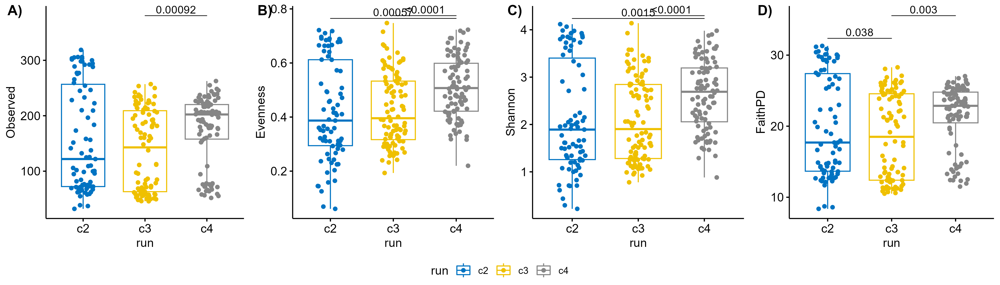

# ALPHA DIVERSITY {.tabset .tabset-fade .tabset-pills}

This Rmarkdown contains the commands necessary to perform alpha diversity analysis of the output from the DF_GMH_PIPELINE. It is expected that the data has been imported, cleaned, and saved following the script 1_Import_QC.Rmd prior to using this script. I recommend visiting the ["Analysis of community ecology data in R"](https://www.davidzeleny.net/anadat-r/doku.php/en:start) to read about the theory behind the alpha and beta diversity and examples of the necessary R-code to execute them. Other excellent source of help is the R [cheat-sheets](https://www.rstudio.com/resources/cheatsheets/) and for problems related to Rmarkdown I suggest this [online Book](https://bookdown.org/yihui/rmarkdown/).

Alpha diversity, also called "within sample diversity" is calculated for each sample individually and is independent of all other samples. Alpha diversity is sensitive to sequencing depth, so rarefaction must be done first.

# INFO

This document has been fitted to perform calculations of phyloseq element from the Import & QC script. It has been fitted for data from Flurex (internal project name: R20-22). The project data contains 16S V3 amplicon sequencing from feces samples from 4 different days and cecum and ileum samples from one day from 48 rats. There are feces samples from all rats from day 0, 2, 4 and 8. Cecum and ileum samples were all collected at dissection on day 8. Please read the method section for this paper for details on experimental setup.

Metadata contains sample information regarding:
-   rat number/name, cage number (rats were co-caged 2-2), day of sampling, material (feces, cecum, ileum), sequencing information (gram of material used for extracted DNA, DNA concentrations, primers, barcodes for demultiplexing, batch number ("run" = c2, c3, c4)), treatment groups. Several columns have been created for easy sample grouping during analysis, including for distinguishing between vancomycin and PFOS treatment alone.

Metadata contains results from:
-   Bodyweight per sampling day, while cecum and liver weight for day 8 (addition column with organ weights normalised to bodyweight).

-   PFOS quantification of:
    +   Blood serum from day 4 and 8 measured in µg/mL
    +   Liver tissue from day 8 measured in mg PFOS in full liver weight
-   Short-chain fatty acids quantification of 10 compounds in colonic water given in mM from day 8: acetic acid, formic acid, propanoic acid, 2methyl-propanoic acid, butanoic acid, 3methyl-butanoic acid, pentanoic acid, 4methyl-pentanoic acid, hexanoic acid and heptanoic acid

## SETUP

```{r setup, eval=TRUE, echo=TRUE, message=FALSE,warning = FALSE}
knitr::opts_chunk$set(echo = TRUE)

# Load libraries
library(tidyverse)
library(phyloseq)
library(ggpubr)
library(rstatix)
library(kableExtra)
library(picante)

# Create used folders if missing
if (!file.exists("R_objects")) dir.create(file.path(getwd(), "R_objects"))
if (!file.exists("plots")) dir.create(file.path(getwd(), "plots"))
if (!file.exists("plots/adiv")) dir.create(file.path(getwd(), "plots/adiv"))
if (!file.exists("tables")) dir.create(file.path(getwd(), "tables"))
if (!file.exists("scripts")) dir.create(file.path(getwd(), "scripts"))

# Save params
saveRDS(params, file = "R_objects/Adiv_params.RDS")
```

## SCRIPTS {.tabset .tabset-fade .tabset-pills}

This section contains the scripts for the custom functions used in this pipeline

### ALPHA DIVERSITY

Alpha diversity is sensitive to sequencing depth, especially richness based metrics will increase with sequencing depth. To avoid any such bias rarefaction should be performed.

```{r, eval=TRUE, echo=TRUE}

# Rarefaction curves
Rcurve_data <- function(physeq, ntables=10, step=250,maxdepth = max(sample_sums(physeq)), methods=c("Observed","Chao1","ACE","Shannon","FaithPD","Evenness"), seedstart=500, verbose=FALSE) {
  require("vegan")
  require("picante")
  
  # prep list of 
  step.seq <- seq(from = 1, to = maxdepth, by = step)
  
  # Calculate alpha diversity
  rare_tab <- lapply(step.seq,function(k) Calculate_alpha_div(physeq = physeq, ntables = ntables, depth = k, methods = methods, seedstart = seedstart, verbose = verbose))
    
  # Format table
  rare_tab <- do.call(rbind, rare_tab)
  
  return(rare_tab)
}

# Calculate alpha diversity
Calculate_alpha_div <- function(physeq, ntables=100, depth = round(min(sample_sums(physeq))*0.9), methods=c("Observed","Chao1","FaithPD","Shannon","Evenness"), seedstart=500, verbose=FALSE) {
  require("vegan")
  
  # remove samples below depth
  phy.use <- prune_samples(sample_sums(physeq) >= depth, physeq )
  
  # Orientate the OTU correctly
  if (taxa_are_rows(phy.use)){otu.tab<-unclass(t(otu_table(phy.use)))} else otu.tab <- unclass(otu_table(phy.use))
  
  # Rarefaction function
  rarefy <- function(x, depth) {
    y <- sample(rep(1:length(x), x), depth)
    y.tab <- table(y)
    j <- numeric(length(x))
    j[as.numeric(names(y.tab))] <- y.tab
    j
  }
  
  # Table to output alpha diversity table
  Alpha_diversity = data.frame(row.names = row.names(otu.tab))
  
  for (i in seq(length(methods))){
    Alpha_diversity[,methods[i]] <- numeric(length = nrow(otu.tab))
    Alpha_diversity[,paste0(methods[i],"_sd")] <- numeric(length = nrow(otu.tab))
  }
  
  # Run each sample separately
  for (z in 1:nrow(otu.tab)) {
    if (verbose==TRUE) {
      print(paste("Rarefaction sample number", z, sep=" "))
    }
    numbers <- otu.tab[z,]
    
    # Rarefy the sample ntables times
    set.seed(seedstart + z)
    rare_tab <- lapply(1:ntables,function(k) rarefy(numbers,depth))
    
    # Format table
    rare_tab <- do.call(rbind, rare_tab)
    
    # Calculate Observed richness, Chao1, and ACE.
    adiv <- data.frame(t(estimateR(rare_tab)))
    
    if ("Observed" %in% methods){
      # Save mean and sd of observed richness
      Alpha_diversity$Observed[z] <- mean(adiv$S.obs)
      Alpha_diversity$Observed_sd[z] <- sd(adiv$S.obs)
    }
    
    if ("Chao1" %in% methods){
      # Save mean and sd of observed richness
      Alpha_diversity$Chao1[z] <- mean(adiv$S.chao1)
      Alpha_diversity$Chao1_sd[z] <- sd(adiv$S.chao1)
    }
    
    if ("ACE" %in% methods){
      # Save mean and sd of observed richness
      Alpha_diversity$ACE[z] <- mean(adiv$se.ACE)
      Alpha_diversity$ACE_sd[z] <- sd(adiv$se.ACE)
    }
    
    if ("Shannon" %in% methods){
      # Calculate observed richness for each rep of sample z
      adiv <- vegan::diversity(rare_tab, index = "shannon")
      
      # Save mean and sd of observed richness
      Alpha_diversity$Shannon[z] <- mean(adiv)
      Alpha_diversity$Shannon_sd[z] <- sd(adiv)
    }
    
    if ("Simpson" %in% methods){
      # Calculate observed richness for each rep of sample z
      adiv <- diversity(rare_tab, index = "simpson")
      # Save mean and sd of observed richness
      Alpha_diversity$Simpson[z] <- mean(adiv)
      Alpha_diversity$Simpson_sd[z] <- sd(adiv)
    }
    
    if ("Evenness" %in% methods){
      # Calculate observed richness for each rep of sample z
      sha <- vegan::diversity(rare_tab, index = "shannon")
      obs <- rowSums(rare_tab != 0)
      adiv <- sha/log(obs)
      # Save mean and sd of observed richness
      Alpha_diversity$Evenness[z] <- mean(adiv)
      Alpha_diversity$Evenness_sd[z] <- sd(adiv)
    }
    
    if ("FaithPD" %in% methods){
      colnames(rare_tab) <- taxa_names(physeq)
      # Calculate Faith Phylogenetic distance for each rep of sample z
      tmp <- pd(rare_tab, phy_tree(physeq), include.root = T)
      Alpha_diversity$FaithPD[z] <- mean(tmp$PD)
      Alpha_diversity$FaithPD_sd[z] <- sd(tmp$PD)
    }
    
  }

  # Add alpha diversity to sample data
  output <- cbind(sample_data(phy.use),Alpha_diversity)
  output$depth = depth
  # Return physeq to the environment
  return(output) 
}

# save functions
save(Calculate_alpha_div, Rcurve_data, file = "scripts/adiv.Rdata")

# clear the environment and release memory
rm(list = ls(all.names = TRUE)) #will clear all objects includes hidden objects.
invisible(gc()) #free up memory and report the memory usage.

```

## CALCULATE ALPHA DIVERSITY

There is randomness involved in performing rarefaction (random subsampling). To minimize any effect of this randomness it is recommended to use the mean of multiple rarefactions instead of just relying on just one random subsampling. Not rarefying a sample can create a bias, so to avoid this I will rarefy all samples to 90% of the lowest sample depth (default setting). As this will be done for just one sequencing depth and we need the results to be consistent default setting is to rarefy 100 times. The function will produce a data.frame with sample metadata and the mean and standard deviation for each sample using the methods set prior.

```{r alpha_div_calc, eval=FALSE}

params <- readRDS("R_objects/Adiv_params.RDS")

# load data
load(params$input)
load("scripts/adiv.Rdata")

INDECES <- c("Observed","Shannon","FaithPD","Chao1","Evenness")
# Calculate data
adat <- Calculate_alpha_div(phy, methods = INDECES)

# Save the phyloseq object
save(adat, INDECES, file="R_objects/AlphaDiversity.RData")

# clear the environment and release memory
rm(list = ls(all.names = TRUE)) #will clear all objects includes hidden objects.
invisible(gc()) #free up memory and report the memory usage.

```

## BATCH EFFECTS

Before testing any of the project specific variables it is important to determine if there is any batch effects that affect the samples (for example extraction batches or sequencing run)

```{r alpha_div_batch, eval=TRUE}

params <- readRDS("R_objects/Adiv_params.RDS")
# Load data
load("R_objects/AlphaDiversity.RData")

### Test observed richness
FORMULA <- as.formula(paste("Observed ~", params$batch, sep = " "))
compare_means(FORMULA,  data = adat, method = "kruskal")

## If significant:
# Perform pairwise comparisons
stat.test <- adat %>%
  wilcox_test(FORMULA) %>%
  adjust_pvalue(method = "BH") %>%
  add_significance("p.adj") %>% 
  add_x_position(x = params$batch) %>%
  p_format("p.adj", accuracy = 0.0001, trailing.zero = TRUE, new.col = TRUE)

# Format for 
if (sum(stat.test$p.adj.signif != "ns") == 0) {
  stat.sig <- stat.test %>%
    add_y_position(step.increase = 0.25) %>%
    mutate(y.position = seq(min(y.position), max(y.position),length.out = n()))
} else {
  stat.sig <- stat.test[stat.test$p.adj.signif != "ns",] %>%
    add_y_position(step.increase = 0.25) %>%
    mutate(y.position = seq(min(y.position), max(y.position),length.out = n()))
}

# Create plot
p <- ggboxplot(adat, x = params$batch, y = "Observed",
          color = params$batch, palette = "jco",
          add = "jitter")

p.obs <- p + stat_pvalue_manual(stat.sig, label = "p.adj.format",tip.length = 0)

### Pilous Evenness
FORMULA <- as.formula(paste("Evenness ~", params$batch, sep = " "))
compare_means(FORMULA,  data = adat, method = "kruskal")

## If significant:
# Perform pairwise comparisons
stat.test <- adat %>%
  wilcox_test(FORMULA) %>%
  adjust_pvalue(method = "BH") %>%
  add_significance("p.adj") %>% 
  add_x_position(x = params$batch) %>%
  p_format("p.adj", accuracy = 0.0001, trailing.zero = TRUE, new.col = TRUE)

# Format for 
if (sum(stat.test$p.adj.signif != "ns") == 0) {
  stat.sig <- stat.test %>%
    add_y_position(step.increase = 0.25) %>%
    mutate(y.position = seq(min(y.position), max(y.position),length.out = n()))
} else {
  stat.sig <- stat.test[stat.test$p.adj.signif != "ns",] %>%
    add_y_position(step.increase = 0.25) %>%
    mutate(y.position = seq(min(y.position), max(y.position),length.out = n()))
}

# Create plot
p <- ggboxplot(adat, x = params$batch, y = "Evenness",
          color = params$batch, palette = "jco",
          add = "jitter")

p.eve <- p + stat_pvalue_manual(stat.sig, label = "p.adj.format",tip.length = 0)

### Test shannon diversity index
# Run statistical test of batch effect
FORMULA <- as.formula(paste("Shannon ~", params$batch, sep = " "))
compare_means(FORMULA,  data = adat, method = "kruskal")

## If significant:
# Perform pairwise comparisons
stat.test <- adat %>%
  wilcox_test(FORMULA) %>%
  adjust_pvalue(method = "BH") %>%
  add_significance("p.adj") %>% 
  add_x_position(x = params$batch) %>%
  p_format("p.adj", accuracy = 0.0001, trailing.zero = TRUE, new.col = TRUE)

# Format for 
if (sum(stat.test$p.adj.signif != "ns") == 0) {
  stat.sig <- stat.test %>%
    add_y_position(step.increase = 0.25) %>%
    mutate(y.position = seq(min(y.position), max(y.position),length.out = n()))
} else {
  stat.sig <- stat.test[stat.test$p.adj.signif != "ns",] %>%
    add_y_position(step.increase = 0.25) %>%
    mutate(y.position = seq(min(y.position), max(y.position),length.out = n()))
}

# Create plot
p <- ggboxplot(adat, x = params$batch, y = "Shannon", color = params$batch, palette = "jco", add = "jitter")

p.sdi <- p + stat_pvalue_manual(stat.sig, label = "p.adj.format",tip.length = 0)
# If there is a significant batch effect, then it will be necessary to correct following tests for this effect.

# Test Faith phylogenetic distance
FORMULA <- as.formula(paste("FaithPD ~", params$batch, sep = " "))
compare_means(FORMULA,  data = adat, method = "kruskal")

## If significant:
# Perform pairwise comparisons
stat.test <- adat %>%
  wilcox_test(FORMULA) %>%
  adjust_pvalue(method = "BH") %>%
  add_significance("p.adj") %>% 
  add_x_position(x = params$batch) %>%
  p_format("p.adj", accuracy = 0.0001, trailing.zero = TRUE, new.col = TRUE)

# Format for 
if (sum(stat.test$p.adj.signif != "ns") == 0) {
  stat.sig <- stat.test %>%
    add_y_position(step.increase = 0.25) %>%
    mutate(y.position = seq(min(y.position), max(y.position),length.out = n()))
} else {
  stat.sig <- stat.test[stat.test$p.adj.signif != "ns",] %>%
    add_y_position(step.increase = 0.25) %>%
    mutate(y.position = seq(min(y.position), max(y.position),length.out = n()))
}

# Create plot
p <- ggboxplot(adat, x = params$batch, y = "FaithPD",
          color = params$batch, palette = "jco",
          add = "jitter")

p.fpd <- p + stat_pvalue_manual(stat.sig, label = "p.adj.format",tip.length = 0)

adiv_batch <- ggarrange(p.obs, p.eve, p.sdi, p.fpd, nrow = 1, labels = c("A)","B)","C)","D)"), common.legend = TRUE, legend = "bottom")
suppressMessages(ggsave(filename = "plots/adiv/misc/adiv_batch.png",plot = adiv_batch, device = "png", units = "mm", width = 350, height = 100, dpi = 300))
suppressMessages(ggsave(filename = "plots/adiv/misc/adiv_batch.pdf",plot = adiv_batch, device = "pdf", units = "mm", width = 350, height = 100, dpi = 300))
adiv_batch

# clear the environment and release memory
rm(list = ls(all.names = TRUE))
invisible(gc())

```

Boxplot of the influence of sequencing batches on alpha diversity: {width="100%"} As there is a batch effect it is important that we determine if any tested variables are independent of the batches or if there is an interaction. A main contributor to the batch difference is likely the division of samples per batch: c2 = cecum and ileum samples, c3 = feces day 2 and 4, c4 = feces day 0 and 8.

# CATEGORICAL VARIABLES EFFECTS {.tabset .tabset-fade .tabset-pills}

Keeping in mind possible batch effects, now we can test for project effects. Depending on the project it might be best to test each variable individually or to perform a nested test of the variables. It is important to ensure that R has interpreted the selected variable as a factor, charactor variables will automatically be interpreted as factors, but variables that consists solely of numbers (numerical or integers) is interpreted as continous by R and must be transformed to be factors.

## Diversity plot with rats over time

Here we look at all data in one figure per metric. The plots contain data from all feces data which are plotted for each rat along with summary of each treatment group per day as boxplots. Vancomycin treatment factor "van" is used to facet_wrap for better overview and labels are adjusted for better overview.

```{r adiv_figure_over_time, eval=TRUE, echo=TRUE}
# Load, subset and order data
load("R_objects/AlphaDiversity.RData")
tmp <- adat[adat$material == "Feces",]
tmp <- tmp[order(tmp$day),]

# Add column
rats <- unique(tmp$rat_name)

# Color scheme
COL <- c("#606060","#31b44b","#6699d1","#F0cc05")

# Facet names
facet_names <- list("ctrl" = "No vancomycin", "van" = "Vancomycin")
facet_labeller <- function(variable,value){
  return(facet_names[value])
  
}# OBSERVED ADIV PLOT FOR RATS + TREATMENT OVER TIME (NORMALISED)

for (rat in rats){
  tmp$Observed_norm[tmp$rat_name == rat] <- tmp$Observed[tmp$rat_name == rat]/tmp$Observed[tmp$rat_name == rat & tmp$day == "d0"]*100
}

#Plot
p <- ggplot(tmp, aes(x=day, y = Observed_norm, color = treatment)) + 
  geom_boxplot(outlier.shape = NA, lwd=1) + 
  geom_line(aes(group = rat_name), alpha = 0.5) + 
  geom_point() + 
  facet_wrap("van", nrow = 2,scales = "free",labeller = facet_labeller, strip.position="left") + 
  scale_color_manual(values = COL) + 
  ylab("Observed % change") +
  xlab("Day") +
  labs(color = "Treatment") +
  scale_x_discrete(breaks=c("d0","d2","d4","d8"), labels=c("0","2","4","8")) +
  theme_bw()
pT <- p + ggtitle("Observed richness in fecal samples over time")
pT
ggsave(filename = "plots/adiv/time/adiv_over_time_rats_obs.png", plot = pT, device = "png", units = "mm", width = 150, height = 180, dpi = 300)
ggsave(filename = "plots/adiv/time/adiv_over_time_rats_obs.pdf", plot = pT, device = "pdf", units = "mm", width = 150, height = 180, dpi = 300)


# SHANNON ADIV PLOT FOR RATS + TREATMENT OVER TIME (NORMALISED)

for (rat in rats){
  tmp$Shannon_norm[tmp$rat_name == rat] <- tmp$Shannon[tmp$rat_name == rat]/tmp$Shannon[tmp$rat_name == rat & tmp$day == "d0"]*100
}

#Plot
p <- ggplot(tmp, aes(x=day, y = Shannon_norm, color = treatment)) + 
  geom_boxplot(outlier.shape = NA, lwd=1) + 
  geom_line(aes(group = rat_name), alpha = 0.5) + 
  geom_point() + 
  facet_wrap("van", nrow = 2,scales = "free",labeller = facet_labeller, strip.position="left") + 
  scale_color_manual(values = COL) + 
  ylab("Shannon % change") +
  xlab("Day") +
  labs(color = "Treatment") +
  scale_x_discrete(breaks=c("d0","d2","d4","d8"), labels=c("0","2","4","8")) +
  theme_bw()
pT <- p + ggtitle("Shannon diversity in fecal samples over time")
pT
ggsave(filename = "plots/adiv/time/adiv_over_time_rats_sha.png", plot = pT, device = "png", units = "mm", width = 150, height = 180, dpi = 300)
ggsave(filename = "plots/adiv/time/adiv_over_time_rats_sha.pdf", plot = pT, device = "pdf", units = "mm", width = 150, height = 180, dpi = 300)


# EVENNESS ADIV PLOT FOR RATS + TREATMENT OVER TIME (NORMALISED)

for (rat in rats){
  tmp$Evenness_norm[tmp$rat_name == rat] <- tmp$Evenness[tmp$rat_name == rat]/tmp$Evenness[tmp$rat_name == rat & tmp$day == "d0"]*100
}

#Plot
p <- ggplot(tmp, aes(x=day, y = Evenness_norm, color = treatment)) + 
  geom_boxplot(outlier.shape = NA, lwd=1) + 
  geom_line(aes(group = rat_name), alpha = 0.5) + 
  geom_point() + 
  facet_wrap("van", nrow = 2,scales = "free",labeller = facet_labeller, strip.position="left") + 
  scale_color_manual(values = COL) + 
  ylab("Evenness % change") +
  xlab("Day") +
  labs(color = "Treatment") +
  scale_x_discrete(breaks=c("d0","d2","d4","d8"), labels=c("0","2","4","8")) +
  theme_bw()
pT <- p + ggtitle("Pielou's Evenness in fecal samples over time")
pT
ggsave(filename = "plots/adiv/time/adiv_over_time_rats_env.png", plot = pT, device = "png", units = "mm", width = 150, height = 180, dpi = 300)
ggsave(filename = "plots/adiv/time/adiv_over_time_rats_rnv.pdf", plot = pT, device = "pdf", units = "mm", width = 150, height = 180, dpi = 300)


# FAITHPD ADIV PLOT FOR RATS + TREATMENT OVER TIME (NORMALISED)

for (rat in rats){
  tmp$FaithPD_norm[tmp$rat_name == rat] <- tmp$FaithPD[tmp$rat_name == rat]/tmp$FaithPD[tmp$rat_name == rat & tmp$day == "d0"]*100
}

#Plot
p <- ggplot(tmp, aes(x=day, y = FaithPD_norm, color = treatment)) + 
  geom_boxplot(outlier.shape = NA, lwd=1) + 
  geom_line(aes(group = rat_name), alpha = 0.5) + 
  geom_point() + 
  facet_wrap("van", nrow = 2,scales = "free",labeller = facet_labeller, strip.position="left") + 
  scale_color_manual(values = COL) + 
  ylab("FaithPD % change") +
  xlab("Day") +
  labs(color = "Treatment") +
  scale_x_discrete(breaks=c("d0","d2","d4","d8"), labels=c("0","2","4","8")) +
  theme_bw()
pT <- p + ggtitle("Faith's Phylogenetic Diversity in fecal samples over time")
pT
ggsave(filename = "plots/adiv/time/adiv_over_time_rats_fpd.png", plot = pT, device = "png", units = "mm", width = 150, height = 180, dpi = 300)
ggsave(filename = "plots/adiv/time/adiv_over_time_rats_fpd.pdf", plot = pT, device = "pdf", units = "mm", width = 150, height = 180, dpi = 300)

# clear the environment and release memory
rm(list = ls(all.names = TRUE)) #will clear all objects includes hidden objects.
invisible(gc()) #free up memory and report the memory usage.

```

## Diversity daily treatment per material

Here we aim to look at diversity differences in each type of sample (material) on each day (0, 2, 4, 8).

### Feces treatment day 0

Here is code to test alpha diversity for a the categorical "treatment" variable.

```{r, eval=TRUE}

params <- readRDS("R_objects/Adiv_params.RDS")
# Load data
load("R_objects/AlphaDiversity.RData")
TEST.VAR <- "treatment"
SUBSET.VAR <- "Feces"
DAY.VAR <- "d0"

# Subset
adat <- adat[adat$material == SUBSET.VAR & adat$day == DAY.VAR,]

# Remove samples with incomplete metadata
adat <- adat[!is.na(adat[,TEST.VAR]),]
adat[,TEST.VAR] <- as.factor(adat[,TEST.VAR])

### Determine if any batch effect might influence your data
# Calculate distribution counts
freq.t <- with(adat, table(run, treatment, exclude = NULL))
freq.t

# Determine distribution percentages
prop.table(freq.t,2)*100

# Test if any difference is significant (if not significant the batch effect should be negligible)
chisq_test(freq.t)
```

As there is no significant interaction identified by the chi^2^-test, we can ignore the batch effects when analysing the variable.

```{r alpha_div_treatF0_test, eval=TRUE, fig.cap="Boxplot of alpha diversity"}
#### Test project variable
### Observed richness
FORMULA <- as.formula(paste("Observed ~", TEST.VAR, sep = " "))
compare_means(FORMULA,  data = adat, method = "kruskal")

# Color scheme
COL <- c("#606060","#31b44b","#6699d1","#fcdd05")

## If significant:
# Perform pairwise comparisons
stat.test <- adat %>%
  wilcox_test(FORMULA) %>%
  adjust_pvalue(method = "BH") %>%
  add_significance("p.adj") %>% 
  add_x_position(x = TEST.VAR) %>%
  p_format("p.adj", accuracy = 0.0001, trailing.zero = TRUE, new.col = TRUE)

# Format for 
if (sum(stat.test$p.adj.signif != "ns") == 0) {
  stat.sig <- stat.test %>%
    add_y_position(step.increase = 0.25) %>%
    mutate(y.position = seq(min(y.position), max(y.position),length.out = n()))
} else {
  stat.sig <- stat.test[stat.test$p.adj.signif != "ns",] %>%
    add_y_position(step.increase = 0.25) %>%
    mutate(y.position = seq(min(y.position), max(y.position),length.out = n()))
}

# Create plot
p <- ggboxplot(adat, x = TEST.VAR, y = "Observed",
          fill = TEST.VAR,
          add = "jitter") + scale_fill_manual(values = COL) 

p.obs <- p + stat_pvalue_manual(stat.sig, label = "p.adj.format",tip.length = 0)

### Pilous Evenness
FORMULA <- as.formula(paste("Evenness ~", TEST.VAR, sep = " "))
compare_means(FORMULA,  data = adat, method = "kruskal")

## If significant:
# Perform pairwise comparisons
stat.test <- adat %>%
  wilcox_test(FORMULA) %>%
  adjust_pvalue(method = "BH") %>%
  add_significance("p.adj") %>% 
  add_x_position(x = TEST.VAR) %>%
  p_format("p.adj", accuracy = 0.0001, trailing.zero = TRUE, new.col = TRUE)

# Format for 
if (sum(stat.test$p.adj.signif != "ns") == 0) {
  stat.sig <- stat.test %>%
    add_y_position(step.increase = 0.25) %>%
    mutate(y.position = seq(min(y.position), max(y.position),length.out = n()))
} else {
  stat.sig <- stat.test[stat.test$p.adj.signif != "ns",] %>%
    add_y_position(step.increase = 0.25) %>%
    mutate(y.position = seq(min(y.position), max(y.position),length.out = n()))
}

# Create plot
p <- ggboxplot(adat, x = TEST.VAR, y = "Evenness",
          fill = TEST.VAR,
          add = "jitter") + scale_fill_manual(values = COL)

p.eve <- p + stat_pvalue_manual(stat.sig, label = "p.adj.format",tip.length = 0)

### Test shannon diversity index
# Run statistical test of batch effect
FORMULA <- as.formula(paste("Shannon ~", TEST.VAR, sep = " "))
compare_means(FORMULA,  data = adat, method = "kruskal")

## If significant:
# Perform pairwise comparisons
stat.test <- adat %>%
  wilcox_test(FORMULA) %>%
  adjust_pvalue(method = "BH") %>%
  add_significance("p.adj") %>% 
  add_x_position(x = TEST.VAR) %>%
  p_format("p.adj", accuracy = 0.0001, trailing.zero = TRUE, new.col = TRUE)

# Format for 
if (sum(stat.test$p.adj.signif != "ns") == 0) {
  stat.sig <- stat.test %>%
    add_y_position(step.increase = 0.25) %>%
    mutate(y.position = seq(min(y.position), max(y.position),length.out = n()))
} else {
  stat.sig <- stat.test[stat.test$p.adj.signif != "ns",] %>%
    add_y_position(step.increase = 0.25) %>%
    mutate(y.position = seq(min(y.position), max(y.position),length.out = n()))
}
# Create plot
p <- ggboxplot(adat, x = TEST.VAR, y = "Shannon",
          fill = TEST.VAR,
          add = "jitter") + scale_fill_manual(values = COL)

p.sdi <- p + stat_pvalue_manual(stat.sig, label = "p.adj.format",tip.length = 0)

# Test Faith phylogenetic distance
FORMULA <- as.formula(paste("FaithPD ~", TEST.VAR, sep = " "))
compare_means(FORMULA,  data = adat, method = "kruskal")

## If significant:
# Perform pairwise comparisons
stat.test <- adat %>%
  wilcox_test(FORMULA) %>%
  adjust_pvalue(method = "BH") %>%
  add_significance("p.adj") %>% 
  add_x_position(x = TEST.VAR) %>%
  p_format("p.adj", accuracy = 0.0001, trailing.zero = TRUE, new.col = TRUE)

# Format for 
if (sum(stat.test$p.adj.signif != "ns") == 0) {
  stat.sig <- stat.test %>%
    add_y_position(step.increase = 0.25) %>%
    mutate(y.position = seq(min(y.position), max(y.position),length.out = n()))
} else {
  stat.sig <- stat.test[stat.test$p.adj.signif != "ns",] %>%
    add_y_position(step.increase = 0.25) %>%
    mutate(y.position = seq(min(y.position), max(y.position),length.out = n()))
}

# Create plot
p <- ggboxplot(adat, x = TEST.VAR, y = "FaithPD",
          fill = TEST.VAR,
          add = "jitter") + scale_fill_manual(values = COL)

p.fpd <- p + stat_pvalue_manual(stat.sig, label = "p.adj.format",tip.length = 0)

# If there is a significant batch effect, then it will be necessary to correct following tests for this effect.
filename <- paste0("plots/adiv/alpha_f0/adiv_",SUBSET.VAR,"_",DAY.VAR,"_",TEST.VAR,".png")
filename2 <- paste0("plots/adiv/alpha_f0/adiv_",SUBSET.VAR,"_",DAY.VAR,"_",TEST.VAR,".pdf")
adiv_plot <- ggarrange(p.obs, p.eve, p.sdi, p.fpd, nrow = 1, labels = c("A)","B)","C)","D)"), common.legend = TRUE,legend = "bottom")
adiv.plot <- adiv_plot + ggtitle(paste0("Difference in alpha diversity between ",TEST.VAR,":"))
adiv.plot
suppressMessages(ggsave(filename = filename, plot = adiv.plot, device = "png", units = "mm", width = 350, height = 100, dpi = 300))
suppressMessages(ggsave(filename = filename2, plot = adiv.plot, device = "pdf", units = "mm", width = 350, height = 100, dpi = 300))

# clear the environment and release memory
rm(list = ls(all.names = TRUE))
invisible(gc())
```

### Feces treatment day 2

Here is code to test alpha diversity for a the categorical "treatment" variable.

```{r alpha_div_treatF2_independence, eval=TRUE}

params <- readRDS("R_objects/Adiv_params.RDS")
# Load data
load("R_objects/AlphaDiversity.RData")
TEST.VAR <- "treatment"
SUBSET.VAR <- "Feces"
DAY.VAR <- "d2"

# Subset
adat <- adat[adat$material == SUBSET.VAR & adat$day == DAY.VAR,]

# Remove samples with incomplete metadata
adat <- adat[!is.na(adat[,TEST.VAR]),]
adat[,TEST.VAR] <- as.factor(adat[,TEST.VAR])

### Determine if any batch effect might influence your data
# Calculate distribution counts
freq.t <- with(adat, table(run, treatment, exclude = NULL))
freq.t

# Determine distribution percentages
prop.table(freq.t,2)*100

# Test if any difference is significant (if not significant the batch effect should be negligible)
chisq_test(freq.t)
```

As there is no significant interaction identified by the chi^2^-test, we can ignore the batch effects when analysing the variable.

```{r alpha_div_treatF2_test, eval=TRUE, fig.cap="Boxplot of alpha diversity"}
################################################################################

#adat <- adat[adat$day == DAY.VAR,]
#### Test project variable
### Observed richness
FORMULA <- as.formula(paste("Observed ~", TEST.VAR, sep = " "))
compare_means(FORMULA,  data = adat, method = "kruskal")

# Color scheme
COL <- c("#606060","#31b44b","#6699d1","#fcdd05")

## If significant:
# Perform pairwise comparisons
stat.test <- adat %>%
  wilcox_test(FORMULA) %>%
  adjust_pvalue(method = "BH") %>%
  add_significance("p.adj") %>% 
  add_x_position(x = TEST.VAR) %>%
  p_format("p.adj", accuracy = 0.0001, trailing.zero = TRUE, new.col = TRUE)

# Format for 
if (sum(stat.test$p.adj.signif != "ns") == 0) {
  stat.sig <- stat.test %>%
    add_y_position(step.increase = 0.25) %>%
    mutate(y.position = seq(min(y.position), max(y.position),length.out = n()))
} else {
  stat.sig <- stat.test[stat.test$p.adj.signif != "ns",] %>%
    add_y_position(step.increase = 0.25) %>%
    mutate(y.position = seq(min(y.position), max(y.position),length.out = n()))
}

# Create plot
p <- ggboxplot(adat, x = TEST.VAR, y = "Observed",
          fill = TEST.VAR,
          add = "jitter") + scale_fill_manual(values = COL)

p.obs <- p + stat_pvalue_manual(stat.sig, label = "p.adj.format",tip.length = 0)

### Pilous Evenness
FORMULA <- as.formula(paste("Evenness ~", TEST.VAR, sep = " "))
compare_means(FORMULA,  data = adat, method = "kruskal")

## If significant:
# Perform pairwise comparisons
stat.test <- adat %>%
  wilcox_test(FORMULA) %>%
  adjust_pvalue(method = "BH") %>%
  add_significance("p.adj") %>% 
  add_x_position(x = TEST.VAR) %>%
  p_format("p.adj", accuracy = 0.0001, trailing.zero = TRUE, new.col = TRUE)

# Format for 
if (sum(stat.test$p.adj.signif != "ns") == 0) {
  stat.sig <- stat.test %>%
    add_y_position(step.increase = 0.25) %>%
    mutate(y.position = seq(min(y.position), max(y.position),length.out = n()))
} else {
  stat.sig <- stat.test[stat.test$p.adj.signif != "ns",] %>%
    add_y_position(step.increase = 0.25) %>%
    mutate(y.position = seq(min(y.position), max(y.position),length.out = n()))
}

# Create plot
p <- ggboxplot(adat, x = TEST.VAR, y = "Evenness",
          fill = TEST.VAR,
          add = "jitter") +scale_fill_manual(values = COL)

p.eve <- p + stat_pvalue_manual(stat.sig, label = "p.adj.format",tip.length = 0)

### Test shannon diversity index
# Run statistical test of batch effect
FORMULA <- as.formula(paste("Shannon ~", TEST.VAR, sep = " "))
compare_means(FORMULA,  data = adat, method = "kruskal")

## If significant:
# Perform pairwise comparisons
stat.test <- adat %>%
  wilcox_test(FORMULA) %>%
  adjust_pvalue(method = "BH") %>%
  add_significance("p.adj") %>% 
  add_x_position(x = TEST.VAR) %>%
  p_format("p.adj", accuracy = 0.0001, trailing.zero = TRUE, new.col = TRUE)

# Format for 
if (sum(stat.test$p.adj.signif != "ns") == 0) {
  stat.sig <- stat.test %>%
    add_y_position(step.increase = 0.25) %>%
    mutate(y.position = seq(min(y.position), max(y.position),length.out = n()))
} else {
  stat.sig <- stat.test[stat.test$p.adj.signif != "ns",] %>%
    add_y_position(step.increase = 0.25) %>%
    mutate(y.position = seq(min(y.position), max(y.position),length.out = n()))
}
# Create plot
p <- ggboxplot(adat, x = TEST.VAR, y = "Shannon", 
          fill = TEST.VAR,
          add = "jitter") +scale_fill_manual(values = COL)

p.sdi <- p + stat_pvalue_manual(stat.sig, label = "p.adj.format",tip.length = 0)

# Test Faith phylogenetic distance
FORMULA <- as.formula(paste("FaithPD ~", TEST.VAR, sep = " "))
compare_means(FORMULA,  data = adat, method = "kruskal")

## If significant:
# Perform pairwise comparisons
stat.test <- adat %>%
  wilcox_test(FORMULA) %>%
  adjust_pvalue(method = "BH") %>%
  add_significance("p.adj") %>% 
  add_x_position(x = TEST.VAR) %>%
  p_format("p.adj", accuracy = 0.0001, trailing.zero = TRUE, new.col = TRUE)

# Format for 
if (sum(stat.test$p.adj.signif != "ns") == 0) {
  stat.sig <- stat.test %>%
    add_y_position(step.increase = 0.25) %>%
    mutate(y.position = seq(min(y.position), max(y.position),length.out = n()))
} else {
  stat.sig <- stat.test[stat.test$p.adj.signif != "ns",] %>%
    add_y_position(step.increase = 0.25) %>%
    mutate(y.position = seq(min(y.position), max(y.position),length.out = n()))
}

# Create plot
p <- ggboxplot(adat, x = TEST.VAR, y = "FaithPD",
          fill = TEST.VAR,
          add = "jitter") +scale_fill_manual(values = COL)

p.fpd <- p + stat_pvalue_manual(stat.sig, label = "p.adj.format",tip.length = 0)

# If there is a significant batch effect, then it will be necessary to correct following tests for this effect.
filename <- paste0("plots/adiv/alpha_f2/adiv_",SUBSET.VAR,"_",DAY.VAR,"_",TEST.VAR,".png")
filename2 <- paste0("plots/adiv/alpha_f2/adiv_",SUBSET.VAR,"_",DAY.VAR,"_",TEST.VAR,".pdf")
adiv_plot <- ggarrange(p.obs, p.eve, p.sdi, p.fpd, nrow = 1, labels = c("A)","B)","C)","D)"), common.legend = TRUE,legend = "bottom")
adiv.plot <- adiv_plot + ggtitle(paste0("Difference in alpha diversity between ",TEST.VAR,":"))
adiv.plot
suppressMessages(ggsave(filename = filename, plot = adiv.plot, device = "png", units = "mm", width = 350, height = 100, dpi = 300))
suppressMessages(ggsave(filename = filename2, plot = adiv.plot, device = "pdf", units = "mm", width = 350, height = 100, dpi = 300))

# clear the environment and release memory
rm(list = ls(all.names = TRUE))
invisible(gc())
```

### Feces treatment day 4

Here is code to test alpha diversity for a the categorical "treatment" variable.

```{r alpha_div_treatF4_independence, eval=TRUE}

params <- readRDS("R_objects/Adiv_params.RDS")
# Load data
load("R_objects/AlphaDiversity.RData")
TEST.VAR <- "treatment"
SUBSET.VAR <- "Feces"
DAY.VAR <- "d4"

# Subset
adat <- adat[adat$material == SUBSET.VAR & adat$day == DAY.VAR,]

# Remove samples with incomplete metadata
adat <- adat[!is.na(adat[,TEST.VAR]),]
adat[,TEST.VAR] <- as.factor(adat[,TEST.VAR])

### Determine if any batch effect might influence your data
# Calculate distribution counts
freq.t <- with(adat, table(run, treatment, exclude = NULL))
freq.t

# Determine distribution percentages
prop.table(freq.t,2)*100

# Test if any difference is significant (if not significant the batch effect should be negligible)
chisq_test(freq.t)
```

As there is no significant interaction identified by the chi^2^-test, we can ignore the batch effects when analysing the variable.

```{r alpha_div_treatF4_test, eval=TRUE, fig.cap="Boxplot of alpha diversity"}
################################################################################

#adat <- adat[adat$day == DAY.VAR,]
#### Test project variable
### Observed richness
FORMULA <- as.formula(paste("Observed ~", TEST.VAR, sep = " "))
compare_means(FORMULA,  data = adat, method = "kruskal")

# Color scheme
COL <- c("#606060","#31b44b","#6699d1","#fcdd05")

## If significant:
# Perform pairwise comparisons
stat.test <- adat %>%
  wilcox_test(FORMULA) %>%
  adjust_pvalue(method = "BH") %>%
  add_significance("p.adj") %>% 
  add_x_position(x = TEST.VAR) %>%
  p_format("p.adj", accuracy = 0.0001, trailing.zero = TRUE, new.col = TRUE)

# Format for 
if (sum(stat.test$p.adj.signif != "ns") == 0) {
  stat.sig <- stat.test %>%
    add_y_position(step.increase = 0.25) %>%
    mutate(y.position = seq(min(y.position), max(y.position),length.out = n()))
} else {
  stat.sig <- stat.test[stat.test$p.adj.signif != "ns",] %>%
    add_y_position(step.increase = 0.25) %>%
    mutate(y.position = seq(min(y.position), max(y.position),length.out = n()))
}

# Create plot
p <- ggboxplot(adat, x = TEST.VAR, y = "Observed",
          fill = TEST.VAR,
          add = "jitter") +scale_fill_manual(values = COL)

p.obs <- p + stat_pvalue_manual(stat.sig, label = "p.adj.format",tip.length = 0)

### Pilous Evenness
FORMULA <- as.formula(paste("Evenness ~", TEST.VAR, sep = " "))
compare_means(FORMULA,  data = adat, method = "kruskal")

## If significant:
# Perform pairwise comparisons
stat.test <- adat %>%
  wilcox_test(FORMULA) %>%
  adjust_pvalue(method = "BH") %>%
  add_significance("p.adj") %>% 
  add_x_position(x = TEST.VAR) %>%
  p_format("p.adj", accuracy = 0.0001, trailing.zero = TRUE, new.col = TRUE)

# Format for 
if (sum(stat.test$p.adj.signif != "ns") == 0) {
  stat.sig <- stat.test %>%
    add_y_position(step.increase = 0.25) %>%
    mutate(y.position = seq(min(y.position), max(y.position),length.out = n()))
} else {
  stat.sig <- stat.test[stat.test$p.adj.signif != "ns",] %>%
    add_y_position(step.increase = 0.25) %>%
    mutate(y.position = seq(min(y.position), max(y.position),length.out = n()))
}

# Create plot
p <- ggboxplot(adat, x = TEST.VAR, y = "Evenness",
          fill = TEST.VAR,
          add = "jitter") +scale_fill_manual(values = COL)

p.eve <- p + stat_pvalue_manual(stat.sig, label = "p.adj.format",tip.length = 0)

### Test shannon diversity index
# Run statistical test of batch effect
FORMULA <- as.formula(paste("Shannon ~", TEST.VAR, sep = " "))
compare_means(FORMULA,  data = adat, method = "kruskal")

## If significant:
# Perform pairwise comparisons
stat.test <- adat %>%
  wilcox_test(FORMULA) %>%
  adjust_pvalue(method = "BH") %>%
  add_significance("p.adj") %>% 
  add_x_position(x = TEST.VAR) %>%
  p_format("p.adj", accuracy = 0.0001, trailing.zero = TRUE, new.col = TRUE)

# Format for 
if (sum(stat.test$p.adj.signif != "ns") == 0) {
  stat.sig <- stat.test %>%
    add_y_position(step.increase = 0.25) %>%
    mutate(y.position = seq(min(y.position), max(y.position),length.out = n()))
} else {
  stat.sig <- stat.test[stat.test$p.adj.signif != "ns",] %>%
    add_y_position(step.increase = 0.25) %>%
    mutate(y.position = seq(min(y.position), max(y.position),length.out = n()))
}
# Create plot
p <- ggboxplot(adat, x = TEST.VAR, y = "Shannon",
          fill = TEST.VAR,
          add = "jitter") +scale_fill_manual(values = COL)

p.sdi <- p + stat_pvalue_manual(stat.sig, label = "p.adj.format",tip.length = 0)

# Test Faith phylogenetic distance
FORMULA <- as.formula(paste("FaithPD ~", TEST.VAR, sep = " "))
compare_means(FORMULA,  data = adat, method = "kruskal")

## If significant:
# Perform pairwise comparisons
stat.test <- adat %>%
  wilcox_test(FORMULA) %>%
  adjust_pvalue(method = "BH") %>%
  add_significance("p.adj") %>% 
  add_x_position(x = TEST.VAR) %>%
  p_format("p.adj", accuracy = 0.0001, trailing.zero = TRUE, new.col = TRUE)

# Format for 
if (sum(stat.test$p.adj.signif != "ns") == 0) {
  stat.sig <- stat.test %>%
    add_y_position(step.increase = 0.25) %>%
    mutate(y.position = seq(min(y.position), max(y.position),length.out = n()))
} else {
  stat.sig <- stat.test[stat.test$p.adj.signif != "ns",] %>%
    add_y_position(step.increase = 0.25) %>%
    mutate(y.position = seq(min(y.position), max(y.position),length.out = n()))
}

# Create plot
p <- ggboxplot(adat, x = TEST.VAR, y = "FaithPD",
          fill = TEST.VAR,
          add = "jitter") +scale_fill_manual(values = COL)

p.fpd <- p + stat_pvalue_manual(stat.sig, label = "p.adj.format",tip.length = 0)

# If there is a significant batch effect, then it will be necessary to correct following tests for this effect.
filename <- paste0("plots/adiv/alpha_f4/adiv_",SUBSET.VAR,"_",DAY.VAR,"_",TEST.VAR,".png")
filename2 <- paste0("plots/adiv/alpha_f4/adiv_",SUBSET.VAR,"_",DAY.VAR,"_",TEST.VAR,".pdf")
adiv_plot <- ggarrange(p.obs, p.eve, p.sdi, p.fpd, nrow = 1, labels = c("A)","B)","C)","D)"), common.legend = TRUE,legend = "bottom")
adiv.plot <- adiv_plot + ggtitle(paste0("Difference in alpha diversity between ",TEST.VAR,":"))
adiv.plot
suppressMessages(ggsave(filename = filename, plot = adiv.plot, device = "png", units = "mm", width = 350, height = 100, dpi = 300))
suppressMessages(ggsave(filename = filename2, plot = adiv.plot, device = "pdf", units = "mm", width = 350, height = 100, dpi = 300))

# clear the environment and release memory
rm(list = ls(all.names = TRUE))
invisible(gc())
```

### Feces treatment day 8

Here is code to test alpha diversity for a the categorical "treatment" variable.

```{r alpha_div_treatF8_independence, eval=TRUE}

params <- readRDS("R_objects/Adiv_params.RDS")
# Load data
load("R_objects/AlphaDiversity.RData")
TEST.VAR <- "treatment"
SUBSET.VAR <- "Feces"
DAY.VAR <- "d8"

# Subset
adat <- adat[adat$material == SUBSET.VAR & adat$day == DAY.VAR,]

# Remove samples with incomplete metadata
adat <- adat[!is.na(adat[,TEST.VAR]),]
adat[,TEST.VAR] <- as.factor(adat[,TEST.VAR])

### Determine if any batch effect might influence your data
# Calculate distribution counts
freq.t <- with(adat, table(run, treatment, exclude = NULL))
freq.t

# Determine distribution percentages
prop.table(freq.t,2)*100

# Test if any difference is significant (if not significant the batch effect should be negligible)
chisq_test(freq.t)
```

As there is no significant interaction identified by the chi^2^-test, we can ignore the batch effects when analysing the variable.

```{r alpha_div_treatF8_test, eval=TRUE, fig.cap="Boxplot of alpha diversity"}
################################################################################

#adat <- adat[adat$day == DAY.VAR,]
#### Test project variable
### Observed richness
FORMULA <- as.formula(paste("Observed ~", TEST.VAR, sep = " "))
compare_means(FORMULA,  data = adat, method = "kruskal")

# Color scheme
COL <- c("#606060","#31b44b","#6699d1","#fcdd05")

## If significant:
# Perform pairwise comparisons
stat.test <- adat %>%
  wilcox_test(FORMULA) %>%
  adjust_pvalue(method = "BH") %>%
  add_significance("p.adj") %>% 
  add_x_position(x = TEST.VAR) %>%
  p_format("p.adj", accuracy = 0.0001, trailing.zero = TRUE, new.col = TRUE)

# Format for 
if (sum(stat.test$p.adj.signif != "ns") == 0) {
  stat.sig <- stat.test %>%
    add_y_position(step.increase = 0.25) %>%
    mutate(y.position = seq(min(y.position), max(y.position),length.out = n()))
} else {
  stat.sig <- stat.test[stat.test$p.adj.signif != "ns",] %>%
    add_y_position(step.increase = 0.25) %>%
    mutate(y.position = seq(min(y.position), max(y.position),length.out = n()))
}

# Create plot
p <- ggboxplot(adat, x = TEST.VAR, y = "Observed",
          fill = TEST.VAR,
          add = "jitter") +scale_fill_manual(values = COL)

p.obs <- p + stat_pvalue_manual(stat.sig, label = "p.adj.format",tip.length = 0)

### Pilous Evenness
FORMULA <- as.formula(paste("Evenness ~", TEST.VAR, sep = " "))
compare_means(FORMULA,  data = adat, method = "kruskal")

## If significant:
# Perform pairwise comparisons
stat.test <- adat %>%
  wilcox_test(FORMULA) %>%
  adjust_pvalue(method = "BH") %>%
  add_significance("p.adj") %>% 
  add_x_position(x = TEST.VAR) %>%
  p_format("p.adj", accuracy = 0.0001, trailing.zero = TRUE, new.col = TRUE)

# Format for 
if (sum(stat.test$p.adj.signif != "ns") == 0) {
  stat.sig <- stat.test %>%
    add_y_position(step.increase = 0.25) %>%
    mutate(y.position = seq(min(y.position), max(y.position),length.out = n()))
} else {
  stat.sig <- stat.test[stat.test$p.adj.signif != "ns",] %>%
    add_y_position(step.increase = 0.25) %>%
    mutate(y.position = seq(min(y.position), max(y.position),length.out = n()))
}

# Create plot
p <- ggboxplot(adat, x = TEST.VAR, y = "Evenness",
          fill = TEST.VAR,
          add = "jitter") +scale_fill_manual(values = COL)

p.eve <- p + stat_pvalue_manual(stat.sig, label = "p.adj.format",tip.length = 0)

### Test shannon diversity index
# Run statistical test of batch effect
FORMULA <- as.formula(paste("Shannon ~", TEST.VAR, sep = " "))
compare_means(FORMULA,  data = adat, method = "kruskal")

## If significant:
# Perform pairwise comparisons
stat.test <- adat %>%
  wilcox_test(FORMULA) %>%
  adjust_pvalue(method = "BH") %>%
  add_significance("p.adj") %>% 
  add_x_position(x = TEST.VAR) %>%
  p_format("p.adj", accuracy = 0.0001, trailing.zero = TRUE, new.col = TRUE)

# Format for 
if (sum(stat.test$p.adj.signif != "ns") == 0) {
  stat.sig <- stat.test %>%
    add_y_position(step.increase = 0.25) %>%
    mutate(y.position = seq(min(y.position), max(y.position),length.out = n()))
} else {
  stat.sig <- stat.test[stat.test$p.adj.signif != "ns",] %>%
    add_y_position(step.increase = 0.25) %>%
    mutate(y.position = seq(min(y.position), max(y.position),length.out = n()))
}
# Create plot
p <- ggboxplot(adat, x = TEST.VAR, y = "Shannon",
          fill = TEST.VAR,
          add = "jitter") +scale_fill_manual(values = COL)

p.sdi <- p + stat_pvalue_manual(stat.sig, label = "p.adj.format",tip.length = 0)

# Test Faith phylogenetic distance
FORMULA <- as.formula(paste("FaithPD ~", TEST.VAR, sep = " "))
compare_means(FORMULA,  data = adat, method = "kruskal")

## If significant:
# Perform pairwise comparisons
stat.test <- adat %>%
  wilcox_test(FORMULA) %>%
  adjust_pvalue(method = "BH") %>%
  add_significance("p.adj") %>% 
  add_x_position(x = TEST.VAR) %>%
  p_format("p.adj", accuracy = 0.0001, trailing.zero = TRUE, new.col = TRUE)

# Format for 
if (sum(stat.test$p.adj.signif != "ns") == 0) {
  stat.sig <- stat.test %>%
    add_y_position(step.increase = 0.25) %>%
    mutate(y.position = seq(min(y.position), max(y.position),length.out = n()))
} else {
  stat.sig <- stat.test[stat.test$p.adj.signif != "ns",] %>%
    add_y_position(step.increase = 0.25) %>%
    mutate(y.position = seq(min(y.position), max(y.position),length.out = n()))
}

# Create plot
p <- ggboxplot(adat, x = TEST.VAR, y = "FaithPD",
          fill = TEST.VAR,
          add = "jitter") +scale_fill_manual(values = COL)

p.fpd <- p + stat_pvalue_manual(stat.sig, label = "p.adj.format",tip.length = 0)

# If there is a significant batch effect, then it will be necessary to correct following tests for this effect.
filename <- paste0("plots/adiv/alpha_f8/adiv_",SUBSET.VAR,"_",DAY.VAR,"_",TEST.VAR,".png")
filename2 <- paste0("plots/adiv/alpha_f8/adiv_",SUBSET.VAR,"_",DAY.VAR,"_",TEST.VAR,".pdf")
adiv_plot <- ggarrange(p.obs, p.eve, p.sdi, p.fpd, nrow = 1, labels = c("A)","B)","C)","D)"), common.legend = TRUE,legend = "bottom")
adiv.plot <- adiv_plot + ggtitle(paste0("Difference in alpha diversity between ",TEST.VAR,":"))
adiv.plot
suppressMessages(ggsave(filename = filename, plot = adiv.plot, device = "png", units = "mm", width = 350, height = 100, dpi = 300))
suppressMessages(ggsave(filename = filename2, plot = adiv.plot, device = "pdf", units = "mm", width = 350, height = 100, dpi = 300))

# clear the environment and release memory
rm(list = ls(all.names = TRUE))
invisible(gc())
```

## Diversity over time

Here we investigate the change in alpha-diversity over the four sampling days in feces.

### Feces Control Group

Here is code to test alpha diversity for a the categorical "day" variable.

```{r alpha_div_dayFctrl_independence, eval=TRUE}

params <- readRDS("R_objects/Adiv_params.RDS")
# Load data
load("R_objects/AlphaDiversity.RData")
TEST.VAR <- "day"
SUBSET.VAR <- "Feces"
TREAT.VAR <- "CTRL"

# Subset
adat <- adat[adat$material == SUBSET.VAR & adat$treatment == TREAT.VAR,]

# Remove samples with incomplete metadata
adat <- adat[!is.na(adat[,TEST.VAR]),]
adat[,TEST.VAR] <- as.factor(adat[,TEST.VAR])

### Determine if any batch effect might influence your data
# Calculate distribution counts
freq.t <- with(adat, table(run, day, exclude = NULL))
freq.t

# Determine distribution percentages
prop.table(freq.t,2)*100

# Test if any difference is significant (if not significant the batch effect should be negligible)
chisq_test(freq.t)
```

Unfortunately, a significant interaction is identified by the chi^2^-test, which we need to take into account when analysing the variable.

```{r alpha_div_dayFctrl_test, eval=TRUE, fig.cap="Boxplot of alpha diversity"}

#### Test project variable
### Observed richness
FORMULA <- as.formula(paste("Observed ~", TEST.VAR, sep = " "))
compare_means(FORMULA,  data = adat, method = "kruskal")

# Color scheme
COL <- c("#f9f9f9","#c8c8c8","#919191","#606060")

## If significant:
# Perform pairwise comparisons
stat.test <- adat %>%
  wilcox_test(FORMULA) %>%
  adjust_pvalue(method = "BH") %>%
  add_significance("p.adj") %>% 
  add_x_position(x = TEST.VAR) %>%
  p_format("p.adj", accuracy = 0.0001, trailing.zero = TRUE, new.col = TRUE)

# Format for 
if (sum(stat.test$p.adj.signif != "ns") == 0) {
  stat.sig <- stat.test %>%
    add_y_position(step.increase = 0.25) %>%
    mutate(y.position = seq(min(y.position), max(y.position),length.out = n()))
} else {
  stat.sig <- stat.test[stat.test$p.adj.signif != "ns",] %>%
    add_y_position(step.increase = 0.25) %>%
    mutate(y.position = seq(min(y.position), max(y.position),length.out = n()))
}

# Create plot
p <- ggboxplot(adat, x = TEST.VAR, y = "Observed",
          fill = TEST.VAR,
          add = "jitter") +scale_fill_manual(values = COL)

p.obs <- p + stat_pvalue_manual(stat.sig, label = "p.adj.format",tip.length = 0)

### Pilous Evenness
FORMULA <- as.formula(paste("Evenness ~", TEST.VAR, sep = " "))
compare_means(FORMULA,  data = adat, method = "kruskal")

## If significant:
# Perform pairwise comparisons
stat.test <- adat %>%
  wilcox_test(FORMULA) %>%
  adjust_pvalue(method = "BH") %>%
  add_significance("p.adj") %>% 
  add_x_position(x = TEST.VAR) %>%
  p_format("p.adj", accuracy = 0.0001, trailing.zero = TRUE, new.col = TRUE)

# Format for 
if (sum(stat.test$p.adj.signif != "ns") == 0) {
  stat.sig <- stat.test %>%
    add_y_position(step.increase = 0.25) %>%
    mutate(y.position = seq(min(y.position), max(y.position),length.out = n()))
} else {
  stat.sig <- stat.test[stat.test$p.adj.signif != "ns",] %>%
    add_y_position(step.increase = 0.25) %>%
    mutate(y.position = seq(min(y.position), max(y.position),length.out = n()))
}

# Create plot
p <- ggboxplot(adat, x = TEST.VAR, y = "Evenness",
          fill = TEST.VAR,
          add = "jitter") +scale_fill_manual(values = COL)

p.eve <- p + stat_pvalue_manual(stat.sig, label = "p.adj.format",tip.length = 0)

### Test shannon diversity index
# Run statistical test of batch effect
FORMULA <- as.formula(paste("Shannon ~", TEST.VAR, sep = " "))
compare_means(FORMULA,  data = adat, method = "kruskal")

## If significant:
# Perform pairwise comparisons
stat.test <- adat %>%
  wilcox_test(FORMULA) %>%
  adjust_pvalue(method = "BH") %>%
  add_significance("p.adj") %>% 
  add_x_position(x = TEST.VAR) %>%
  p_format("p.adj", accuracy = 0.0001, trailing.zero = TRUE, new.col = TRUE)

# Format for 
if (sum(stat.test$p.adj.signif != "ns") == 0) {
  stat.sig <- stat.test %>%
    add_y_position(step.increase = 0.25) %>%
    mutate(y.position = seq(min(y.position), max(y.position),length.out = n()))
} else {
  stat.sig <- stat.test[stat.test$p.adj.signif != "ns",] %>%
    add_y_position(step.increase = 0.25) %>%
    mutate(y.position = seq(min(y.position), max(y.position),length.out = n()))
}
# Create plot
p <- ggboxplot(adat, x = TEST.VAR, y = "Shannon", 
          fill = TEST.VAR,
          add = "jitter") +scale_fill_manual(values = COL)

p.sdi <- p + stat_pvalue_manual(stat.sig, label = "p.adj.format",tip.length = 0)

# Test Faith phylogenetic distance
FORMULA <- as.formula(paste("FaithPD ~", TEST.VAR, sep = " "))
compare_means(FORMULA,  data = adat, method = "kruskal")

## If significant:
# Perform pairwise comparisons
stat.test <- adat %>%
  wilcox_test(FORMULA) %>%
  adjust_pvalue(method = "BH") %>%
  add_significance("p.adj") %>% 
  add_x_position(x = TEST.VAR) %>%
  p_format("p.adj", accuracy = 0.0001, trailing.zero = TRUE, new.col = TRUE)

# Format for 
if (sum(stat.test$p.adj.signif != "ns") == 0) {
  stat.sig <- stat.test %>%
    add_y_position(step.increase = 0.25) %>%
    mutate(y.position = seq(min(y.position), max(y.position),length.out = n()))
} else {
  stat.sig <- stat.test[stat.test$p.adj.signif != "ns",] %>%
    add_y_position(step.increase = 0.25) %>%
    mutate(y.position = seq(min(y.position), max(y.position),length.out = n()))
}

# Create plot
p <- ggboxplot(adat, x = TEST.VAR, y = "FaithPD",
          fill = TEST.VAR,
          add = "jitter") +scale_fill_manual(values = COL)

p.fpd <- p + stat_pvalue_manual(stat.sig, label = "p.adj.format",tip.length = 0)

# If there is a significant batch effect, then it will be necessary to correct following tests for this effect.
filename <- paste0("plots/adiv/alpha_feces/adiv_",SUBSET.VAR,"_",TREAT.VAR,"_",TEST.VAR,".png")
filename2 <- paste0("plots/adiv/alpha_feces/adiv_",SUBSET.VAR,"_",TREAT.VAR,"_",TEST.VAR,".pdf")
adiv_plot <- ggarrange(p.obs, p.eve, p.sdi, p.fpd, nrow = 1, labels = c("A)","B)","C)","D)"), common.legend = TRUE,legend = "bottom")
adiv.plot <- adiv_plot + ggtitle(paste0("Difference in alpha diversity between ",TEST.VAR,":"))
adiv.plot
suppressMessages(ggsave(filename = filename, plot = adiv.plot, device = "png", units = "mm", width = 350, height = 100, dpi = 300))
suppressMessages(ggsave(filename = filename2, plot = adiv.plot, device = "pdf", units = "mm", width = 350, height = 100, dpi = 300))

# clear the environment and release memory
rm(list = ls(all.names = TRUE))
invisible(gc())
```

No difference is observed between days. As a significant batch difference was found by the Chi\^2 test, this needs to be addressed. Batch c3 contains samples solely from day d2 and d4, and c4 contains samples solely from day d0 and d8. As no differences are observed between the pairs d2-d4 and d0-d8, the batch effect has little impact on the interpretation of this group.

### Feces PFOS Group

Here is code to test alpha diversity for a the categorical "day" variable.

```{r alpha_div_dayFpfos_independence, eval=TRUE}

params <- readRDS("R_objects/Adiv_params.RDS")
# Load data
load("R_objects/AlphaDiversity.RData")
TEST.VAR <- "day"
SUBSET.VAR <- "Feces"
TREAT.VAR <- "PFOS"

# Subset
adat <- adat[adat$material == SUBSET.VAR & adat$treatment == TREAT.VAR,]

# Remove samples with incomplete metadata
adat <- adat[!is.na(adat[,TEST.VAR]),]
adat[,TEST.VAR] <- as.factor(adat[,TEST.VAR])

### Determine if any batch effect might influence your data
# Calculate distribution counts
freq.t <- with(adat, table(run, day, exclude = NULL))
freq.t

# Determine distribution percentages
prop.table(freq.t,2)*100

# Test if any difference is significant (if not significant the batch effect should be negligible)
chisq_test(freq.t)
```

Unfortunately, a significant interaction is identified by the chi^2^-test, which we need to take into account when analysing the variable.

```{r alpha_div_dayFpfos_test, eval=TRUE, fig.cap="Boxplot of alpha diversity"}

# Color scheme
COL <- c("#f5fbf7","#b6e5bf","#70cb82","#31b44b")

#### Test project variable
### Observed richness
FORMULA <- as.formula(paste("Observed ~", TEST.VAR, sep = " "))
compare_means(FORMULA,  data = adat, method = "kruskal")

## If significant:
# Perform pairwise comparisons
stat.test <- adat %>%
  wilcox_test(FORMULA) %>%
  adjust_pvalue(method = "BH") %>%
  add_significance("p.adj") %>% 
  add_x_position(x = TEST.VAR) %>%
  p_format("p.adj", accuracy = 0.0001, trailing.zero = TRUE, new.col = TRUE)

# Format for 
if (sum(stat.test$p.adj.signif != "ns") == 0) {
  stat.sig <- stat.test %>%
    add_y_position(step.increase = 0.25) %>%
    mutate(y.position = seq(min(y.position), max(y.position),length.out = n()))
} else {
  stat.sig <- stat.test[stat.test$p.adj.signif != "ns",] %>%
    add_y_position(step.increase = 0.25) %>%
    mutate(y.position = seq(min(y.position), max(y.position),length.out = n()))
}

# Create plot
p <- ggboxplot(adat, x = TEST.VAR, y = "Observed",
          fill = TEST.VAR,
          add = "jitter") +scale_fill_manual(values = COL)

p.obs <- p + stat_pvalue_manual(stat.sig, label = "p.adj.format",tip.length = 0)

### Pilous Evenness
FORMULA <- as.formula(paste("Evenness ~", TEST.VAR, sep = " "))
compare_means(FORMULA,  data = adat, method = "kruskal")

## If significant:
# Perform pairwise comparisons
stat.test <- adat %>%
  wilcox_test(FORMULA) %>%
  adjust_pvalue(method = "BH") %>%
  add_significance("p.adj") %>% 
  add_x_position(x = TEST.VAR) %>%
  p_format("p.adj", accuracy = 0.0001, trailing.zero = TRUE, new.col = TRUE)

# Format for 
if (sum(stat.test$p.adj.signif != "ns") == 0) {
  stat.sig <- stat.test %>%
    add_y_position(step.increase = 0.25) %>%
    mutate(y.position = seq(min(y.position), max(y.position),length.out = n()))
} else {
  stat.sig <- stat.test[stat.test$p.adj.signif != "ns",] %>%
    add_y_position(step.increase = 0.25) %>%
    mutate(y.position = seq(min(y.position), max(y.position),length.out = n()))
}

# Create plot
p <- ggboxplot(adat, x = TEST.VAR, y = "Evenness",
          fill = TEST.VAR,
          add = "jitter") +scale_fill_manual(values = COL)

p.eve <- p + stat_pvalue_manual(stat.sig, label = "p.adj.format",tip.length = 0)

### Test shannon diversity index
# Run statistical test of batch effect
FORMULA <- as.formula(paste("Shannon ~", TEST.VAR, sep = " "))
compare_means(FORMULA,  data = adat, method = "kruskal")

## If significant:
# Perform pairwise comparisons
stat.test <- adat %>%
  wilcox_test(FORMULA) %>%
  adjust_pvalue(method = "BH") %>%
  add_significance("p.adj") %>% 
  add_x_position(x = TEST.VAR) %>%
  p_format("p.adj", accuracy = 0.0001, trailing.zero = TRUE, new.col = TRUE)

# Format for 
if (sum(stat.test$p.adj.signif != "ns") == 0) {
  stat.sig <- stat.test %>%
    add_y_position(step.increase = 0.25) %>%
    mutate(y.position = seq(min(y.position), max(y.position),length.out = n()))
} else {
  stat.sig <- stat.test[stat.test$p.adj.signif != "ns",] %>%
    add_y_position(step.increase = 0.25) %>%
    mutate(y.position = seq(min(y.position), max(y.position),length.out = n()))
}
# Create plot
p <- ggboxplot(adat, x = TEST.VAR, y = "Shannon",
          fill = TEST.VAR,
          add = "jitter") +scale_fill_manual(values = COL)

p.sdi <- p + stat_pvalue_manual(stat.sig, label = "p.adj.format",tip.length = 0)

# Test Faith phylogenetic distance
FORMULA <- as.formula(paste("FaithPD ~", TEST.VAR, sep = " "))
compare_means(FORMULA,  data = adat, method = "kruskal")

## If significant:
# Perform pairwise comparisons
stat.test <- adat %>%
  wilcox_test(FORMULA) %>%
  adjust_pvalue(method = "BH") %>%
  add_significance("p.adj") %>% 
  add_x_position(x = TEST.VAR) %>%
  p_format("p.adj", accuracy = 0.0001, trailing.zero = TRUE, new.col = TRUE)

# Format for 
if (sum(stat.test$p.adj.signif != "ns") == 0) {
  stat.sig <- stat.test %>%
    add_y_position(step.increase = 0.25) %>%
    mutate(y.position = seq(min(y.position), max(y.position),length.out = n()))
} else {
  stat.sig <- stat.test[stat.test$p.adj.signif != "ns",] %>%
    add_y_position(step.increase = 0.25) %>%
    mutate(y.position = seq(min(y.position), max(y.position),length.out = n()))
}

# Create plot
p <- ggboxplot(adat, x = TEST.VAR, y = "FaithPD",
          fill = TEST.VAR,
          add = "jitter") +scale_fill_manual(values = COL)

p.fpd <- p + stat_pvalue_manual(stat.sig, label = "p.adj.format",tip.length = 0)

# If there is a significant batch effect, then it will be necessary to correct following tests for this effect.
filename <- paste0("plots/adiv/alpha_feces/adiv_",SUBSET.VAR,"_",TREAT.VAR,"_",TEST.VAR,".png")
filename2 <- paste0("plots/adiv/alpha_feces/adiv_",SUBSET.VAR,"_",TREAT.VAR,"_",TEST.VAR,".pdf")
adiv_plot <- ggarrange(p.obs, p.eve, p.sdi, p.fpd, nrow = 1, labels = c("A)","B)","C)","D)"), common.legend = TRUE,legend = "bottom")
adiv.plot <- adiv_plot + ggtitle(paste0("Difference in alpha diversity between ",TEST.VAR,":"))
adiv.plot
suppressMessages(ggsave(filename = filename, plot = adiv.plot, device = "png", units = "mm", width = 350, height = 100, dpi = 300))
suppressMessages(ggsave(filename = filename2, plot = adiv.plot, device = "pdf", units = "mm", width = 350, height = 100, dpi = 300))

# clear the environment and release memory
rm(list = ls(all.names = TRUE))
invisible(gc())
```

Significant difference is found between day d0 and d8 in Observed richness and FaithPD. As a significant batch difference was found by the Chi\^2 test, this needs to be addressed. Batch c3 contains samples solely from day d2 and d4, and c4 contains samples solely from day d0 and d8. Significant differences are observed mainly between d0-d8 which neglects influence from batch effect, while significant difference d0-d4 could be impacted by batch effect.

### Feces VAN Group

Here is code to test alpha diversity for a the categorical "day" variable.

```{r alpha_div_dayFvan_independence, eval=TRUE}

params <- readRDS("R_objects/Adiv_params.RDS")
# Load data
load("R_objects/AlphaDiversity.RData")
TEST.VAR <- "day"
SUBSET.VAR <- "Feces"
TREAT.VAR <- "VAN"

# Subset
adat <- adat[adat$material == SUBSET.VAR & adat$treatment == TREAT.VAR,]

# Remove samples with incomplete metadata
adat <- adat[!is.na(adat[,TEST.VAR]),]
adat[,TEST.VAR] <- as.factor(adat[,TEST.VAR])

### Determine if any batch effect might influence your data
# Calculate distribution counts
freq.t <- with(adat, table(run, day, exclude = NULL))
freq.t

# Determine distribution percentages
prop.table(freq.t,2)*100

# Test if any difference is significant (if not significant the batch effect should be negligible)
chisq_test(freq.t)
```

Unfortunately, a significant interaction is identified by the chi^2^-test, which we need to take into account when analysing the variable.

```{r alpha_div_dayFvan_test, eval=TRUE, fig.cap="Boxplot of alpha diversity"}

# Color scheme
COL <- c("#f8fafd","#cadbef","#94b7df","#6699d1")

#### Test project variable
### Observed richness
FORMULA <- as.formula(paste("Observed ~", TEST.VAR, sep = " "))
compare_means(FORMULA,  data = adat, method = "kruskal")

## If significant:
# Perform pairwise comparisons
stat.test <- adat %>%
  wilcox_test(FORMULA) %>%
  adjust_pvalue(method = "BH") %>%
  add_significance("p.adj") %>% 
  add_x_position(x = TEST.VAR) %>%
  p_format("p.adj", accuracy = 0.0001, trailing.zero = TRUE, new.col = TRUE)

# Format for 
if (sum(stat.test$p.adj.signif != "ns") == 0) {
  stat.sig <- stat.test %>%
    add_y_position(step.increase = 0.25) %>%
    mutate(y.position = seq(min(y.position), max(y.position),length.out = n()))
} else {
  stat.sig <- stat.test[stat.test$p.adj.signif != "ns",] %>%
    add_y_position(step.increase = 0.25) %>%
    mutate(y.position = seq(min(y.position), max(y.position),length.out = n()))
}

# Create plot
p <- ggboxplot(adat, x = TEST.VAR, y = "Observed",
          fill = TEST.VAR,
          add = "jitter") +scale_fill_manual(values = COL)

p.obs <- p + stat_pvalue_manual(stat.sig, label = "p.adj.format",tip.length = 0)

### Pilous Evenness
FORMULA <- as.formula(paste("Evenness ~", TEST.VAR, sep = " "))
compare_means(FORMULA,  data = adat, method = "kruskal")

## If significant:
# Perform pairwise comparisons
stat.test <- adat %>%
  wilcox_test(FORMULA) %>%
  adjust_pvalue(method = "BH") %>%
  add_significance("p.adj") %>% 
  add_x_position(x = TEST.VAR) %>%
  p_format("p.adj", accuracy = 0.0001, trailing.zero = TRUE, new.col = TRUE)

# Format for 
if (sum(stat.test$p.adj.signif != "ns") == 0) {
  stat.sig <- stat.test %>%
    add_y_position(step.increase = 0.25) %>%
    mutate(y.position = seq(min(y.position), max(y.position),length.out = n()))
} else {
  stat.sig <- stat.test[stat.test$p.adj.signif != "ns",] %>%
    add_y_position(step.increase = 0.25) %>%
    mutate(y.position = seq(min(y.position), max(y.position),length.out = n()))
}

# Create plot
p <- ggboxplot(adat, x = TEST.VAR, y = "Evenness",
          fill = TEST.VAR,
          add = "jitter") +scale_fill_manual(values = COL)

p.eve <- p + stat_pvalue_manual(stat.sig, label = "p.adj.format",tip.length = 0)

### Test shannon diversity index
# Run statistical test of batch effect
FORMULA <- as.formula(paste("Shannon ~", TEST.VAR, sep = " "))
compare_means(FORMULA,  data = adat, method = "kruskal")

## If significant:
# Perform pairwise comparisons
stat.test <- adat %>%
  wilcox_test(FORMULA) %>%
  adjust_pvalue(method = "BH") %>%
  add_significance("p.adj") %>% 
  add_x_position(x = TEST.VAR) %>%
  p_format("p.adj", accuracy = 0.0001, trailing.zero = TRUE, new.col = TRUE)

# Format for 
if (sum(stat.test$p.adj.signif != "ns") == 0) {
  stat.sig <- stat.test %>%
    add_y_position(step.increase = 0.25) %>%
    mutate(y.position = seq(min(y.position), max(y.position),length.out = n()))
} else {
  stat.sig <- stat.test[stat.test$p.adj.signif != "ns",] %>%
    add_y_position(step.increase = 0.25) %>%
    mutate(y.position = seq(min(y.position), max(y.position),length.out = n()))
}
# Create plot
p <- ggboxplot(adat, x = TEST.VAR, y = "Shannon", 
          fill = TEST.VAR,
          add = "jitter") +scale_fill_manual(values = COL)

p.sdi <- p + stat_pvalue_manual(stat.sig, label = "p.adj.format",tip.length = 0)

# Test Faith phylogenetic distance
FORMULA <- as.formula(paste("FaithPD ~", TEST.VAR, sep = " "))
compare_means(FORMULA,  data = adat, method = "kruskal")

## If significant:
# Perform pairwise comparisons
stat.test <- adat %>%
  wilcox_test(FORMULA) %>%
  adjust_pvalue(method = "BH") %>%
  add_significance("p.adj") %>% 
  add_x_position(x = TEST.VAR) %>%
  p_format("p.adj", accuracy = 0.0001, trailing.zero = TRUE, new.col = TRUE)

# Format for 
if (sum(stat.test$p.adj.signif != "ns") == 0) {
  stat.sig <- stat.test %>%
    add_y_position(step.increase = 0.25) %>%
    mutate(y.position = seq(min(y.position), max(y.position),length.out = n()))
} else {
  stat.sig <- stat.test[stat.test$p.adj.signif != "ns",] %>%
    add_y_position(step.increase = 0.25) %>%
    mutate(y.position = seq(min(y.position), max(y.position),length.out = n()))
}

# Create plot
p <- ggboxplot(adat, x = TEST.VAR, y = "FaithPD",
          fill = TEST.VAR,
          add = "jitter") +scale_fill_manual(values = COL)

p.fpd <- p + stat_pvalue_manual(stat.sig, label = "p.adj.format",tip.length = 0)

# If there is a significant batch effect, then it will be necessary to correct following tests for this effect.
filename <- paste0("plots/adiv/alpha_feces/adiv_",SUBSET.VAR,"_",TREAT.VAR,"_",TEST.VAR,".png")
filename2 <- paste0("plots/adiv/alpha_feces/adiv_",SUBSET.VAR,"_",TREAT.VAR,"_",TEST.VAR,".pdf")
adiv_plot <- ggarrange(p.obs, p.eve, p.sdi, p.fpd, nrow = 1, labels = c("A)","B)","C)","D)"), common.legend = TRUE,legend = "bottom")
adiv.plot <- adiv_plot + ggtitle(paste0("Difference in alpha diversity between ",TEST.VAR,":"))
adiv.plot
suppressMessages(ggsave(filename = filename, plot = adiv.plot, device = "png", units = "mm", width = 350, height = 100, dpi = 300))
suppressMessages(ggsave(filename = filename2, plot = adiv.plot, device = "pdf", units = "mm", width = 350, height = 100, dpi = 300))

# clear the environment and release memory
rm(list = ls(all.names = TRUE))
invisible(gc())
```

Significant difference is found between day d0 and all other days in all indices, which is expected from vancomycin treatment. As a significant batch difference was found by the Chi\^2 test, this needs to be addressed. Batch c3 contains samples solely from day d2 and d4, and c4 contains samples solely from day d0 and d8. General decrease in diversity indices compared to day d0 will not be affected markedly by batch effect. Additional significant differences are observed between d2-d8 and d4-d8 in Evenness and between d4-d8 in Shannon diversty index which could be influenced by batch effect. However, increase in diversity over the course of a antibiotic treatment has been previously documented ["Palleja, A., Mikkelsen, K.H., Forslund, S.K. et al. Recovery of gut microbiota of healthy adults following antibiotic exposure."](https://doi.org/10.1038/s41564-018-0257-9) and ["Ng et al. Recovery of the Gut Microbiota after Antibiotics Depends on Host Diet, Community Context, and Environmental Reservoirs"](https://doi.org/10.1016/j.chom.2019.10.011). Also, increased diversity outside batch effect is found for the PFOS group above supporting the increase at d8.

### Feces VAN+PFOS Group

Here is code to test alpha diversity for a the categorical "day" variable.

```{r alpha_div_dayFvanpfos_independence, eval=TRUE}

params <- readRDS("R_objects/Adiv_params.RDS")
# Load data
load("R_objects/AlphaDiversity.RData")
TEST.VAR <- "day"
SUBSET.VAR <- "Feces"
TREAT.VAR <- "VAN+PFOS"

# Subset
adat <- adat[adat$material == SUBSET.VAR & adat$treatment == TREAT.VAR,]

# Remove samples with incomplete metadata
adat <- adat[!is.na(adat[,TEST.VAR]),]
adat[,TEST.VAR] <- as.factor(adat[,TEST.VAR])

### Determine if any batch effect might influence your data
# Calculate distribution counts
freq.t <- with(adat, table(run, day, exclude = NULL))
freq.t

# Determine distribution percentages
prop.table(freq.t,2)*100

# Test if any difference is significant (if not significant the batch effect should be negligible)
chisq_test(freq.t)
```

Unfortunately, a significant interaction is identified by the chi^2^-test, which we need to take into account when analysing the variable.

```{r alpha_div_dayFvanpfos_test, eval=TRUE, fig.cap="Boxplot of alpha diversity"}

# Color scheme
COL <- c("#fffdf1","#fef3a6","#fde853","#fcdd05")

#### Test project variable
### Observed richness
FORMULA <- as.formula(paste("Observed ~", TEST.VAR, sep = " "))
compare_means(FORMULA,  data = adat, method = "kruskal")

## If significant:
# Perform pairwise comparisons
stat.test <- adat %>%
  wilcox_test(FORMULA) %>%
  adjust_pvalue(method = "BH") %>%
  add_significance("p.adj") %>% 
  add_x_position(x = TEST.VAR) %>%
  p_format("p.adj", accuracy = 0.0001, trailing.zero = TRUE, new.col = TRUE)

# Format for 
if (sum(stat.test$p.adj.signif != "ns") == 0) {
  stat.sig <- stat.test %>%
    add_y_position(step.increase = 0.25) %>%
    mutate(y.position = seq(min(y.position), max(y.position),length.out = n()))
} else {
  stat.sig <- stat.test[stat.test$p.adj.signif != "ns",] %>%
    add_y_position(step.increase = 0.25) %>%
    mutate(y.position = seq(min(y.position), max(y.position),length.out = n()))
}

# Create plot
p <- ggboxplot(adat, x = TEST.VAR, y = "Observed",
          fill = TEST.VAR,
          add = "jitter") +scale_fill_manual(values = COL)

p.obs <- p + stat_pvalue_manual(stat.sig, label = "p.adj.format",tip.length = 0)

### Pilous Evenness
FORMULA <- as.formula(paste("Evenness ~", TEST.VAR, sep = " "))
compare_means(FORMULA,  data = adat, method = "kruskal")

## If significant:
# Perform pairwise comparisons
stat.test <- adat %>%
  wilcox_test(FORMULA) %>%
  adjust_pvalue(method = "BH") %>%
  add_significance("p.adj") %>% 
  add_x_position(x = TEST.VAR) %>%
  p_format("p.adj", accuracy = 0.0001, trailing.zero = TRUE, new.col = TRUE)

# Format for 
if (sum(stat.test$p.adj.signif != "ns") == 0) {
  stat.sig <- stat.test %>%
    add_y_position(step.increase = 0.25) %>%
    mutate(y.position = seq(min(y.position), max(y.position),length.out = n()))
} else {
  stat.sig <- stat.test[stat.test$p.adj.signif != "ns",] %>%
    add_y_position(step.increase = 0.25) %>%
    mutate(y.position = seq(min(y.position), max(y.position),length.out = n()))
}

# Create plot
p <- ggboxplot(adat, x = TEST.VAR, y = "Evenness",
          fill = TEST.VAR,
          add = "jitter") +scale_fill_manual(values = COL)

p.eve <- p + stat_pvalue_manual(stat.sig, label = "p.adj.format",tip.length = 0)

### Test shannon diversity index
# Run statistical test of batch effect
FORMULA <- as.formula(paste("Shannon ~", TEST.VAR, sep = " "))
compare_means(FORMULA,  data = adat, method = "kruskal")

## If significant:
# Perform pairwise comparisons
stat.test <- adat %>%
  wilcox_test(FORMULA) %>%
  adjust_pvalue(method = "BH") %>%
  add_significance("p.adj") %>% 
  add_x_position(x = TEST.VAR) %>%
  p_format("p.adj", accuracy = 0.0001, trailing.zero = TRUE, new.col = TRUE)

# Format for 
if (sum(stat.test$p.adj.signif != "ns") == 0) {
  stat.sig <- stat.test %>%
    add_y_position(step.increase = 0.25) %>%
    mutate(y.position = seq(min(y.position), max(y.position),length.out = n()))
} else {
  stat.sig <- stat.test[stat.test$p.adj.signif != "ns",] %>%
    add_y_position(step.increase = 0.25) %>%
    mutate(y.position = seq(min(y.position), max(y.position),length.out = n()))
}
# Create plot
p <- ggboxplot(adat, x = TEST.VAR, y = "Shannon", 
          fill = TEST.VAR,
          add = "jitter") +scale_fill_manual(values = COL)

p.sdi <- p + stat_pvalue_manual(stat.sig, label = "p.adj.format",tip.length = 0)

# Test Faith phylogenetic distance
FORMULA <- as.formula(paste("FaithPD ~", TEST.VAR, sep = " "))
compare_means(FORMULA,  data = adat, method = "kruskal")

## If significant:
# Perform pairwise comparisons
stat.test <- adat %>%
  wilcox_test(FORMULA) %>%
  adjust_pvalue(method = "BH") %>%
  add_significance("p.adj") %>% 
  add_x_position(x = TEST.VAR) %>%
  p_format("p.adj", accuracy = 0.0001, trailing.zero = TRUE, new.col = TRUE)

# Format for 
if (sum(stat.test$p.adj.signif != "ns") == 0) {
  stat.sig <- stat.test %>%
    add_y_position(step.increase = 0.25) %>%
    mutate(y.position = seq(min(y.position), max(y.position),length.out = n()))
} else {
  stat.sig <- stat.test[stat.test$p.adj.signif != "ns",] %>%
    add_y_position(step.increase = 0.25) %>%
    mutate(y.position = seq(min(y.position), max(y.position),length.out = n()))
}

# Create plot
p <- ggboxplot(adat, x = TEST.VAR, y = "FaithPD",
          fill = TEST.VAR,
          add = "jitter") +scale_fill_manual(values = COL)

p.fpd <- p + stat_pvalue_manual(stat.sig, label = "p.adj.format",tip.length = 0)

# If there is a significant batch effect, then it will be necessary to correct following tests for this effect.
filename <- paste0("plots/adiv/alpha_feces/adiv_",SUBSET.VAR,"_",TREAT.VAR,"_",TEST.VAR,".png")
filename2 <- paste0("plots/adiv/alpha_feces/adiv_",SUBSET.VAR,"_",TREAT.VAR,"_",TEST.VAR,".pdf")
adiv_plot <- ggarrange(p.obs, p.eve, p.sdi, p.fpd, nrow = 1, labels = c("A)","B)","C)","D)"), common.legend = TRUE,legend = "bottom")
adiv.plot <- adiv_plot + ggtitle(paste0("Difference in alpha diversity between ",TEST.VAR,":"))
adiv.plot
suppressMessages(ggsave(filename = filename, plot = adiv.plot, device = "png", units = "mm", width = 350, height = 100, dpi = 300))
suppressMessages(ggsave(filename = filename2, plot = adiv.plot, device = "pdf", units = "mm", width = 350, height = 100, dpi = 300))

# clear the environment and release memory
rm(list = ls(all.names = TRUE))
invisible(gc())
```

Significant difference is found between day d0 and all other days in all indices, which is expected from vancomycin treatment. As a significant batch difference was found by the Chi\^2 test, this needs to be addressed. Batch c3 contains samples solely from day d2 and d4, and c4 contains samples solely from day d0 and d8. General decrease in diversity indices compared to day d0 will not be affected markedly by batch effect. Additional significant differences are observed between d4-d8 in all indices and d2-d8 in Evenness and Shannon diversity indices, which all could be influenced by batch effect. However, increase in diversity over the course of a antibiotic treatment has been previously documented ["Palleja, A., Mikkelsen, K.H., Forslund, S.K. et al. Recovery of gut microbiota of healthy adults following antibiotic exposure."](https://doi.org/10.1038/s41564-018-0257-9) and ["Ng et al. Recovery of the Gut Microbiota after Antibiotics Depends on Host Diet, Community Context, and Environmental Reservoirs"](https://doi.org/10.1016/j.chom.2019.10.011). Significant difference within the same batch is found between d2-d4 in FaithPD.

## PFOS-driven diversity difference

Here we aim to look at diversity differences in fecal samples on each day (0, 2, 4, 8) on subsets of two groups given either vancomycin or not.

### Feces day 0 CTRL&PFOS

Here is code to test alpha diversity for a the categorical "treatment" variable for Control vs. PFOS groups.

```{r alpha_div_d0TreatNoVan_independence, eval=TRUE}

params <- readRDS("R_objects/Adiv_params.RDS")
# Load data
load("R_objects/AlphaDiversity.RData")
TEST.VAR <- "treatment"
SUBSET.VAR <- "Feces"
DAY.VAR <- "d0"
VAN.VAR <- "ctrl"

# Subset
adat <- adat[adat$material == SUBSET.VAR & adat$day == DAY.VAR & adat$van == VAN.VAR,]

# Remove samples with incomplete metadata
adat <- adat[!is.na(adat[,TEST.VAR]),]
adat[,TEST.VAR] <- as.factor(adat[,TEST.VAR])

### Determine if any batch effect might influence your data
# Calculate distribution counts
freq.t <- with(adat, table(run, treatment, exclude = NULL))
freq.t

# Determine distribution percentages
prop.table(freq.t,2)*100

# Test if any difference is significant (if not significant the batch effect should be negligible)
chisq_test(freq.t)
```

As there is no significant interaction identified by the chi^2^-test, we can ignore the batch effects when analysing the variable.

```{r alpha_div_d0TreatNoVan_test, eval=TRUE, fig.cap="Boxplot of alpha diversity"}

# Color scheme
COL <- c("#606060","#31b44b")

#### Test project variable
### Observed richness
FORMULA <- as.formula(paste("Observed ~", TEST.VAR, sep = " "))
compare_means(FORMULA,  data = adat, method = "kruskal")

## If significant:
# Perform pairwise comparisons
stat.test <- adat %>%
  wilcox_test(FORMULA) %>%
  adjust_pvalue(method = "BH") %>%
  add_significance("p.adj") %>% 
  add_x_position(x = TEST.VAR) %>%
  p_format("p.adj", accuracy = 0.0001, trailing.zero = TRUE, new.col = TRUE)

# Format for 
if (sum(stat.test$p.adj.signif != "ns") == 0) {
  stat.sig <- stat.test %>%
    add_y_position(step.increase = 0.25) %>%
    mutate(y.position = seq(min(y.position), max(y.position),length.out = n()))
} else {
  stat.sig <- stat.test[stat.test$p.adj.signif != "ns",] %>%
    add_y_position(step.increase = 0.25) %>%
    mutate(y.position = seq(min(y.position), max(y.position),length.out = n()))
}

# Create plot
p <- ggboxplot(adat, x = TEST.VAR, y = "Observed",
          fill = TEST.VAR,
          add = "jitter") +
  scale_fill_manual(values = COL)

p.obs <- p + stat_pvalue_manual(stat.sig, label = "p.adj.format",tip.length = 0) 

### Pilous Evenness
FORMULA <- as.formula(paste("Evenness ~", TEST.VAR, sep = " "))
compare_means(FORMULA,  data = adat, method = "kruskal")

## If significant:
# Perform pairwise comparisons
stat.test <- adat %>%
  wilcox_test(FORMULA) %>%
  adjust_pvalue(method = "BH") %>%
  add_significance("p.adj") %>% 
  add_x_position(x = TEST.VAR) %>%
  p_format("p.adj", accuracy = 0.0001, trailing.zero = TRUE, new.col = TRUE)

# Format for 
if (sum(stat.test$p.adj.signif != "ns") == 0) {
  stat.sig <- stat.test %>%
    add_y_position(step.increase = 0.25) %>%
    mutate(y.position = seq(min(y.position), max(y.position),length.out = n()))
} else {
  stat.sig <- stat.test[stat.test$p.adj.signif != "ns",] %>%
    add_y_position(step.increase = 0.25) %>%
    mutate(y.position = seq(min(y.position), max(y.position),length.out = n()))
}

# Create plot
p <- ggboxplot(adat, x = TEST.VAR, y = "Evenness",
          fill = TEST.VAR,
          add =  "jitter") +scale_fill_manual(values = COL)

p.eve <- p + stat_pvalue_manual(stat.sig, label = "p.adj.format",tip.length = 0)

### Test shannon diversity index
# Run statistical test of batch effect
FORMULA <- as.formula(paste("Shannon ~", TEST.VAR, sep = " "))
compare_means(FORMULA,  data = adat, method = "kruskal")

## If significant:
# Perform pairwise comparisons
stat.test <- adat %>%
  wilcox_test(FORMULA) %>%
  adjust_pvalue(method = "BH") %>%
  add_significance("p.adj") %>% 
  add_x_position(x = TEST.VAR) %>%
  p_format("p.adj", accuracy = 0.0001, trailing.zero = TRUE, new.col = TRUE)

# Format for 
if (sum(stat.test$p.adj.signif != "ns") == 0) {
  stat.sig <- stat.test %>%
    add_y_position(step.increase = 0.25) %>%
    mutate(y.position = seq(min(y.position), max(y.position),length.out = n()))
} else {
  stat.sig <- stat.test[stat.test$p.adj.signif != "ns",] %>%
    add_y_position(step.increase = 0.25) %>%
    mutate(y.position = seq(min(y.position), max(y.position),length.out = n()))
}
# Create plot
p <- ggboxplot(adat, x = TEST.VAR, y = "Shannon", fill = TEST.VAR, add =  "jitter") +scale_fill_manual(values = COL)

p.sdi <- p + stat_pvalue_manual(stat.sig, label = "p.adj.format",tip.length = 0)

# Test Faith phylogenetic distance
FORMULA <- as.formula(paste("FaithPD ~", TEST.VAR, sep = " "))
compare_means(FORMULA,  data = adat, method = "kruskal")

## If significant:
# Perform pairwise comparisons
stat.test <- adat %>%
  wilcox_test(FORMULA) %>%
  adjust_pvalue(method = "BH") %>%
  add_significance("p.adj") %>% 
  add_x_position(x = TEST.VAR) %>%
  p_format("p.adj", accuracy = 0.0001, trailing.zero = TRUE, new.col = TRUE)

# Format for 
if (sum(stat.test$p.adj.signif != "ns") == 0) {
  stat.sig <- stat.test %>%
    add_y_position(step.increase = 0.25) %>%
    mutate(y.position = seq(min(y.position), max(y.position),length.out = n()))
} else {
  stat.sig <- stat.test[stat.test$p.adj.signif != "ns",] %>%
    add_y_position(step.increase = 0.25) %>%
    mutate(y.position = seq(min(y.position), max(y.position),length.out = n()))
}

# Create plot
p <- ggboxplot(adat, x = TEST.VAR, y = "FaithPD",
          fill = TEST.VAR,
          add =  "jitter") + scale_fill_manual(values = COL)

p.fpd <- p + stat_pvalue_manual(stat.sig, label = "p.adj.format",tip.length = 0)

# If there is a significant batch effect, then it will be necessary to correct following tests for this effect.
filename <- paste0("plots/adiv/alpha_f0/adiv_",SUBSET.VAR,"_",DAY.VAR,"_VAN_",VAN.VAR,"_",TEST.VAR,".png")
filename2 <- paste0("plots/adiv/alpha_f0/adiv_",SUBSET.VAR,"_",DAY.VAR,"_VAN_",VAN.VAR,"_",TEST.VAR,".pdf")
adiv_plot <- ggarrange(p.obs, p.eve, p.sdi, p.fpd, nrow = 1, labels = c("A)","B)","C)","D)"), common.legend = TRUE,legend = "bottom")
adiv.plot <- adiv_plot + ggtitle(paste0("Difference in alpha diversity between ",TEST.VAR,":"))
adiv.plot
suppressMessages(ggsave(filename = filename, plot = adiv.plot, device = "png", units = "mm", width = 250, height = 100, dpi = 300))
suppressMessages(ggsave(filename = filename2, plot = adiv.plot, device = "pdf", units = "mm", width = 250, height = 100, dpi = 300))

# clear the environment and release memory
rm(list = ls(all.names = TRUE))
invisible(gc())
```

### Feces day 2 CTRL&PFOS

Here is code to test alpha diversity for a the categorical "treatment" variable for Control vs. PFOS groups.

```{r alpha_div_d2TreatNoVan_independence, eval=TRUE}

params <- readRDS("R_objects/Adiv_params.RDS")
# Load data
load("R_objects/AlphaDiversity.RData")
TEST.VAR <- "treatment"
SUBSET.VAR <- "Feces"
DAY.VAR <- "d2"
VAN.VAR <- "ctrl"

# Subset
adat <- adat[adat$material == SUBSET.VAR & adat$day == DAY.VAR & adat$van == VAN.VAR,]

# Remove samples with incomplete metadata
adat <- adat[!is.na(adat[,TEST.VAR]),]
adat[,TEST.VAR] <- as.factor(adat[,TEST.VAR])

### Determine if any batch effect might influence your data
# Calculate distribution counts
freq.t <- with(adat, table(run, treatment, exclude = NULL))
freq.t

# Determine distribution percentages
prop.table(freq.t,2)*100

# Test if any difference is significant (if not significant the batch effect should be negligible)
chisq_test(freq.t)
```

As there is no significant interaction identified by the chi^2^-test, we can ignore the batch effects when analysing the variable.

```{r alpha_div_d2TreatNoVan_test, eval=TRUE, fig.cap="Boxplot of alpha diversity"}

# Color scheme
COL <- c("#606060","#31b44b")

#### Test project variable
### Observed richness
FORMULA <- as.formula(paste("Observed ~", TEST.VAR, sep = " "))
compare_means(FORMULA,  data = adat, method = "kruskal")

## If significant:
# Perform pairwise comparisons
stat.test <- adat %>%
  wilcox_test(FORMULA) %>%
  adjust_pvalue(method = "BH") %>%
  add_significance("p.adj") %>% 
  add_x_position(x = TEST.VAR) %>%
  p_format("p.adj", accuracy = 0.0001, trailing.zero = TRUE, new.col = TRUE)

# Format for 
if (sum(stat.test$p.adj.signif != "ns") == 0) {
  stat.sig <- stat.test %>%
    add_y_position(step.increase = 0.25) %>%
    mutate(y.position = seq(min(y.position), max(y.position),length.out = n()))
} else {
  stat.sig <- stat.test[stat.test$p.adj.signif != "ns",] %>%
    add_y_position(step.increase = 0.25) %>%
    mutate(y.position = seq(min(y.position), max(y.position),length.out = n()))
}

# Create plot
p <- ggboxplot(adat, x = TEST.VAR, y = "Observed",
          fill = TEST.VAR,
          add =  "jitter") +scale_fill_manual(values = COL)

p.obs <- p + stat_pvalue_manual(stat.sig, label = "p.adj.format",tip.length = 0) 

### Pilous Evenness
FORMULA <- as.formula(paste("Evenness ~", TEST.VAR, sep = " "))
compare_means(FORMULA,  data = adat, method = "kruskal")

## If significant:
# Perform pairwise comparisons
stat.test <- adat %>%
  wilcox_test(FORMULA) %>%
  adjust_pvalue(method = "BH") %>%
  add_significance("p.adj") %>% 
  add_x_position(x = TEST.VAR) %>%
  p_format("p.adj", accuracy = 0.0001, trailing.zero = TRUE, new.col = TRUE)

# Format for 
if (sum(stat.test$p.adj.signif != "ns") == 0) {
  stat.sig <- stat.test %>%
    add_y_position(step.increase = 0.25) %>%
    mutate(y.position = seq(min(y.position), max(y.position),length.out = n()))
} else {
  stat.sig <- stat.test[stat.test$p.adj.signif != "ns",] %>%
    add_y_position(step.increase = 0.25) %>%
    mutate(y.position = seq(min(y.position), max(y.position),length.out = n()))
}

# Create plot
p <- ggboxplot(adat, x = TEST.VAR, y = "Evenness",
          fill = TEST.VAR,
          add =  "jitter") +scale_fill_manual(values = COL)

p.eve <- p + stat_pvalue_manual(stat.sig, label = "p.adj.format",tip.length = 0)

### Test shannon diversity index
# Run statistical test of batch effect
FORMULA <- as.formula(paste("Shannon ~", TEST.VAR, sep = " "))
compare_means(FORMULA,  data = adat, method = "kruskal")

## If significant:
# Perform pairwise comparisons
stat.test <- adat %>%
  wilcox_test(FORMULA) %>%
  adjust_pvalue(method = "BH") %>%
  add_significance("p.adj") %>% 
  add_x_position(x = TEST.VAR) %>%
  p_format("p.adj", accuracy = 0.0001, trailing.zero = TRUE, new.col = TRUE)

# Format for 
if (sum(stat.test$p.adj.signif != "ns") == 0) {
  stat.sig <- stat.test %>%
    add_y_position(step.increase = 0.25) %>%
    mutate(y.position = seq(min(y.position), max(y.position),length.out = n()))
} else {
  stat.sig <- stat.test[stat.test$p.adj.signif != "ns",] %>%
    add_y_position(step.increase = 0.25) %>%
    mutate(y.position = seq(min(y.position), max(y.position),length.out = n()))
}
# Create plot
p <- ggboxplot(adat, x = TEST.VAR, y = "Shannon", fill = TEST.VAR, add =  "jitter") +scale_fill_manual(values = COL)

p.sdi <- p + stat_pvalue_manual(stat.sig, label = "p.adj.format",tip.length = 0)

# Test Faith phylogenetic distance
FORMULA <- as.formula(paste("FaithPD ~", TEST.VAR, sep = " "))
compare_means(FORMULA,  data = adat, method = "kruskal")

## If significant:
# Perform pairwise comparisons
stat.test <- adat %>%
  wilcox_test(FORMULA) %>%
  adjust_pvalue(method = "BH") %>%
  add_significance("p.adj") %>% 
  add_x_position(x = TEST.VAR) %>%
  p_format("p.adj", accuracy = 0.0001, trailing.zero = TRUE, new.col = TRUE)

# Format for 
if (sum(stat.test$p.adj.signif != "ns") == 0) {
  stat.sig <- stat.test %>%
    add_y_position(step.increase = 0.25) %>%
    mutate(y.position = seq(min(y.position), max(y.position),length.out = n()))
} else {
  stat.sig <- stat.test[stat.test$p.adj.signif != "ns",] %>%
    add_y_position(step.increase = 0.25) %>%
    mutate(y.position = seq(min(y.position), max(y.position),length.out = n()))
}

# Create plot
p <- ggboxplot(adat, x = TEST.VAR, y = "FaithPD",
          fill = TEST.VAR,
          add =  "jitter") +scale_fill_manual(values = COL)

p.fpd <- p + stat_pvalue_manual(stat.sig, label = "p.adj.format",tip.length = 0)

# If there is a significant batch effect, then it will be necessary to correct following tests for this effect.
filename <- paste0("plots/adiv/alpha_f2/adiv_",SUBSET.VAR,"_",DAY.VAR,"_VAN_",VAN.VAR,"_",TEST.VAR,".png")
filename2 <- paste0("plots/adiv/alpha_f2/adiv_",SUBSET.VAR,"_",DAY.VAR,"_VAN_",VAN.VAR,"_",TEST.VAR,".pdf")
adiv_plot <- ggarrange(p.obs, p.eve, p.sdi, p.fpd, nrow = 1, labels = c("A)","B)","C)","D)"), common.legend = TRUE,legend = "bottom")
adiv.plot <- adiv_plot + ggtitle(paste0("Difference in alpha diversity between ",TEST.VAR,":"))
adiv.plot
suppressMessages(ggsave(filename = filename, plot = adiv.plot, device = "png", units = "mm", width = 250, height = 100, dpi = 300))
suppressMessages(ggsave(filename = filename2, plot = adiv.plot, device = "pdf", units = "mm", width = 250, height = 100, dpi = 300))

# clear the environment and release memory
rm(list = ls(all.names = TRUE))
invisible(gc())
```

### Feces day 4 CTRL&PFOS

Here is code to test alpha diversity for a the categorical "treatment" variable for Control vs. PFOS groups.

```{r alpha_div_d4TreatNoVan_independence, eval=TRUE}

params <- readRDS("R_objects/Adiv_params.RDS")
# Load data
load("R_objects/AlphaDiversity.RData")
TEST.VAR <- "treatment"
SUBSET.VAR <- "Feces"
DAY.VAR <- "d4"
VAN.VAR <- "ctrl"

# Subset
adat <- adat[adat$material == SUBSET.VAR & adat$day == DAY.VAR & adat$van == VAN.VAR,]

# Remove samples with incomplete metadata
adat <- adat[!is.na(adat[,TEST.VAR]),]
adat[,TEST.VAR] <- as.factor(adat[,TEST.VAR])

### Determine if any batch effect might influence your data
# Calculate distribution counts
freq.t <- with(adat, table(run, treatment, exclude = NULL))
freq.t

# Determine distribution percentages
prop.table(freq.t,2)*100

# Test if any difference is significant (if not significant the batch effect should be negligible)
chisq_test(freq.t)
```

As there is no significant interaction identified by the chi^2^-test, we can ignore the batch effects when analysing the variable.

```{r alpha_div_d4TreatNoVan_test, eval=TRUE, fig.cap="Boxplot of alpha diversity"}
################################################################################

# Color scheme
COL <- c("#606060","#31b44b")

#adat <- adat[adat$day == DAY.VAR,]
#### Test project variable
### Observed richness
FORMULA <- as.formula(paste("Observed ~", TEST.VAR, sep = " "))
compare_means(FORMULA,  data = adat, method = "kruskal")

## If significant:
# Perform pairwise comparisons
stat.test <- adat %>%
  wilcox_test(FORMULA) %>%
  adjust_pvalue(method = "BH") %>%
  add_significance("p.adj") %>% 
  add_x_position(x = TEST.VAR) %>%
  p_format("p.adj", accuracy = 0.0001, trailing.zero = TRUE, new.col = TRUE)

# Format for 
if (sum(stat.test$p.adj.signif != "ns") == 0) {
  stat.sig <- stat.test %>%
    add_y_position(step.increase = 0.25) %>%
    mutate(y.position = seq(min(y.position), max(y.position),length.out = n()))
} else {
  stat.sig <- stat.test[stat.test$p.adj.signif != "ns",] %>%
    add_y_position(step.increase = 0.25) %>%
    mutate(y.position = seq(min(y.position), max(y.position),length.out = n()))
}

# Create plot
p <- ggboxplot(adat, x = TEST.VAR, y = "Observed",
          fill = TEST.VAR,
          add =  "jitter") + scale_fill_manual(values = COL)

p.obs <- p + stat_pvalue_manual(stat.sig, label = "p.adj.format",tip.length = 0) 

### Pilous Evenness
FORMULA <- as.formula(paste("Evenness ~", TEST.VAR, sep = " "))
compare_means(FORMULA,  data = adat, method = "kruskal")

## If significant:
# Perform pairwise comparisons
stat.test <- adat %>%
  wilcox_test(FORMULA) %>%
  adjust_pvalue(method = "BH") %>%
  add_significance("p.adj") %>% 
  add_x_position(x = TEST.VAR) %>%
  p_format("p.adj", accuracy = 0.0001, trailing.zero = TRUE, new.col = TRUE)

# Format for 
if (sum(stat.test$p.adj.signif != "ns") == 0) {
  stat.sig <- stat.test %>%
    add_y_position(step.increase = 0.25) %>%
    mutate(y.position = seq(min(y.position), max(y.position),length.out = n()))
} else {
  stat.sig <- stat.test[stat.test$p.adj.signif != "ns",] %>%
    add_y_position(step.increase = 0.25) %>%
    mutate(y.position = seq(min(y.position), max(y.position),length.out = n()))
}

# Create plot
p <- ggboxplot(adat, x = TEST.VAR, y = "Evenness",
          fill = TEST.VAR,
          add =  "jitter") +scale_fill_manual(values = COL)

p.eve <- p + stat_pvalue_manual(stat.sig, label = "p.adj.format",tip.length = 0)

### Test shannon diversity index
# Run statistical test of batch effect
FORMULA <- as.formula(paste("Shannon ~", TEST.VAR, sep = " "))
compare_means(FORMULA,  data = adat, method = "kruskal")

## If significant:
# Perform pairwise comparisons
stat.test <- adat %>%
  wilcox_test(FORMULA) %>%
  adjust_pvalue(method = "BH") %>%
  add_significance("p.adj") %>% 
  add_x_position(x = TEST.VAR) %>%
  p_format("p.adj", accuracy = 0.0001, trailing.zero = TRUE, new.col = TRUE)

# Format for 
if (sum(stat.test$p.adj.signif != "ns") == 0) {
  stat.sig <- stat.test %>%
    add_y_position(step.increase = 0.25) %>%
    mutate(y.position = seq(min(y.position), max(y.position),length.out = n()))
} else {
  stat.sig <- stat.test[stat.test$p.adj.signif != "ns",] %>%
    add_y_position(step.increase = 0.25) %>%
    mutate(y.position = seq(min(y.position), max(y.position),length.out = n()))
}
# Create plot
p <- ggboxplot(adat, x = TEST.VAR, y = "Shannon", fill = TEST.VAR, add =  "jitter") +scale_fill_manual(values = COL)

p.sdi <- p + stat_pvalue_manual(stat.sig, label = "p.adj.format",tip.length = 0)

# Test Faith phylogenetic distance
FORMULA <- as.formula(paste("FaithPD ~", TEST.VAR, sep = " "))
compare_means(FORMULA,  data = adat, method = "kruskal")

## If significant:
# Perform pairwise comparisons
stat.test <- adat %>%
  wilcox_test(FORMULA) %>%
  adjust_pvalue(method = "BH") %>%
  add_significance("p.adj") %>% 
  add_x_position(x = TEST.VAR) %>%
  p_format("p.adj", accuracy = 0.0001, trailing.zero = TRUE, new.col = TRUE)

# Format for 
if (sum(stat.test$p.adj.signif != "ns") == 0) {
  stat.sig <- stat.test %>%
    add_y_position(step.increase = 0.25) %>%
    mutate(y.position = seq(min(y.position), max(y.position),length.out = n()))
} else {
  stat.sig <- stat.test[stat.test$p.adj.signif != "ns",] %>%
    add_y_position(step.increase = 0.25) %>%
    mutate(y.position = seq(min(y.position), max(y.position),length.out = n()))
}

# Create plot
p <- ggboxplot(adat, x = TEST.VAR, y = "FaithPD",
          fill = TEST.VAR,
          add =  "jitter") +scale_fill_manual(values = COL)

p.fpd <- p + stat_pvalue_manual(stat.sig, label = "p.adj.format",tip.length = 0)

# If there is a significant batch effect, then it will be necessary to correct following tests for this effect.
filename <- paste0("plots/adiv/alpha_f4/adiv_",SUBSET.VAR,"_",DAY.VAR,"_VAN_",VAN.VAR,"_",TEST.VAR,".png")
filename2 <- paste0("plots/adiv/alpha_f4/adiv_",SUBSET.VAR,"_",DAY.VAR,"_VAN_",VAN.VAR,"_",TEST.VAR,".pdf")
adiv_plot <- ggarrange(p.obs, p.eve, p.sdi, p.fpd, nrow = 1, labels = c("A)","B)","C)","D)"), common.legend = TRUE,legend = "bottom")
adiv.plot <- adiv_plot + ggtitle(paste0("Difference in alpha diversity between ",TEST.VAR,":"))
adiv.plot
suppressMessages(ggsave(filename = filename, plot = adiv.plot, device = "png", units = "mm", width = 250, height = 100, dpi = 300))
suppressMessages(ggsave(filename = filename2, plot = adiv.plot, device = "pdf", units = "mm", width = 250, height = 100, dpi = 300))

# clear the environment and release memory
rm(list = ls(all.names = TRUE))
invisible(gc())
```

### Feces day 8 CTRL&PFOS

Here is code to test alpha diversity for a the categorical "treatment" variable for Control vs. PFOS groups.

```{r alpha_div_d8TreatNoVan_independence, eval=TRUE}

params <- readRDS("R_objects/Adiv_params.RDS")
# Load data
load("R_objects/AlphaDiversity.RData")
TEST.VAR <- "treatment"
SUBSET.VAR <- "Feces"
DAY.VAR <- "d8"
VAN.VAR <- "ctrl"

# Subset
adat <- adat[adat$material == SUBSET.VAR & adat$day == DAY.VAR & adat$van == VAN.VAR,]

# Remove samples with incomplete metadata
adat <- adat[!is.na(adat[,TEST.VAR]),]
adat[,TEST.VAR] <- as.factor(adat[,TEST.VAR])

### Determine if any batch effect might influence your data
# Calculate distribution counts
freq.t <- with(adat, table(run, treatment, exclude = NULL))
freq.t

# Determine distribution percentages
prop.table(freq.t,2)*100

# Test if any difference is significant (if not significant the batch effect should be negligible)
chisq_test(freq.t)
```

As there is no significant interaction identified by the chi^2^-test, we can ignore the batch effects when analysing the variable.

```{r alpha_div_d8TreatNoVan_test, eval=TRUE, fig.cap="Boxplot of alpha diversity"}
################################################################################

# Color scheme
COL <- c("#606060","#31b44b")

#adat <- adat[adat$day == DAY.VAR,]
#### Test project variable
### Observed richness
FORMULA <- as.formula(paste("Observed ~", TEST.VAR, sep = " "))
compare_means(FORMULA,  data = adat, method = "kruskal")

## If significant:
# Perform pairwise comparisons
stat.test <- adat %>%
  wilcox_test(FORMULA) %>%
  adjust_pvalue(method = "BH") %>%
  add_significance("p.adj") %>% 
  add_x_position(x = TEST.VAR) %>%
  p_format("p.adj", accuracy = 0.0001, trailing.zero = TRUE, new.col = TRUE)

# Format for 
if (sum(stat.test$p.adj.signif != "ns") == 0) {
  stat.sig <- stat.test %>%
    add_y_position(step.increase = 0.25) %>%
    mutate(y.position = seq(min(y.position), max(y.position),length.out = n()))
} else {
  stat.sig <- stat.test[stat.test$p.adj.signif != "ns",] %>%
    add_y_position(step.increase = 0.25) %>%
    mutate(y.position = seq(min(y.position), max(y.position),length.out = n()))
}

# Create plot
p <- ggboxplot(adat, x = TEST.VAR, y = "Observed",
          fill = TEST.VAR,
          add =  "jitter") +scale_fill_manual(values = COL)

p.obs <- p + stat_pvalue_manual(stat.sig, label = "p.adj.format",tip.length = 0) 

### Pilous Evenness
FORMULA <- as.formula(paste("Evenness ~", TEST.VAR, sep = " "))
compare_means(FORMULA,  data = adat, method = "kruskal")

## If significant:
# Perform pairwise comparisons
stat.test <- adat %>%
  wilcox_test(FORMULA) %>%
  adjust_pvalue(method = "BH") %>%
  add_significance("p.adj") %>% 
  add_x_position(x = TEST.VAR) %>%
  p_format("p.adj", accuracy = 0.0001, trailing.zero = TRUE, new.col = TRUE)

# Format for 
if (sum(stat.test$p.adj.signif != "ns") == 0) {
  stat.sig <- stat.test %>%
    add_y_position(step.increase = 0.25) %>%
    mutate(y.position = seq(min(y.position), max(y.position),length.out = n()))
} else {
  stat.sig <- stat.test[stat.test$p.adj.signif != "ns",] %>%
    add_y_position(step.increase = 0.25) %>%
    mutate(y.position = seq(min(y.position), max(y.position),length.out = n()))
}

# Create plot
p <- ggboxplot(adat, x = TEST.VAR, y = "Evenness",
          fill = TEST.VAR,
          add =  "jitter") +scale_fill_manual(values = COL)

p.eve <- p + stat_pvalue_manual(stat.sig, label = "p.adj.format",tip.length = 0)

### Test shannon diversity index
# Run statistical test of batch effect
FORMULA <- as.formula(paste("Shannon ~", TEST.VAR, sep = " "))
compare_means(FORMULA,  data = adat, method = "kruskal")

## If significant:
# Perform pairwise comparisons
stat.test <- adat %>%
  wilcox_test(FORMULA) %>%
  adjust_pvalue(method = "BH") %>%
  add_significance("p.adj") %>% 
  add_x_position(x = TEST.VAR) %>%
  p_format("p.adj", accuracy = 0.0001, trailing.zero = TRUE, new.col = TRUE)

# Format for 
if (sum(stat.test$p.adj.signif != "ns") == 0) {
  stat.sig <- stat.test %>%
    add_y_position(step.increase = 0.25) %>%
    mutate(y.position = seq(min(y.position), max(y.position),length.out = n()))
} else {
  stat.sig <- stat.test[stat.test$p.adj.signif != "ns",] %>%
    add_y_position(step.increase = 0.25) %>%
    mutate(y.position = seq(min(y.position), max(y.position),length.out = n()))
}
# Create plot
p <- ggboxplot(adat, x = TEST.VAR, y = "Shannon", fill = TEST.VAR, add =  "jitter") +scale_fill_manual(values = COL)

p.sdi <- p + stat_pvalue_manual(stat.sig, label = "p.adj.format",tip.length = 0)

# Test Faith phylogenetic distance
FORMULA <- as.formula(paste("FaithPD ~", TEST.VAR, sep = " "))
compare_means(FORMULA,  data = adat, method = "kruskal")

## If significant:
# Perform pairwise comparisons
stat.test <- adat %>%
  wilcox_test(FORMULA) %>%
  adjust_pvalue(method = "BH") %>%
  add_significance("p.adj") %>% 
  add_x_position(x = TEST.VAR) %>%
  p_format("p.adj", accuracy = 0.0001, trailing.zero = TRUE, new.col = TRUE)

# Format for 
if (sum(stat.test$p.adj.signif != "ns") == 0) {
  stat.sig <- stat.test %>%
    add_y_position(step.increase = 0.25) %>%
    mutate(y.position = seq(min(y.position), max(y.position),length.out = n()))
} else {
  stat.sig <- stat.test[stat.test$p.adj.signif != "ns",] %>%
    add_y_position(step.increase = 0.25) %>%
    mutate(y.position = seq(min(y.position), max(y.position),length.out = n()))
}

# Create plot
p <- ggboxplot(adat, x = TEST.VAR, y = "FaithPD",
          fill = TEST.VAR,
          add =  "jitter") +scale_fill_manual(values = COL)

p.fpd <- p + stat_pvalue_manual(stat.sig, label = "p.adj.format",tip.length = 0)

# If there is a significant batch effect, then it will be necessary to correct following tests for this effect.
filename <- paste0("plots/adiv/alpha_f8/adiv_",SUBSET.VAR,"_",DAY.VAR,"_VAN_",VAN.VAR,"_",TEST.VAR,".png")
filename2 <- paste0("plots/adiv/alpha_f8/adiv_",SUBSET.VAR,"_",DAY.VAR,"_VAN_",VAN.VAR,"_",TEST.VAR,".pdf")
adiv_plot <- ggarrange(p.obs, p.eve, p.sdi, p.fpd, nrow = 1, labels = c("A)","B)","C)","D)"), common.legend = TRUE,legend = "bottom")
adiv.plot <- adiv_plot + ggtitle(paste0("Difference in alpha diversity between ",TEST.VAR,":"))
adiv.plot
suppressMessages(ggsave(filename = filename, plot = adiv.plot, device = "png", units = "mm", width = 250, height = 100, dpi = 300))
suppressMessages(ggsave(filename = filename2, plot = adiv.plot, device = "pdf", units = "mm", width = 250, height = 100, dpi = 300))

# clear the environment and release memory
rm(list = ls(all.names = TRUE))
invisible(gc())
```

### Feces day 0 VAN&VAN+PFOS

Here is code to test alpha diversity for a the categorical "treatment" variable for VAN vs. VAN+PFOS groups.

```{r alpha_div_d0TreatVan_independence, eval=TRUE}

params <- readRDS("R_objects/Adiv_params.RDS")
# Load data
load("R_objects/AlphaDiversity.RData")
TEST.VAR <- "treatment"
SUBSET.VAR <- "Feces"
DAY.VAR <- "d0"
VAN.VAR <- "van"

# Subset
adat <- adat[adat$material == SUBSET.VAR & adat$day == DAY.VAR & adat$van == VAN.VAR,]

# Remove samples with incomplete metadata
adat <- adat[!is.na(adat[,TEST.VAR]),]
adat[,TEST.VAR] <- as.factor(adat[,TEST.VAR])

### Determine if any batch effect might influence your data
# Calculate distribution counts
freq.t <- with(adat, table(run, treatment, exclude = NULL))
freq.t

# Determine distribution percentages
prop.table(freq.t,2)*100

# Test if any difference is significant (if not significant the batch effect should be negligible)
chisq_test(freq.t)
```

As there is no significant interaction identified by the chi^2^-test, we can ignore the batch effects when analysing the variable.

```{r alpha_div_d0TreatVan_test, eval=TRUE, fig.cap="Boxplot of alpha diversity"}
################################################################################

# Color scheme
COL <- c("#6699d1","#fcdd05")

#adat <- adat[adat$day == DAY.VAR,]
#### Test project variable
### Observed richness
FORMULA <- as.formula(paste("Observed ~", TEST.VAR, sep = " "))
compare_means(FORMULA,  data = adat, method = "kruskal")

## If significant:
# Perform pairwise comparisons
stat.test <- adat %>%
  wilcox_test(FORMULA) %>%
  adjust_pvalue(method = "BH") %>%
  add_significance("p.adj") %>% 
  add_x_position(x = TEST.VAR) %>%
  p_format("p.adj", accuracy = 0.0001, trailing.zero = TRUE, new.col = TRUE)

# Format for 
if (sum(stat.test$p.adj.signif != "ns") == 0) {
  stat.sig <- stat.test %>%
    add_y_position(step.increase = 0.25) %>%
    mutate(y.position = seq(min(y.position), max(y.position),length.out = n()))
} else {
  stat.sig <- stat.test[stat.test$p.adj.signif != "ns",] %>%
    add_y_position(step.increase = 0.25) %>%
    mutate(y.position = seq(min(y.position), max(y.position),length.out = n()))
}

# Create plot
p <- ggboxplot(adat, x = TEST.VAR, y = "Observed",
          fill = TEST.VAR,
          add =  "jitter") +scale_fill_manual(values = COL)

p.obs <- p + stat_pvalue_manual(stat.sig, label = "p.adj.format",tip.length = 0) 

### Pilous Evenness
FORMULA <- as.formula(paste("Evenness ~", TEST.VAR, sep = " "))
compare_means(FORMULA,  data = adat, method = "kruskal")

## If significant:
# Perform pairwise comparisons
stat.test <- adat %>%
  wilcox_test(FORMULA) %>%
  adjust_pvalue(method = "BH") %>%
  add_significance("p.adj") %>% 
  add_x_position(x = TEST.VAR) %>%
  p_format("p.adj", accuracy = 0.0001, trailing.zero = TRUE, new.col = TRUE)

# Format for 
if (sum(stat.test$p.adj.signif != "ns") == 0) {
  stat.sig <- stat.test %>%
    add_y_position(step.increase = 0.25) %>%
    mutate(y.position = seq(min(y.position), max(y.position),length.out = n()))
} else {
  stat.sig <- stat.test[stat.test$p.adj.signif != "ns",] %>%
    add_y_position(step.increase = 0.25) %>%
    mutate(y.position = seq(min(y.position), max(y.position),length.out = n()))
}

# Create plot
p <- ggboxplot(adat, x = TEST.VAR, y = "Evenness",
          fill = TEST.VAR,
          add =  "jitter") +scale_fill_manual(values = COL)

p.eve <- p + stat_pvalue_manual(stat.sig, label = "p.adj.format",tip.length = 0)

### Test shannon diversity index
# Run statistical test of batch effect
FORMULA <- as.formula(paste("Shannon ~", TEST.VAR, sep = " "))
compare_means(FORMULA,  data = adat, method = "kruskal")

## If significant:
# Perform pairwise comparisons
stat.test <- adat %>%
  wilcox_test(FORMULA) %>%
  adjust_pvalue(method = "BH") %>%
  add_significance("p.adj") %>% 
  add_x_position(x = TEST.VAR) %>%
  p_format("p.adj", accuracy = 0.0001, trailing.zero = TRUE, new.col = TRUE)

# Format for 
if (sum(stat.test$p.adj.signif != "ns") == 0) {
  stat.sig <- stat.test %>%
    add_y_position(step.increase = 0.25) %>%
    mutate(y.position = seq(min(y.position), max(y.position),length.out = n()))
} else {
  stat.sig <- stat.test[stat.test$p.adj.signif != "ns",] %>%
    add_y_position(step.increase = 0.25) %>%
    mutate(y.position = seq(min(y.position), max(y.position),length.out = n()))
}
# Create plot
p <- ggboxplot(adat, x = TEST.VAR, y = "Shannon", fill = TEST.VAR, add =  "jitter") +scale_fill_manual(values = COL)

p.sdi <- p + stat_pvalue_manual(stat.sig, label = "p.adj.format",tip.length = 0)

# Test Faith phylogenetic distance
FORMULA <- as.formula(paste("FaithPD ~", TEST.VAR, sep = " "))
compare_means(FORMULA,  data = adat, method = "kruskal")

## If significant:
# Perform pairwise comparisons
stat.test <- adat %>%
  wilcox_test(FORMULA) %>%
  adjust_pvalue(method = "BH") %>%
  add_significance("p.adj") %>% 
  add_x_position(x = TEST.VAR) %>%
  p_format("p.adj", accuracy = 0.0001, trailing.zero = TRUE, new.col = TRUE)

# Format for 
if (sum(stat.test$p.adj.signif != "ns") == 0) {
  stat.sig <- stat.test %>%
    add_y_position(step.increase = 0.25) %>%
    mutate(y.position = seq(min(y.position), max(y.position),length.out = n()))
} else {
  stat.sig <- stat.test[stat.test$p.adj.signif != "ns",] %>%
    add_y_position(step.increase = 0.25) %>%
    mutate(y.position = seq(min(y.position), max(y.position),length.out = n()))
}

# Create plot
p <- ggboxplot(adat, x = TEST.VAR, y = "FaithPD",
          fill = TEST.VAR,
          add =  "jitter") +scale_fill_manual(values = COL)

p.fpd <- p + stat_pvalue_manual(stat.sig, label = "p.adj.format",tip.length = 0)

# If there is a significant batch effect, then it will be necessary to correct following tests for this effect.
filename <- paste0("plots/adiv/alpha_f0/adiv_",SUBSET.VAR,"_",DAY.VAR,"_VAN_",VAN.VAR,"_",TEST.VAR,".png")
filename2 <- paste0("plots/adiv/alpha_f0/adiv_",SUBSET.VAR,"_",DAY.VAR,"_VAN_",VAN.VAR,"_",TEST.VAR,".pdf")
adiv_plot <- ggarrange(p.obs, p.eve, p.sdi, p.fpd, nrow = 1, labels = c("A)","B)","C)","D)"), common.legend = TRUE,legend = "bottom")
adiv.plot <- adiv_plot + ggtitle(paste0("Difference in alpha diversity between ",TEST.VAR,":"))
adiv.plot
suppressMessages(ggsave(filename = filename, plot = adiv.plot, device = "png", units = "mm", width = 250, height = 100, dpi = 300))
suppressMessages(ggsave(filename = filename2, plot = adiv.plot, device = "pdf", units = "mm", width = 250, height = 100, dpi = 300))

# clear the environment and release memory
rm(list = ls(all.names = TRUE))
invisible(gc())
```

### Feces day 2 VAN&VAN+PFOS

Here is code to test alpha diversity for a the categorical "treatment" variable for VAN vs. VAN+PFOS groups.

```{r alpha_div_d2TreatVan_independence, eval=TRUE}

params <- readRDS("R_objects/Adiv_params.RDS")
# Load data
load("R_objects/AlphaDiversity.RData")
TEST.VAR <- "treatment"
SUBSET.VAR <- "Feces"
DAY.VAR <- "d2"
VAN.VAR <- "van"

# Subset
adat <- adat[adat$material == SUBSET.VAR & adat$day == DAY.VAR & adat$van == VAN.VAR,]

# Remove samples with incomplete metadata
adat <- adat[!is.na(adat[,TEST.VAR]),]
adat[,TEST.VAR] <- as.factor(adat[,TEST.VAR])

### Determine if any batch effect might influence your data
# Calculate distribution counts
freq.t <- with(adat, table(run, treatment, exclude = NULL))
freq.t

# Determine distribution percentages
prop.table(freq.t,2)*100

# Test if any difference is significant (if not significant the batch effect should be negligible)
chisq_test(freq.t)
```

As there is no significant interaction identified by the chi^2^-test, we can ignore the batch effects when analysing the variable.

```{r alpha_div_d2TreatVan_test, eval=TRUE, fig.cap="Boxplot of alpha diversity"}
################################################################################

# Color scheme
COL <- c("#6699d1","#fcdd05")

#adat <- adat[adat$day == DAY.VAR,]
#### Test project variable
### Observed richness
FORMULA <- as.formula(paste("Observed ~", TEST.VAR, sep = " "))
compare_means(FORMULA,  data = adat, method = "kruskal")

## If significant:
# Perform pairwise comparisons
stat.test <- adat %>%
  wilcox_test(FORMULA) %>%
  adjust_pvalue(method = "BH") %>%
  add_significance("p.adj") %>% 
  add_x_position(x = TEST.VAR) %>%
  p_format("p.adj", accuracy = 0.0001, trailing.zero = TRUE, new.col = TRUE)

# Format for 
if (sum(stat.test$p.adj.signif != "ns") == 0) {
  stat.sig <- stat.test %>%
    add_y_position(step.increase = 0.25) %>%
    mutate(y.position = seq(min(y.position), max(y.position),length.out = n()))
} else {
  stat.sig <- stat.test[stat.test$p.adj.signif != "ns",] %>%
    add_y_position(step.increase = 0.25) %>%
    mutate(y.position = seq(min(y.position), max(y.position),length.out = n()))
}

# Create plot
p <- ggboxplot(adat, x = TEST.VAR, y = "Observed",
          fill = TEST.VAR,
          add =  "jitter") +scale_fill_manual(values = COL)

p.obs <- p + stat_pvalue_manual(stat.sig, label = "p.adj.format",tip.length = 0) 

### Pilous Evenness
FORMULA <- as.formula(paste("Evenness ~", TEST.VAR, sep = " "))
compare_means(FORMULA,  data = adat, method = "kruskal")

## If significant:
# Perform pairwise comparisons
stat.test <- adat %>%
  wilcox_test(FORMULA) %>%
  adjust_pvalue(method = "BH") %>%
  add_significance("p.adj") %>% 
  add_x_position(x = TEST.VAR) %>%
  p_format("p.adj", accuracy = 0.0001, trailing.zero = TRUE, new.col = TRUE)

# Format for 
if (sum(stat.test$p.adj.signif != "ns") == 0) {
  stat.sig <- stat.test %>%
    add_y_position(step.increase = 0.25) %>%
    mutate(y.position = seq(min(y.position), max(y.position),length.out = n()))
} else {
  stat.sig <- stat.test[stat.test$p.adj.signif != "ns",] %>%
    add_y_position(step.increase = 0.25) %>%
    mutate(y.position = seq(min(y.position), max(y.position),length.out = n()))
}

# Create plot
p <- ggboxplot(adat, x = TEST.VAR, y = "Evenness",
          fill = TEST.VAR,
          add =  "jitter") +scale_fill_manual(values = COL)

p.eve <- p + stat_pvalue_manual(stat.sig, label = "p.adj.format",tip.length = 0)

### Test shannon diversity index
# Run statistical test of batch effect
FORMULA <- as.formula(paste("Shannon ~", TEST.VAR, sep = " "))
compare_means(FORMULA,  data = adat, method = "kruskal")

## If significant:
# Perform pairwise comparisons
stat.test <- adat %>%
  wilcox_test(FORMULA) %>%
  adjust_pvalue(method = "BH") %>%
  add_significance("p.adj") %>% 
  add_x_position(x = TEST.VAR) %>%
  p_format("p.adj", accuracy = 0.0001, trailing.zero = TRUE, new.col = TRUE)

# Format for 
if (sum(stat.test$p.adj.signif != "ns") == 0) {
  stat.sig <- stat.test %>%
    add_y_position(step.increase = 0.25) %>%
    mutate(y.position = seq(min(y.position), max(y.position),length.out = n()))
} else {
  stat.sig <- stat.test[stat.test$p.adj.signif != "ns",] %>%
    add_y_position(step.increase = 0.25) %>%
    mutate(y.position = seq(min(y.position), max(y.position),length.out = n()))
}
# Create plot
p <- ggboxplot(adat, x = TEST.VAR, y = "Shannon", fill = TEST.VAR, add =  "jitter") +scale_fill_manual(values = COL)

p.sdi <- p + stat_pvalue_manual(stat.sig, label = "p.adj.format",tip.length = 0)

# Test Faith phylogenetic distance
FORMULA <- as.formula(paste("FaithPD ~", TEST.VAR, sep = " "))
compare_means(FORMULA,  data = adat, method = "kruskal")

## If significant:
# Perform pairwise comparisons
stat.test <- adat %>%
  wilcox_test(FORMULA) %>%
  adjust_pvalue(method = "BH") %>%
  add_significance("p.adj") %>% 
  add_x_position(x = TEST.VAR) %>%
  p_format("p.adj", accuracy = 0.0001, trailing.zero = TRUE, new.col = TRUE)

# Format for 
if (sum(stat.test$p.adj.signif != "ns") == 0) {
  stat.sig <- stat.test %>%
    add_y_position(step.increase = 0.25) %>%
    mutate(y.position = seq(min(y.position), max(y.position),length.out = n()))
} else {
  stat.sig <- stat.test[stat.test$p.adj.signif != "ns",] %>%
    add_y_position(step.increase = 0.25) %>%
    mutate(y.position = seq(min(y.position), max(y.position),length.out = n()))
}

# Create plot
p <- ggboxplot(adat, x = TEST.VAR, y = "FaithPD",
          fill = TEST.VAR,
          add =  "jitter") +scale_fill_manual(values = COL)

p.fpd <- p + stat_pvalue_manual(stat.sig, label = "p.adj.format",tip.length = 0)

# If there is a significant batch effect, then it will be necessary to correct following tests for this effect.
filename <- paste0("plots/adiv/alpha_f2/adiv_",SUBSET.VAR,"_",DAY.VAR,"_VAN_",VAN.VAR,"_",TEST.VAR,".png")
filename2 <- paste0("plots/adiv/alpha_f2/adiv_",SUBSET.VAR,"_",DAY.VAR,"_VAN_",VAN.VAR,"_",TEST.VAR,".pdf")
adiv_plot <- ggarrange(p.obs, p.eve, p.sdi, p.fpd, nrow = 1, labels = c("A)","B)","C)","D)"), common.legend = TRUE,legend = "bottom")
adiv.plot <- adiv_plot + ggtitle(paste0("Difference in alpha diversity between ",TEST.VAR,":"))
adiv.plot
suppressMessages(ggsave(filename = filename, plot = adiv.plot, device = "png", units = "mm", width = 250, height = 100, dpi = 300))
suppressMessages(ggsave(filename = filename2, plot = adiv.plot, device = "pdf", units = "mm", width = 250, height = 100, dpi = 300))

# clear the environment and release memory
rm(list = ls(all.names = TRUE))
invisible(gc())
```

### Feces day 4 VAN&VAN+PFOS

Here is code to test alpha diversity for a the categorical "treatment" variable for VAN vs. VAN+PFOS groups.

```{r alpha_div_d4TreatVan_independence, eval=TRUE}

params <- readRDS("R_objects/Adiv_params.RDS")
# Load data
load("R_objects/AlphaDiversity.RData")
TEST.VAR <- "treatment"
SUBSET.VAR <- "Feces"
DAY.VAR <- "d4"
VAN.VAR <- "van"

# Subset
adat <- adat[adat$material == SUBSET.VAR & adat$day == DAY.VAR & adat$van == VAN.VAR,]

# Remove samples with incomplete metadata
adat <- adat[!is.na(adat[,TEST.VAR]),]
adat[,TEST.VAR] <- as.factor(adat[,TEST.VAR])

### Determine if any batch effect might influence your data
# Calculate distribution counts
freq.t <- with(adat, table(run, treatment, exclude = NULL))
freq.t

# Determine distribution percentages
prop.table(freq.t,2)*100

# Test if any difference is significant (if not significant the batch effect should be negligible)
chisq_test(freq.t)
```

As there is no significant interaction identified by the chi^2^-test, we can ignore the batch effects when analysing the variable.

```{r alpha_div_d4TreatVan_test, eval=TRUE, fig.cap="Boxplot of alpha diversity"}
################################################################################

# Color scheme
COL <- c("#6699d1","#fcdd05")

#adat <- adat[adat$day == DAY.VAR,]
#### Test project variable
### Observed richness
FORMULA <- as.formula(paste("Observed ~", TEST.VAR, sep = " "))
compare_means(FORMULA,  data = adat, method = "kruskal")

## If significant:
# Perform pairwise comparisons
stat.test <- adat %>%
  wilcox_test(FORMULA) %>%
  adjust_pvalue(method = "BH") %>%
  add_significance("p.adj") %>% 
  add_x_position(x = TEST.VAR) %>%
  p_format("p.adj", accuracy = 0.0001, trailing.zero = TRUE, new.col = TRUE)

# Format for 
if (sum(stat.test$p.adj.signif != "ns") == 0) {
  stat.sig <- stat.test %>%
    add_y_position(step.increase = 0.25) %>%
    mutate(y.position = seq(min(y.position), max(y.position),length.out = n()))
} else {
  stat.sig <- stat.test[stat.test$p.adj.signif != "ns",] %>%
    add_y_position(step.increase = 0.25) %>%
    mutate(y.position = seq(min(y.position), max(y.position),length.out = n()))
}

# Create plot
p <- ggboxplot(adat, x = TEST.VAR, y = "Observed",
          fill = TEST.VAR,
          add =  "jitter") +scale_fill_manual(values = COL)

p.obs <- p + stat_pvalue_manual(stat.sig, label = "p.adj.format",tip.length = 0) 

### Pilous Evenness
FORMULA <- as.formula(paste("Evenness ~", TEST.VAR, sep = " "))
compare_means(FORMULA,  data = adat, method = "kruskal")

## If significant:
# Perform pairwise comparisons
stat.test <- adat %>%
  wilcox_test(FORMULA) %>%
  adjust_pvalue(method = "BH") %>%
  add_significance("p.adj") %>% 
  add_x_position(x = TEST.VAR) %>%
  p_format("p.adj", accuracy = 0.0001, trailing.zero = TRUE, new.col = TRUE)

# Format for 
if (sum(stat.test$p.adj.signif != "ns") == 0) {
  stat.sig <- stat.test %>%
    add_y_position(step.increase = 0.25) %>%
    mutate(y.position = seq(min(y.position), max(y.position),length.out = n()))
} else {
  stat.sig <- stat.test[stat.test$p.adj.signif != "ns",] %>%
    add_y_position(step.increase = 0.25) %>%
    mutate(y.position = seq(min(y.position), max(y.position),length.out = n()))
}

# Create plot
p <- ggboxplot(adat, x = TEST.VAR, y = "Evenness",
          fill = TEST.VAR,
          add =  "jitter") +scale_fill_manual(values = COL)

p.eve <- p + stat_pvalue_manual(stat.sig, label = "p.adj.format",tip.length = 0)

### Test shannon diversity index
# Run statistical test of batch effect
FORMULA <- as.formula(paste("Shannon ~", TEST.VAR, sep = " "))
compare_means(FORMULA,  data = adat, method = "kruskal")

## If significant:
# Perform pairwise comparisons
stat.test <- adat %>%
  wilcox_test(FORMULA) %>%
  adjust_pvalue(method = "BH") %>%
  add_significance("p.adj") %>% 
  add_x_position(x = TEST.VAR) %>%
  p_format("p.adj", accuracy = 0.0001, trailing.zero = TRUE, new.col = TRUE)

# Format for 
if (sum(stat.test$p.adj.signif != "ns") == 0) {
  stat.sig <- stat.test %>%
    add_y_position(step.increase = 0.25) %>%
    mutate(y.position = seq(min(y.position), max(y.position),length.out = n()))
} else {
  stat.sig <- stat.test[stat.test$p.adj.signif != "ns",] %>%
    add_y_position(step.increase = 0.25) %>%
    mutate(y.position = seq(min(y.position), max(y.position),length.out = n()))
}
# Create plot
p <- ggboxplot(adat, x = TEST.VAR, y = "Shannon", fill = TEST.VAR, add =  "jitter") +scale_fill_manual(values = COL)

p.sdi <- p + stat_pvalue_manual(stat.sig, label = "p.adj.format",tip.length = 0)

# Test Faith phylogenetic distance
FORMULA <- as.formula(paste("FaithPD ~", TEST.VAR, sep = " "))
compare_means(FORMULA,  data = adat, method = "kruskal")

## If significant:
# Perform pairwise comparisons
stat.test <- adat %>%
  wilcox_test(FORMULA) %>%
  adjust_pvalue(method = "BH") %>%
  add_significance("p.adj") %>% 
  add_x_position(x = TEST.VAR) %>%
  p_format("p.adj", accuracy = 0.0001, trailing.zero = TRUE, new.col = TRUE)

# Format for 
if (sum(stat.test$p.adj.signif != "ns") == 0) {
  stat.sig <- stat.test %>%
    add_y_position(step.increase = 0.25) %>%
    mutate(y.position = seq(min(y.position), max(y.position),length.out = n()))
} else {
  stat.sig <- stat.test[stat.test$p.adj.signif != "ns",] %>%
    add_y_position(step.increase = 0.25) %>%
    mutate(y.position = seq(min(y.position), max(y.position),length.out = n()))
}

# Create plot
p <- ggboxplot(adat, x = TEST.VAR, y = "FaithPD",
          fill = TEST.VAR,
          add =  "jitter") +scale_fill_manual(values = COL)

p.fpd <- p + stat_pvalue_manual(stat.sig, label = "p.adj.format",tip.length = 0)

# If there is a significant batch effect, then it will be necessary to correct following tests for this effect.
filename <- paste0("plots/adiv/alpha_f4/adiv_",SUBSET.VAR,"_",DAY.VAR,"_VAN_",VAN.VAR,"_",TEST.VAR,".png")
filename2 <- paste0("plots/adiv/alpha_f4/adiv_",SUBSET.VAR,"_",DAY.VAR,"_VAN_",VAN.VAR,"_",TEST.VAR,".pdf")
adiv_plot <- ggarrange(p.obs, p.eve, p.sdi, p.fpd, nrow = 1, labels = c("A)","B)","C)","D)"), common.legend = TRUE,legend = "bottom")
adiv.plot <- adiv_plot + ggtitle(paste0("Difference in alpha diversity between ",TEST.VAR,":"))
adiv.plot
suppressMessages(ggsave(filename = filename, plot = adiv.plot, device = "png", units = "mm", width = 250, height = 100, dpi = 300))
suppressMessages(ggsave(filename = filename2, plot = adiv.plot, device = "pdf", units = "mm", width = 250, height = 100, dpi = 300))

# clear the environment and release memory
rm(list = ls(all.names = TRUE))
invisible(gc())
```

### Feces day 8 VAN&VAN+PFOS

Here is code to test alpha diversity for a the categorical "treatment" variable for VAN vs. VAN+PFOS groups.

```{r alpha_div_d8TreatVan_independence, eval=TRUE}

params <- readRDS("R_objects/Adiv_params.RDS")
# Load data
load("R_objects/AlphaDiversity.RData")
TEST.VAR <- "treatment"
SUBSET.VAR <- "Feces"
DAY.VAR <- "d8"
VAN.VAR <- "van"

# Subset
adat <- adat[adat$material == SUBSET.VAR & adat$day == DAY.VAR & adat$van == VAN.VAR,]

# Remove samples with incomplete metadata
adat <- adat[!is.na(adat[,TEST.VAR]),]
adat[,TEST.VAR] <- as.factor(adat[,TEST.VAR])

### Determine if any batch effect might influence your data
# Calculate distribution counts
freq.t <- with(adat, table(run, treatment, exclude = NULL))
freq.t

# Determine distribution percentages
prop.table(freq.t,2)*100

# Test if any difference is significant (if not significant the batch effect should be negligible)
chisq_test(freq.t)
```

As there is no significant interaction identified by the chi^2^-test, we can ignore the batch effects when analysing the variable.

```{r alpha_div_d8TreatVan_test, eval=TRUE, fig.cap="Boxplot of alpha diversity"}
################################################################################

# Color scheme
COL <- c("#6699d1","#fcdd05")

#adat <- adat[adat$day == DAY.VAR,]
#### Test project variable
### Observed richness
FORMULA <- as.formula(paste("Observed ~", TEST.VAR, sep = " "))
compare_means(FORMULA,  data = adat, method = "kruskal")

## If significant:
# Perform pairwise comparisons
stat.test <- adat %>%
  wilcox_test(FORMULA) %>%
  adjust_pvalue(method = "BH") %>%
  add_significance("p.adj") %>% 
  add_x_position(x = TEST.VAR) %>%
  p_format("p.adj", accuracy = 0.0001, trailing.zero = TRUE, new.col = TRUE)

# Format for 
if (sum(stat.test$p.adj.signif != "ns") == 0) {
  stat.sig <- stat.test %>%
    add_y_position(step.increase = 0.25) %>%
    mutate(y.position = seq(min(y.position), max(y.position),length.out = n()))
} else {
  stat.sig <- stat.test[stat.test$p.adj.signif != "ns",] %>%
    add_y_position(step.increase = 0.25) %>%
    mutate(y.position = seq(min(y.position), max(y.position),length.out = n()))
}

# Create plot
p <- ggboxplot(adat, x = TEST.VAR, y = "Observed",
          fill = TEST.VAR,
          add =  "jitter") +scale_fill_manual(values = COL)

p.obs <- p + stat_pvalue_manual(stat.sig, label = "p.adj.format",tip.length = 0) 

### Pilous Evenness
FORMULA <- as.formula(paste("Evenness ~", TEST.VAR, sep = " "))
compare_means(FORMULA,  data = adat, method = "kruskal")

## If significant:
# Perform pairwise comparisons
stat.test <- adat %>%
  wilcox_test(FORMULA) %>%
  adjust_pvalue(method = "BH") %>%
  add_significance("p.adj") %>% 
  add_x_position(x = TEST.VAR) %>%
  p_format("p.adj", accuracy = 0.0001, trailing.zero = TRUE, new.col = TRUE)

# Format for 
if (sum(stat.test$p.adj.signif != "ns") == 0) {
  stat.sig <- stat.test %>%
    add_y_position(step.increase = 0.25) %>%
    mutate(y.position = seq(min(y.position), max(y.position),length.out = n()))
} else {
  stat.sig <- stat.test[stat.test$p.adj.signif != "ns",] %>%
    add_y_position(step.increase = 0.25) %>%
    mutate(y.position = seq(min(y.position), max(y.position),length.out = n()))
}

# Create plot
p <- ggboxplot(adat, x = TEST.VAR, y = "Evenness",
          fill = TEST.VAR,
          add =  "jitter") +scale_fill_manual(values = COL)

p.eve <- p + stat_pvalue_manual(stat.sig, label = "p.adj.format",tip.length = 0)

### Test shannon diversity index
# Run statistical test of batch effect
FORMULA <- as.formula(paste("Shannon ~", TEST.VAR, sep = " "))
compare_means(FORMULA,  data = adat, method = "kruskal")

## If significant:
# Perform pairwise comparisons
stat.test <- adat %>%
  wilcox_test(FORMULA) %>%
  adjust_pvalue(method = "BH") %>%
  add_significance("p.adj") %>% 
  add_x_position(x = TEST.VAR) %>%
  p_format("p.adj", accuracy = 0.0001, trailing.zero = TRUE, new.col = TRUE)

# Format for 
if (sum(stat.test$p.adj.signif != "ns") == 0) {
  stat.sig <- stat.test %>%
    add_y_position(step.increase = 0.25) %>%
    mutate(y.position = seq(min(y.position), max(y.position),length.out = n()))
} else {
  stat.sig <- stat.test[stat.test$p.adj.signif != "ns",] %>%
    add_y_position(step.increase = 0.25) %>%
    mutate(y.position = seq(min(y.position), max(y.position),length.out = n()))
}
# Create plot
p <- ggboxplot(adat, x = TEST.VAR, y = "Shannon",
               fill = TEST.VAR,
               add =  "jitter") +scale_fill_manual(values = COL)

p.sdi <- p + stat_pvalue_manual(stat.sig, label = "p.adj.format",tip.length = 0)

# Test Faith phylogenetic distance
FORMULA <- as.formula(paste("FaithPD ~", TEST.VAR, sep = " "))
compare_means(FORMULA,  data = adat, method = "kruskal")

## If significant:
# Perform pairwise comparisons
stat.test <- adat %>%
  wilcox_test(FORMULA) %>%
  adjust_pvalue(method = "BH") %>%
  add_significance("p.adj") %>% 
  add_x_position(x = TEST.VAR) %>%
  p_format("p.adj", accuracy = 0.0001, trailing.zero = TRUE, new.col = TRUE)

# Format for 
if (sum(stat.test$p.adj.signif != "ns") == 0) {
  stat.sig <- stat.test %>%
    add_y_position(step.increase = 0.25) %>%
    mutate(y.position = seq(min(y.position), max(y.position),length.out = n()))
} else {
  stat.sig <- stat.test[stat.test$p.adj.signif != "ns",] %>%
    add_y_position(step.increase = 0.25) %>%
    mutate(y.position = seq(min(y.position), max(y.position),length.out = n()))
}

# Create plot
p <- ggboxplot(adat, x = TEST.VAR, y = "FaithPD",
          fill = TEST.VAR,
          add =  "jitter") +scale_fill_manual(values = COL)

p.fpd <- p + stat_pvalue_manual(stat.sig, label = "p.adj.format",tip.length = 0)

# If there is a significant batch effect, then it will be necessary to correct following tests for this effect.
filename <- paste0("plots/adiv/alpha_f8/adiv_",SUBSET.VAR,"_",DAY.VAR,"_VAN_",VAN.VAR,"_",TEST.VAR,".png")
filename2 <- paste0("plots/adiv/alpha_f8/adiv_",SUBSET.VAR,"_",DAY.VAR,"_VAN_",VAN.VAR,"_",TEST.VAR,".pdf")
adiv_plot <- ggarrange(p.obs, p.eve, p.sdi, p.fpd, nrow = 1, labels = c("A)","B)","C)","D)"), common.legend = TRUE,legend = "bottom")
adiv.plot <- adiv_plot + ggtitle(paste0("Difference in alpha diversity between ",TEST.VAR,":"))
adiv.plot
suppressMessages(ggsave(filename = filename, plot = adiv.plot, device = "png", units = "mm", width = 250, height = 100, dpi = 300))
suppressMessages(ggsave(filename = filename2, plot = adiv.plot, device = "pdf", units = "mm", width = 250, height = 100, dpi = 300))

# clear the environment and release memory
rm(list = ls(all.names = TRUE))
invisible(gc())
```

# ANALYSES NOT INCLUDED IN PUBLICATION

Analyses listed below has been used for general data analysis but has not yielded results included in the story.

## CONTIOUS VARIABLES EFFECTS {.tabset .tabset-fade .tabset-pills}

When testing continuous variables I will recommend to first test for correlations between all relevant variables. If two or more variables are strongly correlated it is not necessary to test them all. Any identified batch effects should still be kept in mind when testing continous variables. Also it can be relevant to include information about categorical variables in the analysis. The procedure is based on the suggestions from Statistical tools for high-throughput data analysis ([STHDA](http://www.sthda.com/english/wiki/correlation-test-between-two-variables-in-r))

### THEORY

This section is a summary of information on the above mentioned website. For instance, if we are interested to know whether there is a relationship between the heights of fathers and sons, a correlation coefficient can be calculated to answer this question.

### Methods for correlation analyses

There are different methods to perform **correlation analysis**:

#### Pearson correlation (r)

Pearson correlation measures a linear dependence between two variables (x and y). It's also known as a **parametric correlation** test because it depends to the distribution of the data. It can be used only when x and y are from normal distribution. The plot of $y=f(x)$ is named the **linear regression** curve.

#### Kendall rank correlation test

The Kendall rank correlation coefficient or Kendall's tau $(\tau)$ statistic is used to estimate a rank-based measure of association. This test may be used if the data do not necessarily come from a bivariate normal distribution.

#### Spearman rank correlation coefficient

Spearman's rho $(\rho)$ statistic is also used to estimate a rank-based measure of association. This test may be used if the data do not come from a bivariate normal distribution.

#### Correlation formula

In the formula below,

-   **x** and **y** are two vectors of length **n**

-   mxmx and mymy corresponds to the means of x and y, respectively.

**Pearson correlation formula**

$$\frac{\sum(x−m_{x})(y−m_{y})∑(x−mx)}{\sqrt{\sum(x−m_{x})^2\sum(y−m_{y})^2}}$$

$m_{x}$ and $m_{y}$ are the means of x and y variables.

The p-value (significance level) of the correlation can be determined :

1.  by using the correlation coefficient table for the degrees of freedom : $df=n−2$, where nn is the number of observation in x and y variables.

2.  or by calculating the **t value** as follow:

$$t = \frac{r}{\sqrt{1-r^2}}\sqrt{n-2} $$ In the case 2) the corresponding p-value is determined using [**t distribution table**](http://www.sthda.com/english/wiki/t-distribution-table) for $df=n−2$

**Spearman correlation formula** The Spearman correlation method computes the correlation between the rank of $x$ and the rank of $y$ variables. $$\rho=\frac{\sum(x'-m_{x'})(y'_{i}-m_{y'})}{\sqrt{\sum(x'-m_{x'})^2\sum(y'_{i}-m_{y'})^2}}$$ where $x'=rank(x)$ and $y'=rank(y)$.

**Kendall correlation formula** The Kendall correlation method measures the correspondence between the ranking of x and y variables. The total number of possible pairings of x with y observations is $n(n−1)/2$, where n is the size of x and y.

The procedure is as follow: - Begin by ordering the pairs by the x values. If x and y are correlated, then they would have the same relative rank orders. - Now, for each $y_{i}$, count the number of $y_{j}>y_{i}$ (**concordant pairs (c)**) and the number of $y_{j}<y_{i}$ (**discordant pairs (d)**).

**Kendall correlation distance** is defined as follow: $$\tau=\frac{n_{c}-n_{d}}{\frac{1}{2}n(n-1)}$$ Where, - $n_{c}$: total number of concordant pairs - $n_{d}$: total number of discordant pairs - $n$: size of x and y

### TEST VARIABLES

I will perform the test for the calculated alpha diversity indeces as well as continous variables: PFOS concentrations, short-chain fatty acid concentrations and weight data.

```{r cor_variables, eval=TRUE}

params <- readRDS("R_objects/Adiv_params.RDS")
# Load data
load("R_objects/AlphaDiversity.RData")

# Subset
var1 <- "Feces"
var2 <- "d8"
MET <- "pearson"
adat <- adat[adat$material == var1 & adat$day == var2,]

# create vector with the relevant variables (can also be subset by column indeces)
CON.VARS <- c("PFOS_serum8_ug","Observed","Shannon","acetic","formic","propanoic","X_2m_propanoic","butanoic","X_3m_butanoic","pentanoic","X_4m_pentanoic","hexanoic","heptanoic","bw","liver_w","cecum_w")

# Plot all variables against each other
pairs(adat[adat$pfos == "pfos",CON.VARS], pch = 19,  cex = 0.5, lower.panel=NULL)

# Run Pearson test
(corrmat <- cor(adat[,CON.VARS], method = MET, use = "pairwise.complete.obs"))

# Create heatmap
corrmat_rounded <- round(corrmat, 2)

melted_corrmat_rounded <- tibble(Var1 = rep(row.names(corrmat_rounded), length(row.names(corrmat_rounded))),
                                 Var2 = rep(row.names(corrmat_rounded), each = length(row.names(corrmat_rounded))),
                                 dist = as.numeric(matrix(corrmat_rounded)))

p.cor <- ggplot(melted_corrmat_rounded, aes(x = Var1, y = Var2, fill = dist)) + 
  labs(title = "Correlation between continous variables") + 
  geom_tile(color = "white") + 
  scale_fill_gradient2(low = "blue", mid = "white", high = "red", midpoint = 0, limit = c(-1,1), 
                      space = "Lab", name = "Correlation coefficient") +
  theme_minimal() +
  theme(axis.text.x = element_text(angle = 45, size = 12, hjust = 1, vjust = 1), 
        axis.text.y = element_text(size = 12, hjust = 1, vjust = 0.5),
        axis.title.x = element_blank(), axis.title.y = element_blank(),
        panel.grid.major = element_blank(),
        panel.border = element_blank(),
        panel.background = element_blank(),
        axis.ticks = element_blank()) + 
  geom_text(aes(x = Var1, y = Var2, label = dist), color = "black", size = 4) + 
  coord_fixed()
p.cor
filename <- paste0("plots/adiv/correlation/continuous_cor_",var1,"_",var2,"_",MET)
suppressMessages(ggsave(filename = paste0(filename,".png"), plot = p.cor, device = "png", units = "mm", width = 350, height = 350, dpi = 300))
suppressMessages(ggsave(filename = paste0(filename,".pdf"), plot = p.cor, device = "pdf", units = "mm", width = 350, height = 350, dpi = 300))

# The significance of any correlations can the be tested individually
with(adat, cor.test(Observed, Shannon, method = MET, use = "complete.obs"))
with(adat, cor.test(Observed, Evenness, method = MET, use = "complete.obs"))
with(adat, cor.test(Observed, FaithPD, method = MET, use = "complete.obs"))
with(adat, cor.test(FaithPD, Shannon, method = MET, use = "complete.obs"))
with(adat, cor.test(FaithPD, Evenness, method = MET, use = "complete.obs"))


with(adat, cor.test(PFOS_serum8_ug, PFOS_serum4_ug, method = MET, use = "complete.obs"))
with(adat, cor.test(PFOS_serum8_ug, PFOS_liver_mg, method = MET, use = "complete.obs"))
with(adat, cor.test(PFOS_serum4_ug, PFOS_liver_mg, method = MET, use = "complete.obs"))

# rm(list = ls(all.names = TRUE)[ls(all.names = TRUE) != "params"])
# invisible(gc())
```

As we see that Observed, ACE, and Chao1 is strongly correlated there is no reason to test all of them so I will only test Observed richness.

### PERFORM CORRELATION TEST

First step is to determine if the variables are normally distributed.

```{r Adiv_prelim, eval=TRUE}
with(adat, cor.test(PFOS_liver_mg, Observed, method = MET, use = "complete.obs"))

params <- readRDS("R_objects/Adiv_params.RDS")
# Load data
load("R_objects/AlphaDiversity.RData")

#Subset
var1 <- "Feces"
var2 <- "g4"
var3 <- "d8"
adat <- adat[adat$material == var1 & adat$gr == var2 & adat$day == var3,]

# store variables
INDEX <- "Observed"
VAR <- "PFOS_liver_mg"

# Visualise data
ggscatter(adat[adat$pfos == "pfos",], x = VAR, y = INDEX, # basic plot
          facet.by = "mtrl_day", # This line can be commented out if alpha diversity is independent of batches
          add = "reg.line", conf.int = TRUE, # Adds a trendline with confidence interval
          cor.coef = TRUE, cor.method = "pearson") +  # performs a pearson test and show p-value 
  ggtitle("Preliminary visualization of data")

### Preliminary test of assumptions
## Create Q-Q plots
# Adiv plot
Q.ind <- ggqqplot(adat,x = INDEX)
# Variable plot
Q.var <- ggqqplot(adat, x = VAR)

filename <- paste0("plots/QQplot_",INDEX,"_",VAR,".png")
QQplot <- ggarrange(Q.ind,Q.var, nrow = 1, labels = c("A)","B)"), common.legend = TRUE,legend = "bottom")
QQplot + ggtitle(paste0("Q-Q plots for ",INDEX, " and ",VAR,":"))
suppressMessages(ggsave(filename = filename, plot = QQplot, device = "png"))

## Test for normal distribution using Shapiro test
# Shapiro-Wilk normality test for Adiv
shapiro_test(dat = adat[adat$pfos == "pfos",], vars = INDECES)
# Shapiro-Wilk normality test for Variable
shapiro.test(adat[,VAR])

```

To determine what test to use for the correlation analysis we must answer two questions:

1.  **Is the covariation linear?**

    -   In the situation where the scatter plots show curved patterns, we are dealing with nonlinear association between the two variables.

2.  **Are the data from each of the 2 variables (x, y) follow a normal distribution?** + **Visual inspection of the data normality using Q-Q plots (quantile-quantile plots)**.

    -   Q-Q plot draws the correlation between a given sample and the normal distribution. If the samples diverge from the trendline they are not normally distributed. + **From the Shapiro-Wilk normality test:** If the two p-values are greater than the significance level 0.05 it implies that the distribution of the data are not significantly different from normal distribution.

If it looks like the data follows the trendline in the preliminary plot we should test the correlation. If the test of normality determined that both variables are normally distributed we should use a **Pearson correlation** and if not we should use **Kendall correlation** or **Spearman correlation** (I prefer the latter)

```{r Adiv_continous_test}
# Set method
METHOD <- "pearson"

# Run test
cor.test(adat[,INDEX],adat[,VAR], method = METHOD)

# Create plot with correct correlation statistics
filename <- paste0("plots/CORplot_",INDEX,"_",VAR,".png")

ggscatter(adat, x = VAR, y = INDEX,
          facet.by = params$batch, # This line can be commented out if alpha diversity is independent of batches
          add = "reg.line", conf.int = TRUE, 
          cor.coef = TRUE, cor.method = METHOD)
suppressMessages(ggsave(filename = filename, device = "png"))

```


## CATEGORICAL VARIABLES EFFECTS {.tabset .tabset-fade .tabset-pills}

#### Cecum treatment day 8

Here is code to test alpha diversity for a the categorical "treatment" variable in cecum content.

```{r alpha_div_treatCE8_independence, eval=TRUE}

params <- readRDS("R_objects/Adiv_params.RDS")
# Load data
load("R_objects/AlphaDiversity.RData")
TEST.VAR <- "treatment"
SUBSET.VAR <- "Cecum"
DAY.VAR <- "d8"

# Subset
adat <- adat[adat$material == SUBSET.VAR & adat$day == DAY.VAR,]

# Remove samples with incomplete metadata
adat <- adat[!is.na(adat[,TEST.VAR]),]
adat[,TEST.VAR] <- as.factor(adat[,TEST.VAR])

### Determine if any batch effect might influence your data
# Calculate distribution counts
freq.t <- with(adat, table(run, treatment, exclude = NULL))
freq.t

# Determine distribution percentages
prop.table(freq.t,2)*100

# Test if any difference is significant (if not significant the batch effect should be negligible)
chisq_test(freq.t)
```

As there is no significant interaction identified by the chi^2^-test, we can ignore the batch effects when analysing the variable.

```{r alpha_div_treatCE8_test, eval=TRUE, fig.cap="Boxplot of alpha diversity"}
################################################################################

#adat <- adat[adat$day == DAY.VAR,]
#### Test project variable
### Observed richness
FORMULA <- as.formula(paste("Observed ~", TEST.VAR, sep = " "))
compare_means(FORMULA,  data = adat, method = "kruskal")

# Color scheme
COL <- c("#606060","#31b44b","#6699d1","#fcdd05")

## If significant:
# Perform pairwise comparisons
stat.test <- adat %>%
  wilcox_test(FORMULA) %>%
  adjust_pvalue(method = "BH") %>%
  add_significance("p.adj") %>% 
  add_x_position(x = TEST.VAR) %>%
  p_format("p.adj", accuracy = 0.0001, trailing.zero = TRUE, new.col = TRUE)

# Format for 
if (sum(stat.test$p.adj.signif != "ns") == 0) {
  stat.sig <- stat.test %>%
    add_y_position(step.increase = 0.25) %>%
    mutate(y.position = seq(min(y.position), max(y.position),length.out = n()))
} else {
  stat.sig <- stat.test[stat.test$p.adj.signif != "ns",] %>%
    add_y_position(step.increase = 0.25) %>%
    mutate(y.position = seq(min(y.position), max(y.position),length.out = n()))
}

# Create plot
p <- ggboxplot(adat, x = TEST.VAR, y = "Observed",
          fill = TEST.VAR,
          add = "jitter") +scale_fill_manual(values = COL)

p.obs <- p + stat_pvalue_manual(stat.sig, label = "p.adj.format",tip.length = 0)

### Pilous Evenness
FORMULA <- as.formula(paste("Evenness ~", TEST.VAR, sep = " "))
compare_means(FORMULA,  data = adat, method = "kruskal")

## If significant:
# Perform pairwise comparisons
stat.test <- adat %>%
  wilcox_test(FORMULA) %>%
  adjust_pvalue(method = "BH") %>%
  add_significance("p.adj") %>% 
  add_x_position(x = TEST.VAR) %>%
  p_format("p.adj", accuracy = 0.0001, trailing.zero = TRUE, new.col = TRUE)

# Format for 
if (sum(stat.test$p.adj.signif != "ns") == 0) {
  stat.sig <- stat.test %>%
    add_y_position(step.increase = 0.25) %>%
    mutate(y.position = seq(min(y.position), max(y.position),length.out = n()))
} else {
  stat.sig <- stat.test[stat.test$p.adj.signif != "ns",] %>%
    add_y_position(step.increase = 0.25) %>%
    mutate(y.position = seq(min(y.position), max(y.position),length.out = n()))
}

# Create plot
p <- ggboxplot(adat, x = TEST.VAR, y = "Evenness",
          fill = TEST.VAR,
          add = "jitter") +scale_fill_manual(values = COL)

p.eve <- p + stat_pvalue_manual(stat.sig, label = "p.adj.format",tip.length = 0)

### Test shannon diversity index
# Run statistical test of batch effect
FORMULA <- as.formula(paste("Shannon ~", TEST.VAR, sep = " "))
compare_means(FORMULA,  data = adat, method = "kruskal")

## If significant:
# Perform pairwise comparisons
stat.test <- adat %>%
  wilcox_test(FORMULA) %>%
  adjust_pvalue(method = "BH") %>%
  add_significance("p.adj") %>% 
  add_x_position(x = TEST.VAR) %>%
  p_format("p.adj", accuracy = 0.0001, trailing.zero = TRUE, new.col = TRUE)

# Format for 
if (sum(stat.test$p.adj.signif != "ns") == 0) {
  stat.sig <- stat.test %>%
    add_y_position(step.increase = 0.25) %>%
    mutate(y.position = seq(min(y.position), max(y.position),length.out = n()))
} else {
  stat.sig <- stat.test[stat.test$p.adj.signif != "ns",] %>%
    add_y_position(step.increase = 0.25) %>%
    mutate(y.position = seq(min(y.position), max(y.position),length.out = n()))
}
# Create plot
p <- ggboxplot(adat, x = TEST.VAR, y = "Shannon", 
          fill = TEST.VAR,
          add = "jitter") +scale_fill_manual(values = COL)

p.sdi <- p + stat_pvalue_manual(stat.sig, label = "p.adj.format",tip.length = 0)

# Test Faith phylogenetic distance
FORMULA <- as.formula(paste("FaithPD ~", TEST.VAR, sep = " "))
compare_means(FORMULA,  data = adat, method = "kruskal")

## If significant:
# Perform pairwise comparisons
stat.test <- adat %>%
  wilcox_test(FORMULA) %>%
  adjust_pvalue(method = "BH") %>%
  add_significance("p.adj") %>% 
  add_x_position(x = TEST.VAR) %>%
  p_format("p.adj", accuracy = 0.0001, trailing.zero = TRUE, new.col = TRUE)

# Format for 
if (sum(stat.test$p.adj.signif != "ns") == 0) {
  stat.sig <- stat.test %>%
    add_y_position(step.increase = 0.25) %>%
    mutate(y.position = seq(min(y.position), max(y.position),length.out = n()))
} else {
  stat.sig <- stat.test[stat.test$p.adj.signif != "ns",] %>%
    add_y_position(step.increase = 0.25) %>%
    mutate(y.position = seq(min(y.position), max(y.position),length.out = n()))
}

# Create plot
p <- ggboxplot(adat, x = TEST.VAR, y = "FaithPD",
          fill = TEST.VAR,
          add = "jitter") +scale_fill_manual(values = COL)

p.fpd <- p + stat_pvalue_manual(stat.sig, label = "p.adj.format",tip.length = 0)

# If there is a significant batch effect, then it will be necessary to correct following tests for this effect.
filename <- paste0("plots/adiv/alpha_ce8/adiv_",SUBSET.VAR,"_",DAY.VAR,"_",TEST.VAR,".png")
filename2 <- paste0("plots/adiv/alpha_ce8/adiv_",SUBSET.VAR,"_",DAY.VAR,"_",TEST.VAR,".pdf")
adiv_plot <- ggarrange(p.obs, p.eve, p.sdi, p.fpd, nrow = 1, labels = c("A)","B)","C)","D)"), common.legend = TRUE,legend = "bottom")
adiv.plot <- adiv_plot + ggtitle(paste0("Difference in alpha diversity between ",TEST.VAR,":"))
suppressMessages(ggsave(filename = filename, plot = adiv.plot, device = "png", units = "mm", width = 350, height = 100, dpi = 300))
suppressMessages(ggsave(filename = filename2, plot = adiv.plot, device = "pdf", units = "mm", width = 350, height = 100, dpi = 300))

# clear the environment and release memory
rm(list = ls(all.names = TRUE))
invisible(gc())
```

#### Ileum treatment day 8

Here is code to test alpha diversity for a the categorical "treatment" variable in ileum content.

```{r alpha_div_treatIL8_independence, eval=TRUE}

params <- readRDS("R_objects/Adiv_params.RDS")
# Load data
load("R_objects/AlphaDiversity.RData")
TEST.VAR <- "treatment"
SUBSET.VAR <- "Ileum"
DAY.VAR <- "d8"

# Subset
adat <- adat[adat$material == SUBSET.VAR & adat$day == DAY.VAR,]

# Remove samples with incomplete metadata
adat <- adat[!is.na(adat[,TEST.VAR]),]
adat[,TEST.VAR] <- as.factor(adat[,TEST.VAR])

### Determine if any batch effect might influence your data
# Calculate distribution counts
freq.t <- with(adat, table(run, treatment, exclude = NULL))
freq.t

# Determine distribution percentages
prop.table(freq.t,2)*100

# Test if any difference is significant (if not significant the batch effect should be negligible)
chisq_test(freq.t)
```

As there is no significant interaction identified by the chi^2^-test, we can ignore the batch effects when analysing the variable.

```{r alpha_div_treatIL8_test, eval=TRUE, fig.cap="Boxplot of alpha diversity"}
################################################################################

#adat <- adat[adat$day == DAY.VAR,]
#### Test project variable
### Observed richness
FORMULA <- as.formula(paste("Observed ~", TEST.VAR, sep = " "))
compare_means(FORMULA,  data = adat, method = "kruskal")

# Color scheme
COL <- c("#606060","#31b44b","#6699d1","#fcdd05")

## If significant:
# Perform pairwise comparisons
stat.test <- adat %>%
  wilcox_test(FORMULA) %>%
  adjust_pvalue(method = "BH") %>%
  add_significance("p.adj") %>% 
  add_x_position(x = TEST.VAR) %>%
  p_format("p.adj", accuracy = 0.0001, trailing.zero = TRUE, new.col = TRUE)

# Format for 
if (sum(stat.test$p.adj.signif != "ns") == 0) {
  stat.sig <- stat.test %>%
    add_y_position(step.increase = 0.25) %>%
    mutate(y.position = seq(min(y.position), max(y.position),length.out = n()))
} else {
  stat.sig <- stat.test[stat.test$p.adj.signif != "ns",] %>%
    add_y_position(step.increase = 0.25) %>%
    mutate(y.position = seq(min(y.position), max(y.position),length.out = n()))
}

# Create plot
p <- ggboxplot(adat, x = TEST.VAR, y = "Observed",
          fill = TEST.VAR,
          add = "jitter") +scale_fill_manual(values = COL)

p.obs <- p + stat_pvalue_manual(stat.sig, label = "p.adj.format",tip.length = 0)

### Pilous Evenness
FORMULA <- as.formula(paste("Evenness ~", TEST.VAR, sep = " "))
compare_means(FORMULA,  data = adat, method = "kruskal")

## If significant:
# Perform pairwise comparisons
stat.test <- adat %>%
  wilcox_test(FORMULA) %>%
  adjust_pvalue(method = "BH") %>%
  add_significance("p.adj") %>% 
  add_x_position(x = TEST.VAR) %>%
  p_format("p.adj", accuracy = 0.0001, trailing.zero = TRUE, new.col = TRUE)

# Format for 
if (sum(stat.test$p.adj.signif != "ns") == 0) {
  stat.sig <- stat.test %>%
    add_y_position(step.increase = 0.25) %>%
    mutate(y.position = seq(min(y.position), max(y.position),length.out = n()))
} else {
  stat.sig <- stat.test[stat.test$p.adj.signif != "ns",] %>%
    add_y_position(step.increase = 0.25) %>%
    mutate(y.position = seq(min(y.position), max(y.position),length.out = n()))
}

# Create plot
p <- ggboxplot(adat, x = TEST.VAR, y = "Evenness",
          fill = TEST.VAR,
          add = "jitter") +scale_fill_manual(values = COL)

p.eve <- p + stat_pvalue_manual(stat.sig, label = "p.adj.format",tip.length = 0)

### Test shannon diversity index
# Run statistical test of batch effect
FORMULA <- as.formula(paste("Shannon ~", TEST.VAR, sep = " "))
compare_means(FORMULA,  data = adat, method = "kruskal")

## If significant:
# Perform pairwise comparisons
stat.test <- adat %>%
  wilcox_test(FORMULA) %>%
  adjust_pvalue(method = "BH") %>%
  add_significance("p.adj") %>% 
  add_x_position(x = TEST.VAR) %>%
  p_format("p.adj", accuracy = 0.0001, trailing.zero = TRUE, new.col = TRUE)

# Format for 
if (sum(stat.test$p.adj.signif != "ns") == 0) {
  stat.sig <- stat.test %>%
    add_y_position(step.increase = 0.25) %>%
    mutate(y.position = seq(min(y.position), max(y.position),length.out = n()))
} else {
  stat.sig <- stat.test[stat.test$p.adj.signif != "ns",] %>%
    add_y_position(step.increase = 0.25) %>%
    mutate(y.position = seq(min(y.position), max(y.position),length.out = n()))
}
# Create plot
p <- ggboxplot(adat, x = TEST.VAR, y = "Shannon",
          fill = TEST.VAR,
          add = "jitter") +scale_fill_manual(values = COL)

p.sdi <- p + stat_pvalue_manual(stat.sig, label = "p.adj.format",tip.length = 0)

# Test Faith phylogenetic distance
FORMULA <- as.formula(paste("FaithPD ~", TEST.VAR, sep = " "))
compare_means(FORMULA,  data = adat, method = "kruskal")

## If significant:
# Perform pairwise comparisons
stat.test <- adat %>%
  wilcox_test(FORMULA) %>%
  adjust_pvalue(method = "BH") %>%
  add_significance("p.adj") %>% 
  add_x_position(x = TEST.VAR) %>%
  p_format("p.adj", accuracy = 0.0001, trailing.zero = TRUE, new.col = TRUE)

# Format for 
if (sum(stat.test$p.adj.signif != "ns") == 0) {
  stat.sig <- stat.test %>%
    add_y_position(step.increase = 0.25) %>%
    mutate(y.position = seq(min(y.position), max(y.position),length.out = n()))
} else {
  stat.sig <- stat.test[stat.test$p.adj.signif != "ns",] %>%
    add_y_position(step.increase = 0.25) %>%
    mutate(y.position = seq(min(y.position), max(y.position),length.out = n()))
}

# Create plot
p <- ggboxplot(adat, x = TEST.VAR, y = "FaithPD",
          fill = TEST.VAR,
          add = "jitter") +scale_fill_manual(values = COL)

p.fpd <- p + stat_pvalue_manual(stat.sig, label = "p.adj.format",tip.length = 0)

# If there is a significant batch effect, then it will be necessary to correct following tests for this effect.
filename <- paste0("plots/adiv/alpha_il8/adiv_",SUBSET.VAR,"_",DAY.VAR,"_",TEST.VAR,".png")
filename2 <- paste0("plots/adiv/alpha_il8/adiv_",SUBSET.VAR,"_",DAY.VAR,"_",TEST.VAR,".pdf")
adiv_plot <- ggarrange(p.obs, p.eve, p.sdi, p.fpd, nrow = 1, labels = c("A)","B)","C)","D)"), common.legend = TRUE,legend = "bottom")
adiv.plot <- adiv_plot + ggtitle(paste0("Difference in alpha diversity between ",TEST.VAR,":"))
suppressMessages(ggsave(filename = filename, plot = adiv.plot, device = "png", units = "mm", width = 350, height = 100, dpi = 300))
suppressMessages(ggsave(filename = filename2, plot = adiv.plot, device = "pdf", units = "mm", width = 350, height = 100, dpi = 300))

# clear the environment and release memory
rm(list = ls(all.names = TRUE))
invisible(gc())
```

#### Diversity between materials on day 8 - Control

Here is code to test alpha diversity for the categorical "material" variable on day 8 for Control group.

```{r alpha_div_materialctrl_independence, eval=TRUE}

params <- readRDS("R_objects/Adiv_params.RDS")
# Load data
load("R_objects/AlphaDiversity.RData")
TEST.VAR <- "material"
SUBSET.VAR <- "d8"
TREAT.VAR <- "CTRL"

# Subset
adat <- adat[adat$day == SUBSET.VAR & adat$treatment == TREAT.VAR,]

# Remove samples with incomplete metadata
adat <- adat[!is.na(adat[,TEST.VAR]),]
adat[,TEST.VAR] <- as.factor(adat[,TEST.VAR])

### Determine if any batch effect might influence your data
# Calculate distribution counts
freq.t <- with(adat, table(run, material, exclude = NULL))
freq.t

# Determine distribution percentages
prop.table(freq.t,2)*100

# Test if any difference is significant (if not significant the batch effect should be negligible)
chisq_test(freq.t)
```

As there is no significant interaction identified by the chi^2^-test, we can ignore the batch effects when analysing the variable.

```{r alpha_div_materialctrl_test, eval=TRUE, fig.cap="Boxplot of alpha diversity"}
################################################################################

#adat <- adat[adat$treatment == TREAT.VAR,]
#### Test project variable
### Observed richness
FORMULA <- as.formula(paste("Observed ~", TEST.VAR, sep = " "))
compare_means(FORMULA,  data = adat, method = "kruskal")

## If significant:
# Perform pairwise comparisons
stat.test <- adat %>%
  wilcox_test(FORMULA) %>%
  adjust_pvalue(method = "BH") %>%
  add_significance("p.adj") %>% 
  add_x_position(x = TEST.VAR) %>%
  p_format("p.adj", accuracy = 0.0001, trailing.zero = TRUE, new.col = TRUE)

# Format for 
if (sum(stat.test$p.adj.signif != "ns") == 0) {
  stat.sig <- stat.test %>%
    add_y_position(step.increase = 0.25) %>%
    mutate(y.position = seq(min(y.position), max(y.position),length.out = n()))
} else {
  stat.sig <- stat.test[stat.test$p.adj.signif != "ns",] %>%
    add_y_position(step.increase = 0.25) %>%
    mutate(y.position = seq(min(y.position), max(y.position),length.out = n()))
}

# Create plot
p <- ggboxplot(adat, x = TEST.VAR, y = "Observed",
          color = TEST.VAR, palette = "jco",
          add = "jitter")

p.obs <- p + stat_pvalue_manual(stat.sig, label = "p.adj.format",tip.length = 0)
### Pilous Evenness
FORMULA <- as.formula(paste("Evenness ~", TEST.VAR, sep = " "))
compare_means(FORMULA,  data = adat, method = "kruskal")

## If significant:
# Perform pairwise comparisons
stat.test <- adat %>%
  wilcox_test(FORMULA) %>%
  adjust_pvalue(method = "BH") %>%
  add_significance("p.adj") %>% 
  add_x_position(x = TEST.VAR) %>%
  p_format("p.adj", accuracy = 0.0001, trailing.zero = TRUE, new.col = TRUE)

# Format for 
if (sum(stat.test$p.adj.signif != "ns") == 0) {
  stat.sig <- stat.test %>%
    add_y_position(step.increase = 0.25) %>%
    mutate(y.position = seq(min(y.position), max(y.position),length.out = n()))
} else {
  stat.sig <- stat.test[stat.test$p.adj.signif != "ns",] %>%
    add_y_position(step.increase = 0.25) %>%
    mutate(y.position = seq(min(y.position), max(y.position),length.out = n()))
}

# Create plot
p <- ggboxplot(adat, x = TEST.VAR, y = "Evenness",
          color = TEST.VAR, palette = "jco",
          add = "jitter")

p.eve <- p + stat_pvalue_manual(stat.sig, label = "p.adj.format",tip.length = 0)

### Test shannon diversity index
# Run statistical test of batch effect
FORMULA <- as.formula(paste("Shannon ~", TEST.VAR, sep = " "))
compare_means(FORMULA,  data = adat, method = "kruskal")

## If significant:
# Perform pairwise comparisons
stat.test <- adat %>%
  wilcox_test(FORMULA) %>%
  adjust_pvalue(method = "BH") %>%
  add_significance("p.adj") %>% 
  add_x_position(x = TEST.VAR) %>%
  p_format("p.adj", accuracy = 0.0001, trailing.zero = TRUE, new.col = TRUE)

# Format for 
if (sum(stat.test$p.adj.signif != "ns") == 0) {
  stat.sig <- stat.test %>%
    add_y_position(step.increase = 0.25) %>%
    mutate(y.position = seq(min(y.position), max(y.position),length.out = n()))
} else {
  stat.sig <- stat.test[stat.test$p.adj.signif != "ns",] %>%
    add_y_position(step.increase = 0.25) %>%
    mutate(y.position = seq(min(y.position), max(y.position),length.out = n()))
}
# Create plot
p <- ggboxplot(adat, x = TEST.VAR, y = "Shannon", color = TEST.VAR, palette = "jco", add = "jitter")

p.sdi <- p + stat_pvalue_manual(stat.sig, label = "p.adj.format",tip.length = 0)

# Test Faith phylogenetic distance
FORMULA <- as.formula(paste("FaithPD ~", TEST.VAR, sep = " "))
compare_means(FORMULA,  data = adat, method = "kruskal")

## If significant:
# Perform pairwise comparisons
stat.test <- adat %>%
  wilcox_test(FORMULA) %>%
  adjust_pvalue(method = "BH") %>%
  add_significance("p.adj") %>% 
  add_x_position(x = TEST.VAR) %>%
  p_format("p.adj", accuracy = 0.0001, trailing.zero = TRUE, new.col = TRUE)

# Format for 
if (sum(stat.test$p.adj.signif != "ns") == 0) {
  stat.sig <- stat.test %>%
    add_y_position(step.increase = 0.25) %>%
    mutate(y.position = seq(min(y.position), max(y.position),length.out = n()))
} else {
  stat.sig <- stat.test[stat.test$p.adj.signif != "ns",] %>%
    add_y_position(step.increase = 0.25) %>%
    mutate(y.position = seq(min(y.position), max(y.position),length.out = n()))
}

# Create plot
p <- ggboxplot(adat, x = TEST.VAR, y = "FaithPD",
          color = TEST.VAR, palette = "jco",
          add = "jitter")

p.fpd <- p + stat_pvalue_manual(stat.sig, label = "p.adj.format",tip.length = 0)

# If there is a significant batch effect, then it will be necessary to correct following tests for this effect.
filename <- paste0("plots/adiv/alpha_all/adiv_",SUBSET.VAR,"_",TREAT.VAR,"_",TEST.VAR,".png")
filename2 <- paste0("plots/adiv/alpha_all/adiv_",SUBSET.VAR,"_",TREAT.VAR,"_",TEST.VAR,".pdf")
adiv_plot <- ggarrange(p.obs, p.eve, p.sdi, p.fpd, nrow = 1, labels = c("A)","B)","C)","D)"), common.legend = TRUE,legend = "bottom")
adiv.plot <- adiv_plot + ggtitle(paste0("Difference in alpha diversity between ",TEST.VAR,":"))
suppressMessages(ggsave(filename = filename, plot = adiv.plot, device = "png", units = "mm", width = 350, height = 100, dpi = 300))
suppressMessages(ggsave(filename = filename2, plot = adiv.plot, device = "pdf", units = "mm", width = 350, height = 100, dpi = 300))

# clear the environment and release memory
rm(list = ls(all.names = TRUE))
invisible(gc())
```

#### Diversity between materials on day 8 - PFOS

Here is code to test alpha diversity for the categorical "material" variable on day 8 for PFOS group.

```{r alpha_div_materialpfos_independence, eval=TRUE}

params <- readRDS("R_objects/Adiv_params.RDS")
# Load data
load("R_objects/AlphaDiversity.RData")
TEST.VAR <- "material"
SUBSET.VAR <- "d8"
TREAT.VAR <- "PFOS"

# Subset
adat <- adat[adat$day == SUBSET.VAR & adat$treatment == TREAT.VAR,]

# Remove samples with incomplete metadata
adat <- adat[!is.na(adat[,TEST.VAR]),]
adat[,TEST.VAR] <- as.factor(adat[,TEST.VAR])

### Determine if any batch effect might influence your data
# Calculate distribution counts
freq.t <- with(adat, table(run, material, exclude = NULL))
freq.t

# Determine distribution percentages
prop.table(freq.t,2)*100

# Test if any difference is significant (if not significant the batch effect should be negligible)
chisq_test(freq.t)
```

As there is no significant interaction identified by the chi^2^-test, we can ignore the batch effects when analysing the variable.

```{r alpha_div_materialpfos_test, eval=TRUE, fig.cap="Boxplot of alpha diversity"}
################################################################################

#adat <- adat[adat$treatment == TREAT.VAR,]
#### Test project variable
### Observed richness
FORMULA <- as.formula(paste("Observed ~", TEST.VAR, sep = " "))
compare_means(FORMULA,  data = adat, method = "kruskal")

## If significant:
# Perform pairwise comparisons
stat.test <- adat %>%
  wilcox_test(FORMULA) %>%
  adjust_pvalue(method = "BH") %>%
  add_significance("p.adj") %>% 
  add_x_position(x = TEST.VAR) %>%
  p_format("p.adj", accuracy = 0.0001, trailing.zero = TRUE, new.col = TRUE)

# Format for 
if (sum(stat.test$p.adj.signif != "ns") == 0) {
  stat.sig <- stat.test %>%
    add_y_position(step.increase = 0.25) %>%
    mutate(y.position = seq(min(y.position), max(y.position),length.out = n()))
} else {
  stat.sig <- stat.test[stat.test$p.adj.signif != "ns",] %>%
    add_y_position(step.increase = 0.25) %>%
    mutate(y.position = seq(min(y.position), max(y.position),length.out = n()))
}

# Create plot
p <- ggboxplot(adat, x = TEST.VAR, y = "Observed",
          color = TEST.VAR, palette = "jco",
          add = "jitter")

p.obs <- p + stat_pvalue_manual(stat.sig, label = "p.adj.format",tip.length = 0) 

### Pilous Evenness
FORMULA <- as.formula(paste("Evenness ~", TEST.VAR, sep = " "))
compare_means(FORMULA,  data = adat, method = "kruskal")

## If significant:
# Perform pairwise comparisons
stat.test <- adat %>%
  wilcox_test(FORMULA) %>%
  adjust_pvalue(method = "BH") %>%
  add_significance("p.adj") %>% 
  add_x_position(x = TEST.VAR) %>%
  p_format("p.adj", accuracy = 0.0001, trailing.zero = TRUE, new.col = TRUE)

# Format for 
if (sum(stat.test$p.adj.signif != "ns") == 0) {
  stat.sig <- stat.test %>%
    add_y_position(step.increase = 0.25) %>%
    mutate(y.position = seq(min(y.position), max(y.position),length.out = n()))
} else {
  stat.sig <- stat.test[stat.test$p.adj.signif != "ns",] %>%
    add_y_position(step.increase = 0.25) %>%
    mutate(y.position = seq(min(y.position), max(y.position),length.out = n()))
}

# Create plot
p <- ggboxplot(adat, x = TEST.VAR, y = "Evenness",
          color = TEST.VAR, palette = "jco",
          add = "jitter")

p.eve <- p + stat_pvalue_manual(stat.sig, label = "p.adj.format",tip.length = 0)

### Test shannon diversity index
# Run statistical test of batch effect
FORMULA <- as.formula(paste("Shannon ~", TEST.VAR, sep = " "))
compare_means(FORMULA,  data = adat, method = "kruskal")

## If significant:
# Perform pairwise comparisons
stat.test <- adat %>%
  wilcox_test(FORMULA) %>%
  adjust_pvalue(method = "BH") %>%
  add_significance("p.adj") %>% 
  add_x_position(x = TEST.VAR) %>%
  p_format("p.adj", accuracy = 0.0001, trailing.zero = TRUE, new.col = TRUE)

# Format for 
if (sum(stat.test$p.adj.signif != "ns") == 0) {
  stat.sig <- stat.test %>%
    add_y_position(step.increase = 0.25) %>%
    mutate(y.position = seq(min(y.position), max(y.position),length.out = n()))
} else {
  stat.sig <- stat.test[stat.test$p.adj.signif != "ns",] %>%
    add_y_position(step.increase = 0.25) %>%
    mutate(y.position = seq(min(y.position), max(y.position),length.out = n()))
}
# Create plot
p <- ggboxplot(adat, x = TEST.VAR, y = "Shannon", color = TEST.VAR, palette = "jco", add = "jitter")

p.sdi <- p + stat_pvalue_manual(stat.sig, label = "p.adj.format",tip.length = 0)

# Test Faith phylogenetic distance
FORMULA <- as.formula(paste("FaithPD ~", TEST.VAR, sep = " "))
compare_means(FORMULA,  data = adat, method = "kruskal")

## If significant:
# Perform pairwise comparisons
stat.test <- adat %>%
  wilcox_test(FORMULA) %>%
  adjust_pvalue(method = "BH") %>%
  add_significance("p.adj") %>% 
  add_x_position(x = TEST.VAR) %>%
  p_format("p.adj", accuracy = 0.0001, trailing.zero = TRUE, new.col = TRUE)

# Format for 
if (sum(stat.test$p.adj.signif != "ns") == 0) {
  stat.sig <- stat.test %>%
    add_y_position(step.increase = 0.25) %>%
    mutate(y.position = seq(min(y.position), max(y.position),length.out = n()))
} else {
  stat.sig <- stat.test[stat.test$p.adj.signif != "ns",] %>%
    add_y_position(step.increase = 0.25) %>%
    mutate(y.position = seq(min(y.position), max(y.position),length.out = n()))
}

# Create plot
p <- ggboxplot(adat, x = TEST.VAR, y = "FaithPD",
          color = TEST.VAR, palette = "jco",
          add = "jitter")

p.fpd <- p + stat_pvalue_manual(stat.sig, label = "p.adj.format",tip.length = 0)

# If there is a significant batch effect, then it will be necessary to correct following tests for this effect.
filename <- paste0("plots/adiv/alpha_all/adiv_",SUBSET.VAR,"_",TREAT.VAR,"_",TEST.VAR,".png")
filename2 <- paste0("plots/adiv/alpha_all/adiv_",SUBSET.VAR,"_",TREAT.VAR,"_",TEST.VAR,".pdf")
adiv_plot <- ggarrange(p.obs, p.eve, p.sdi, p.fpd, nrow = 1, labels = c("A)","B)","C)","D)"), common.legend = TRUE,legend = "bottom")
adiv.plot <- adiv_plot + ggtitle(paste0("Difference in alpha diversity between ",TEST.VAR,":"))
suppressMessages(ggsave(filename = filename, plot = adiv.plot, device = "png", units = "mm", width = 350, height = 100, dpi = 300))
suppressMessages(ggsave(filename = filename2, plot = adiv.plot, device = "pdf", units = "mm", width = 350, height = 100, dpi = 300))

# clear the environment and release memory
rm(list = ls(all.names = TRUE))
invisible(gc())
```

#### Diversity between materials on day 8 - VAN

Here is code to test alpha diversity for the categorical "material" variable on day 8 for VAN group.

```{r alpha_div_materialvan_independence, eval=TRUE}

params <- readRDS("R_objects/Adiv_params.RDS")
# Load data
load("R_objects/AlphaDiversity.RData")
TEST.VAR <- "material"
SUBSET.VAR <- "d8"
TREAT.VAR <- "VAN"

# Subset
adat <- adat[adat$day == SUBSET.VAR & adat$treatment == TREAT.VAR,]

# Remove samples with incomplete metadata
adat <- adat[!is.na(adat[,TEST.VAR]),]
adat[,TEST.VAR] <- as.factor(adat[,TEST.VAR])

### Determine if any batch effect might influence your data
# Calculate distribution counts
freq.t <- with(adat, table(run, material, exclude = NULL))
freq.t

# Determine distribution percentages
prop.table(freq.t,2)*100

# Test if any difference is significant (if not significant the batch effect should be negligible)
chisq_test(freq.t)
```

As there is no significant interaction identified by the chi^2^-test, we can ignore the batch effects when analysing the variable.

```{r alpha_div_materialvan_test, eval=TRUE, fig.cap="Boxplot of alpha diversity"}
################################################################################

#adat <- adat[adat$treatment == TREAT.VAR,]
#### Test project variable
### Observed richness
FORMULA <- as.formula(paste("Observed ~", TEST.VAR, sep = " "))
compare_means(FORMULA,  data = adat, method = "kruskal")

## If significant:
# Perform pairwise comparisons
stat.test <- adat %>%
  wilcox_test(FORMULA) %>%
  adjust_pvalue(method = "BH") %>%
  add_significance("p.adj") %>% 
  add_x_position(x = TEST.VAR) %>%
  p_format("p.adj", accuracy = 0.0001, trailing.zero = TRUE, new.col = TRUE)

# Format for 
if (sum(stat.test$p.adj.signif != "ns") == 0) {
  stat.sig <- stat.test %>%
    add_y_position(step.increase = 0.25) %>%
    mutate(y.position = seq(min(y.position), max(y.position),length.out = n()))
} else {
  stat.sig <- stat.test[stat.test$p.adj.signif != "ns",] %>%
    add_y_position(step.increase = 0.25) %>%
    mutate(y.position = seq(min(y.position), max(y.position),length.out = n()))
}

# Create plot
p <- ggboxplot(adat, x = TEST.VAR, y = "Observed",
          color = TEST.VAR, palette = "jco",
          add = "jitter")

p.obs <- p + stat_pvalue_manual(stat.sig, label = "p.adj.format",tip.length = 0) 

### Pilous Evenness
FORMULA <- as.formula(paste("Evenness ~", TEST.VAR, sep = " "))
compare_means(FORMULA,  data = adat, method = "kruskal")

## If significant:
# Perform pairwise comparisons
stat.test <- adat %>%
  wilcox_test(FORMULA) %>%
  adjust_pvalue(method = "BH") %>%
  add_significance("p.adj") %>% 
  add_x_position(x = TEST.VAR) %>%
  p_format("p.adj", accuracy = 0.0001, trailing.zero = TRUE, new.col = TRUE)

# Format for 
if (sum(stat.test$p.adj.signif != "ns") == 0) {
  stat.sig <- stat.test %>%
    add_y_position(step.increase = 0.25) %>%
    mutate(y.position = seq(min(y.position), max(y.position),length.out = n()))
} else {
  stat.sig <- stat.test[stat.test$p.adj.signif != "ns",] %>%
    add_y_position(step.increase = 0.25) %>%
    mutate(y.position = seq(min(y.position), max(y.position),length.out = n()))
}

# Create plot
p <- ggboxplot(adat, x = TEST.VAR, y = "Evenness",
          color = TEST.VAR, palette = "jco",
          add = "jitter")

p.eve <- p + stat_pvalue_manual(stat.sig, label = "p.adj.format",tip.length = 0)

### Test shannon diversity index
# Run statistical test of batch effect
FORMULA <- as.formula(paste("Shannon ~", TEST.VAR, sep = " "))
compare_means(FORMULA,  data = adat, method = "kruskal")

## If significant:
# Perform pairwise comparisons
stat.test <- adat %>%
  wilcox_test(FORMULA) %>%
  adjust_pvalue(method = "BH") %>%
  add_significance("p.adj") %>% 
  add_x_position(x = TEST.VAR) %>%
  p_format("p.adj", accuracy = 0.0001, trailing.zero = TRUE, new.col = TRUE)

# Format for 
if (sum(stat.test$p.adj.signif != "ns") == 0) {
  stat.sig <- stat.test %>%
    add_y_position(step.increase = 0.25) %>%
    mutate(y.position = seq(min(y.position), max(y.position),length.out = n()))
} else {
  stat.sig <- stat.test[stat.test$p.adj.signif != "ns",] %>%
    add_y_position(step.increase = 0.25) %>%
    mutate(y.position = seq(min(y.position), max(y.position),length.out = n()))
}
# Create plot
p <- ggboxplot(adat, x = TEST.VAR, y = "Shannon", color = TEST.VAR, palette = "jco", add = "jitter")

p.sdi <- p + stat_pvalue_manual(stat.sig, label = "p.adj.format",tip.length = 0)

# Test Faith phylogenetic distance
FORMULA <- as.formula(paste("FaithPD ~", TEST.VAR, sep = " "))
compare_means(FORMULA,  data = adat, method = "kruskal")

## If significant:
# Perform pairwise comparisons
stat.test <- adat %>%
  wilcox_test(FORMULA) %>%
  adjust_pvalue(method = "BH") %>%
  add_significance("p.adj") %>% 
  add_x_position(x = TEST.VAR) %>%
  p_format("p.adj", accuracy = 0.0001, trailing.zero = TRUE, new.col = TRUE)

# Format for 
if (sum(stat.test$p.adj.signif != "ns") == 0) {
  stat.sig <- stat.test %>%
    add_y_position(step.increase = 0.25) %>%
    mutate(y.position = seq(min(y.position), max(y.position),length.out = n()))
} else {
  stat.sig <- stat.test[stat.test$p.adj.signif != "ns",] %>%
    add_y_position(step.increase = 0.25) %>%
    mutate(y.position = seq(min(y.position), max(y.position),length.out = n()))
}

# Create plot
p <- ggboxplot(adat, x = TEST.VAR, y = "FaithPD",
          color = TEST.VAR, palette = "jco",
          add = "jitter")

p.fpd <- p + stat_pvalue_manual(stat.sig, label = "p.adj.format",tip.length = 0)

# If there is a significant batch effect, then it will be necessary to correct following tests for this effect.
filename <- paste0("plots/adiv/alpha_all/adiv_",SUBSET.VAR,"_",TREAT.VAR,"_",TEST.VAR,".png")
filename2 <- paste0("plots/adiv/alpha_all/adiv_",SUBSET.VAR,"_",TREAT.VAR,"_",TEST.VAR,".pdf")
adiv_plot <- ggarrange(p.obs, p.eve, p.sdi, p.fpd, nrow = 1, labels = c("A)","B)","C)","D)"), common.legend = TRUE,legend = "bottom")
adiv.plot <- adiv_plot + ggtitle(paste0("Difference in alpha diversity between ",TEST.VAR,":"))
suppressMessages(ggsave(filename = filename, plot = adiv.plot, device = "png", units = "mm", width = 350, height = 100, dpi = 300))
suppressMessages(ggsave(filename = filename2, plot = adiv.plot, device = "pdf", units = "mm", width = 350, height = 100, dpi = 300))

# clear the environment and release memory
rm(list = ls(all.names = TRUE))
invisible(gc())
```

#### Diversity between materials on day 8 - VAN+PFOS

Here is code to test alpha diversity for the categorical "material" variable on day 8 for VAN+PFOS group.

```{r alpha_div_materialvanpfos_independence, eval=TRUE}

params <- readRDS("R_objects/Adiv_params.RDS")
# Load data
load("R_objects/AlphaDiversity.RData")
TEST.VAR <- "material"
SUBSET.VAR <- "d8"
TREAT.VAR <- "VAN+PFOS"

# Subset
adat <- adat[adat$day == SUBSET.VAR & adat$treatment == TREAT.VAR,]

# Remove samples with incomplete metadata
adat <- adat[!is.na(adat[,TEST.VAR]),]
adat[,TEST.VAR] <- as.factor(adat[,TEST.VAR])

### Determine if any batch effect might influence your data
# Calculate distribution counts
freq.t <- with(adat, table(run, material, exclude = NULL))
freq.t

# Determine distribution percentages
prop.table(freq.t,2)*100

# Test if any difference is significant (if not significant the batch effect should be negligible)
chisq_test(freq.t)
```

As there is no significant interaction identified by the chi^2^-test, we can ignore the batch effects when analysing the variable.

```{r alpha_div_materialvanpfos_test, eval=TRUE, fig.cap="Boxplot of alpha diversity"}
################################################################################

#adat <- adat[adat$treatment == TREAT.VAR,]
#### Test project variable
### Observed richness
FORMULA <- as.formula(paste("Observed ~", TEST.VAR, sep = " "))
compare_means(FORMULA,  data = adat, method = "kruskal")

## If significant:
# Perform pairwise comparisons
stat.test <- adat %>%
  wilcox_test(FORMULA) %>%
  adjust_pvalue(method = "BH") %>%
  add_significance("p.adj") %>% 
  add_x_position(x = TEST.VAR) %>%
  p_format("p.adj", accuracy = 0.0001, trailing.zero = TRUE, new.col = TRUE)

# Format for 
if (sum(stat.test$p.adj.signif != "ns") == 0) {
  stat.sig <- stat.test %>%
    add_y_position(step.increase = 0.25) %>%
    mutate(y.position = seq(min(y.position), max(y.position),length.out = n()))
} else {
  stat.sig <- stat.test[stat.test$p.adj.signif != "ns",] %>%
    add_y_position(step.increase = 0.25) %>%
    mutate(y.position = seq(min(y.position), max(y.position),length.out = n()))
}

# Create plot
p <- ggboxplot(adat, x = TEST.VAR, y = "Observed",
          color = TEST.VAR, palette = "jco",
          add = "jitter")

p.obs <- p + stat_pvalue_manual(stat.sig, label = "p.adj.format",tip.length = 0) 

### Pilous Evenness
FORMULA <- as.formula(paste("Evenness ~", TEST.VAR, sep = " "))
compare_means(FORMULA,  data = adat, method = "kruskal")

## If significant:
# Perform pairwise comparisons
stat.test <- adat %>%
  wilcox_test(FORMULA) %>%
  adjust_pvalue(method = "BH") %>%
  add_significance("p.adj") %>% 
  add_x_position(x = TEST.VAR) %>%
  p_format("p.adj", accuracy = 0.0001, trailing.zero = TRUE, new.col = TRUE)

# Format for 
if (sum(stat.test$p.adj.signif != "ns") == 0) {
  stat.sig <- stat.test %>%
    add_y_position(step.increase = 0.25) %>%
    mutate(y.position = seq(min(y.position), max(y.position),length.out = n()))
} else {
  stat.sig <- stat.test[stat.test$p.adj.signif != "ns",] %>%
    add_y_position(step.increase = 0.25) %>%
    mutate(y.position = seq(min(y.position), max(y.position),length.out = n()))
}

# Create plot
p <- ggboxplot(adat, x = TEST.VAR, y = "Evenness",
          color = TEST.VAR, palette = "jco",
          add = "jitter")

p.eve <- p + stat_pvalue_manual(stat.sig, label = "p.adj.format",tip.length = 0)
### Test shannon diversity index
# Run statistical test of batch effect
FORMULA <- as.formula(paste("Shannon ~", TEST.VAR, sep = " "))
compare_means(FORMULA,  data = adat, method = "kruskal")

## If significant:
# Perform pairwise comparisons
stat.test <- adat %>%
  wilcox_test(FORMULA) %>%
  adjust_pvalue(method = "BH") %>%
  add_significance("p.adj") %>% 
  add_x_position(x = TEST.VAR) %>%
  p_format("p.adj", accuracy = 0.0001, trailing.zero = TRUE, new.col = TRUE)

# Format for 
if (sum(stat.test$p.adj.signif != "ns") == 0) {
  stat.sig <- stat.test %>%
    add_y_position(step.increase = 0.25) %>%
    mutate(y.position = seq(min(y.position), max(y.position),length.out = n()))
} else {
  stat.sig <- stat.test[stat.test$p.adj.signif != "ns",] %>%
    add_y_position(step.increase = 0.25) %>%
    mutate(y.position = seq(min(y.position), max(y.position),length.out = n()))
}
# Create plot
p <- ggboxplot(adat, x = TEST.VAR, y = "Shannon", color = TEST.VAR, palette = "jco", add = "jitter")

p.sdi <- p + stat_pvalue_manual(stat.sig, label = "p.adj.format",tip.length = 0)

# Test Faith phylogenetic distance
FORMULA <- as.formula(paste("FaithPD ~", TEST.VAR, sep = " "))
compare_means(FORMULA,  data = adat, method = "kruskal")

## If significant:
# Perform pairwise comparisons
stat.test <- adat %>%
  wilcox_test(FORMULA) %>%
  adjust_pvalue(method = "BH") %>%
  add_significance("p.adj") %>% 
  add_x_position(x = TEST.VAR) %>%
  p_format("p.adj", accuracy = 0.0001, trailing.zero = TRUE, new.col = TRUE)

# Format for 
if (sum(stat.test$p.adj.signif != "ns") == 0) {
  stat.sig <- stat.test %>%
    add_y_position(step.increase = 0.25) %>%
    mutate(y.position = seq(min(y.position), max(y.position),length.out = n()))
} else {
  stat.sig <- stat.test[stat.test$p.adj.signif != "ns",] %>%
    add_y_position(step.increase = 0.25) %>%
    mutate(y.position = seq(min(y.position), max(y.position),length.out = n()))
}

# Create plot
p <- ggboxplot(adat, x = TEST.VAR, y = "FaithPD",
          color = TEST.VAR, palette = "jco",
          add = "jitter")

p.fpd <- p + stat_pvalue_manual(stat.sig, label = "p.adj.format",tip.length = 0)

# If there is a significant batch effect, then it will be necessary to correct following tests for this effect.
filename <- paste0("plots/adiv/alpha_all/adiv_",SUBSET.VAR,"_",TREAT.VAR,"_",TEST.VAR,".png")
filename2 <- paste0("plots/adiv/alpha_all/adiv_",SUBSET.VAR,"_",TREAT.VAR,"_",TEST.VAR,".pdf")
adiv_plot <- ggarrange(p.obs, p.eve, p.sdi, p.fpd, nrow = 1, labels = c("A)","B)","C)","D)"), common.legend = TRUE,legend = "bottom")
adiv.plot <- adiv_plot + ggtitle(paste0("Difference in alpha diversity between ",TEST.VAR,":"))
suppressMessages(ggsave(filename = filename, plot = adiv.plot, device = "png", units = "mm", width = 350, height = 100, dpi = 300))
suppressMessages(ggsave(filename = filename2, plot = adiv.plot, device = "pdf", units = "mm", width = 350, height = 100, dpi = 300))

# clear the environment and release memory
rm(list = ls(all.names = TRUE))
invisible(gc())
```

# SETTINGS {.tabset .tabset-fade .tabset-pills}

Overview of the parameters and packages that were used for this analysis

## PARAMETERS

The following paramenters were set in for this analysis:

```{r parameters, eval=TRUE}
params <- readRDS("R_objects/Adiv_params.RDS")

tmp <- unlist(params)
dat <- data.frame(Parameter = names(tmp), Value = unname(tmp))


kbl(dat, row.names = F) %>% kable_classic(lightable_options = "striped")

```

## PACKAGES

The analysis was run in R version `r getRversion()` using the following packages:

```{r packages, eval=TRUE}
pack <- data.frame(Package = (.packages()))

for (i in seq(nrow(pack))) pack$Version[i] <- as.character(packageVersion(pack$Package[i]))

kbl(pack[order(pack$Package),], row.names = F) %>% kable_classic(lightable_options = "striped")   
     
```
