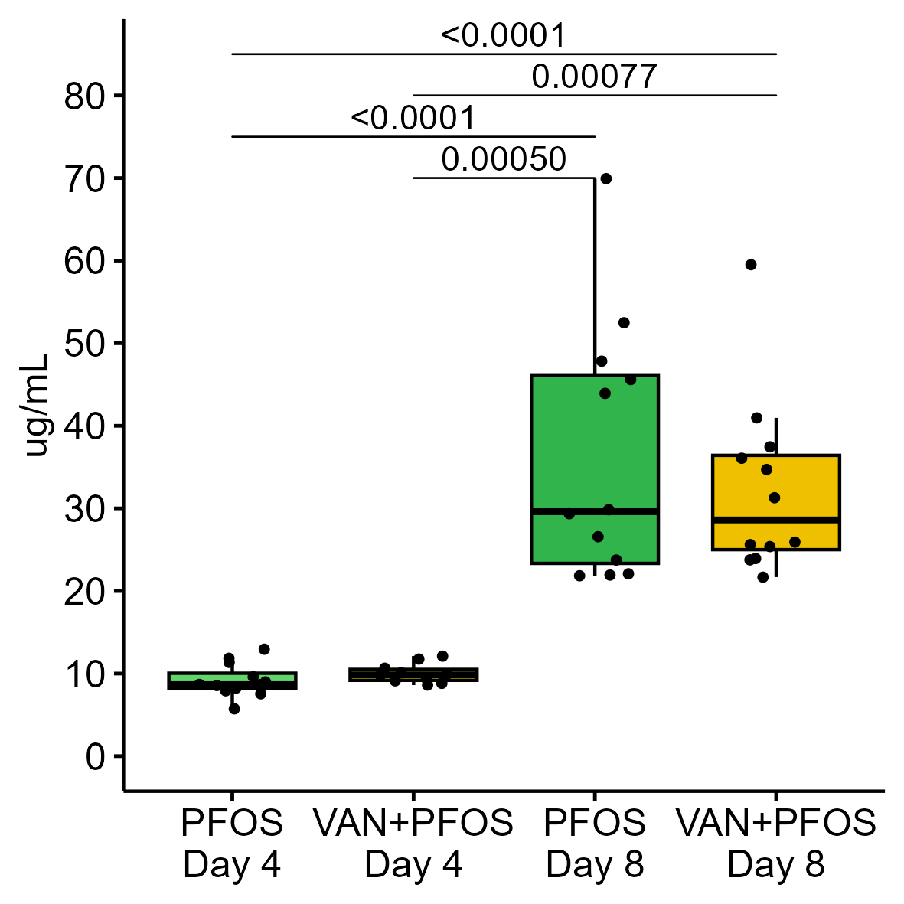
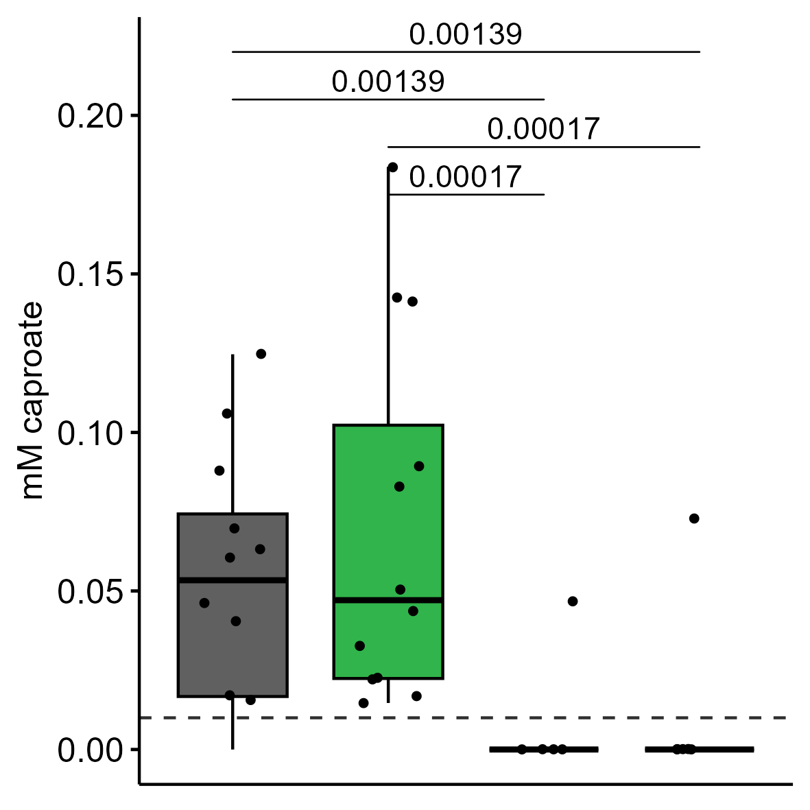

# INFO

This document contains the commands necessary to analyse experimental data obtained from Flurex (internal project name: R20-22). The project data contains:
- Animal weight data including calculated weights per bw and normalized weight data in decimals:
  + body weight (bw) from day 0 to day 8, including bw gain from day 0 - 8
  + liver and cecum weight from dissection on day 8

- PFOS quantitative data:
  + total dosed PFOS per rat on day 4 and 8 respectively (mg)
  + blood day 4 and 8 in ug PFOS/mL serum including calculations on
    + total blood volume per animal based on an standard average of 64mL blood / kilogram in rats ["Diehl et al. 2001"]("https://doi.org/10.1002/jat.727")
    + total PFOS in blood volume (mg)
    + total PFOS detected in blood from total dosed per day (pct)
  + liver from dissection on day 8 in ug PFOS/g tissue including calculations on
    + total pfos in liver per rat (mg)
    + total PFOS detected in liver from total dosed on day 8 (pct)

- Short-chain fatty acids quantification of 10 compounds in colonic water given in mM from day 8:
  + acetic acid, formic acid, propanoic acid, 2-methyl-propanoic acid, butanoic acid, 3-methyl-butanoic acid, pentanoic acid, 4-methyl-pentanoic acid, hexanoic acid and heptanoic acid

# Setup 
Following code loads packages, creates necessary folder and saves parameters for the following analyses.
```{r setup, eval=TRUE, echo=TRUE, message=FALSE, warning = FALSE}
knitr::opts_chunk$set(echo = TRUE)

# Load libraries
library(tidyverse)
library(phyloseq)
library(decontam)
library(pals)
library(ggpubr)
library(vegan)
library(phangorn)
library(kableExtra)
library(plotly)
library(rstatix)
library(forcats)
library(dplyr)
library(tidyr)
library(ggplot2)
library(ggbreak)

# Create used folders if missing
if (!file.exists("R_objects")) dir.create(file.path(getwd(), "R_objects"))
if (!file.exists("plots")) dir.create(file.path(getwd(), "plots"))
if (!file.exists("plots/animal_data")) dir.create(file.path(getwd(), "plots/animal_data"))
if (!file.exists("scripts")) dir.create(file.path(getwd(), "scripts"))

# Save params
saveRDS(params, file = "R_objects/animal_params.RDS")
```

# LOAD DATA
Loading data from CSV-format and saves as Rdata-format.
```{r , eval=TRUE, echo=TRUE, error=TRUE}
params <- readRDS("R_objects/animal_params.RDS")
# Load analysis data
dat <- read.csv(params$input, header = TRUE, sep = ";", dec = ",")

save(dat, file = "R_objects/animal_data.Rdata")

# clear the environment and release memory
rm(list = ls(all.names = TRUE)) #will clear all objects includes hidden objects.
invisible(gc()) #free up memory and report the memory usage.
```


# ANIMAL WEIGHT DATA {.tabset .tabset-fade .tabset-pills}
Animal weight data contains data from body weight through the entire study period with calculated body weight gain, and organ weights from cecum and liver. 

## Body weight gain 
This section will prepare to perform the data analysis for body weight gain

### Statistics
#### **Prepare data**

This section sets the variables to be used and prepares the data if necessary.

```{r, eval=TRUE}
# load data 
load("R_objects/animal_data.Rdata")
params <- readRDS("R_objects/animal_params.RDS")
dat.clean <- dat
#dat.clean <- dat %>% select_if(~ !any(is.na(.)))
#dat.clean <- subset(dat, !dat$rat_name %in% c("R01","R30"))

# Set names of variables
PREDICTOR <- "treatment"#c("treatment","pfos","van")
OUTCOME <- "bw_gain"
SUBJECT <- "rat_name"

# Create formula
PREDICTOR.F <- ifelse(length(PREDICTOR) > 1, paste(PREDICTOR, collapse = "*"), PREDICTOR)
FORMULA <- as.formula(paste(OUTCOME,PREDICTOR.F, sep = " ~ "))

# Summary samples in groups
dat.clean %>% group_by(across(all_of(PREDICTOR))) %>% get_summary_stats(!!sym(OUTCOME), type = "mean_sd")
```

#### **Visualise**

Create a boxplot of the data.

```{r , eval=TRUE, echo=TRUE, error=TRUE}
# Create plot
bxp <- dat.clean %>%
  ggboxplot(x = if_else(length(PREDICTOR) > 1, PREDICTOR[2],PREDICTOR[1]),
            y = OUTCOME,
            color = PREDICTOR[1],
            facet.by = if(length(PREDICTOR) == 3) PREDICTOR[3],
            palette = params$COL)
bxp

```
#### **Assumptions and preliminary tests**

The ANOVA tests assume the following characteristics about the data:

-   **Independence of the observations.** Each subject should belong to only one group. There is no relationship between the observations in each group.\
    *This is already done for the whole project*

-   **No significant outliers** in the two groups

-   **Normality.** the data for each group should be approximately normally distributed.

-   **Homogeneity of variances.** the variance of the outcome variable should be equal in each group.

In this section, we'll perform some preliminary tests to check whether these assumptions are met.

**Identify outliers**\
Outliers can be easily identified using boxplot methods, implemented in the R function identify_outliers() [rstatix package].

```{r, eval=TRUE}
# Test for outliers
dat.clean %>% 
  group_by(across(all_of(PREDICTOR))) %>% 
  identify_outliers(!!sym(OUTCOME))
```

Data contains two outliers: sample from rat_name R01 and R30. 

**Check normality**\
QQ plot and Shapiro-Wilk test of normality are used to analyze the model residuals.

```{r , eval=TRUE, echo=TRUE, error=TRUE}
# Build the linear model
model  <- lm(FORMULA, data = dat.clean)
# Create a QQ plot of residuals
ggqqplot(residuals(model))
# Compute Shapiro-Wilk test of normality
shapiro_test(residuals(model))
```

**Test homogneity of variance assumption**\
1. The residuals versus fits plot can be used to check the homogeneity of variances.

```{r , eval=TRUE, echo=TRUE, error=TRUE}
plot(model, 1)
```

2.  It's also possible to use the Levene's test to check the homogeneity of variances:

```{r , eval=TRUE, echo=TRUE, error=TRUE}
dat.clean %>% levene_test(FORMULA)

# Save result
EQUAL.VAR <- dat.clean %>% levene_test(FORMULA) %>% pull(p) > 0.05

```

This shows that body weight gain data has two outliers, has equal variance and is normally distributed without the outliers according to Shapiro-Wilk test. Therefore we use a **one-way ANOVA test with Tukey's honest significance test**.

#### ANOVA One-Way test

##### **Perform test**

If we had equality of variance we can now run a one-way ANOVA tests `anova_test()` (if we have equal variance) or a `welch_anova_test()` (if variance vary).

```{r , eval=TRUE, echo=TRUE, error=TRUE}

if(EQUAL.VAR) {
  res.aov <- dat.clean %>% anova_test(FORMULA)
  res.aov
} else {
  res.aov <- dat.clean %>% welch_anova_test(FORMULA)
  res.aov
}

```

##### **Perform posthoc test**

A significant one-way ANOVA is generally followed up by Tukey post-hoc tests to perform multiple pairwise comparisons between groups. When running relaxed Welch one-way test, the Games-Howell post hoc test or pairwise t-tests (with no assumption of equal variances) can be used to compare all possible combinations of group differences.

```{r , eval=TRUE, echo=TRUE, error=TRUE}
if(EQUAL.VAR) {
  pwc <- dat.clean %>% tukey_hsd(FORMULA)
  pwc
} else {
  pwc <- dat.clean %>% games_howell_test(FORMULA)
  pwc
}
```

### Create figure
```{r , eval=TRUE, echo=TRUE}
## Prepare statistical information:
pwc.adj <- pwc %>% 
  add_x_position(x = PREDICTOR) %>%
  p_format("p.adj", accuracy = 0.0001, trailing.zero = TRUE, new.col = TRUE)

# Format for ggplot
if (sum(pwc.adj$p.adj.signif != "ns") == 0) {
  stat.sig <- pwc.adj %>%
    add_y_position(step.increase = 0.25) %>%
    mutate(y.position = seq(min(y.position), max(y.position),length.out = n()))
} else {
  stat.sig <- pwc.adj[pwc.adj$p.adj.signif != "ns",] %>%
    add_y_position(step.increase = 0.25) %>%
    mutate(y.position = seq(min(y.position), max(y.position),length.out = n()))
}

# Create plot
p <- ggboxplot(dat.clean, x = PREDICTOR, y = OUTCOME,
          fill = PREDICTOR,
          add =  "jitter",
          add.params = list(size = 1)) +
  scale_fill_manual(values = params$COL) +
  scale_y_continuous(name = "Bodyweight gain",limits = c(5,25),breaks = seq(5,25,5), labels = function(x) paste0(x, "%")) +
  labs(fill = "Treatment") +
  scale_x_discrete(name = "Treatment")

p <- p + stat_pvalue_manual(stat.sig, label = "p.adj.format",tip.length = 0, hide.ns = TRUE)
p
# Plot for saving without legend
p2 <- p + theme(legend.position = "none")

# Output plot
ggsave(filename = paste0("plots/animal_data/weight/",OUTCOME,"_plot.png"), p2, device = "png", dpi = 300, units = "mm", width = 100, height = 100)
ggsave(filename = paste0("plots/animal_data/weight/",OUTCOME,"_plot.pdf"), p2, device = "pdf", dpi = 300, units = "mm", width = 100, height = 100)

# clear the environment and release memory
rm(list = ls(all.names = TRUE)) #will clear all objects includes hidden objects.
invisible(gc()) #free up memory and report the memory usage.
```

{width="100%"}

## Cecum weight (normalized)
This section will prepare to perform the data analysis for normalized cecum weight data

### Statistics
#### **Prepare data**

This section sets the variables to be used and prepares the data if necessary.

```{r, eval=TRUE}
# load data 
load("R_objects/animal_data.Rdata")
params <- readRDS("R_objects/animal_params.RDS")
dat.clean <- subset(dat, !is.na(cecum_norm))

# Set names of variables
PREDICTOR <- "treatment"#c("treatment","pfos","van")
OUTCOME <- "cecum_norm"
SUBJECT <- "rat_name"

# Create formula
PREDICTOR.F <- ifelse(length(PREDICTOR) > 1, paste(PREDICTOR, collapse = "*"), PREDICTOR)
FORMULA <- as.formula(paste(OUTCOME,PREDICTOR.F, sep = " ~ "))

# Summary samples in groups
dat.clean %>% group_by(across(all_of(PREDICTOR))) %>% get_summary_stats(!!sym(OUTCOME), type = "mean_sd")
```

#### **Visualise**

Create a boxplot of the data.

```{r , eval=TRUE, echo=TRUE, error=TRUE}
# Create plot
bxp <- dat.clean %>%
  ggboxplot(x = if_else(length(PREDICTOR) > 1, PREDICTOR[2],PREDICTOR[1]),
            y = OUTCOME,
            color = PREDICTOR[1],
            facet.by = if(length(PREDICTOR) == 3) PREDICTOR[3],
            palette = params$COL)
bxp

```
#### **Assumptions and preliminary tests**

The ANOVA tests assume the following characteristics about the data:

-   **Independence of the observations.** Each subject should belong to only one group. There is no relationship between the observations in each group.\
    *This is already done for the whole project*

-   **No significant outliers** in the two groups

-   **Normality.** the data for each group should be approximately normally distributed.

-   **Homogeneity of variances.** the variance of the outcome variable should be equal in each group.

In this section, we'll perform some preliminary tests to check whether these assumptions are met.

**Identify outliers**\
Outliers can be easily identified using boxplot methods, implemented in the R function identify_outliers() [rstatix package].

```{r, eval=TRUE}
# Test for outliers
dat.clean %>% 
  group_by(across(all_of(PREDICTOR))) %>% 
  identify_outliers(!!sym(OUTCOME))
```

Data contains two outliers.

**Check normality**\
QQ plot and Shapiro-Wilk test of normality are used to analyze the model residuals.

```{r , eval=TRUE, echo=TRUE, error=TRUE}
# Build the linear model
model  <- lm(FORMULA, data = dat.clean)
# Create a QQ plot of residuals
ggqqplot(residuals(model))
# Compute Shapiro-Wilk test of normality
shapiro_test(residuals(model))
```

**Test homogneity of variance assumption**\
1. The residuals versus fits plot can be used to check the homogeneity of variances.

```{r , eval=TRUE, echo=TRUE, error=TRUE}
plot(model, 1)
```

2.  It's also possible to use the Levene's test to check the homogeneity of variances:

```{r , eval=TRUE, echo=TRUE, error=TRUE}
dat.clean %>% levene_test(FORMULA)

# Save result
EQUAL.VAR <- dat.clean %>% levene_test(FORMULA) %>% pull(p) > 0.05

```

This shows that normalised cecum weight data has two outliers, is normally distribution and has equal variance. Therefore we use a **one-way ANOVA test with Tukey's honest significance test**.

#### ANOVA One-Way test

##### **Perform test**

If we had equality of variance we can now run a one-way ANOVA tests `anova_test()` (if we have equal variance) or a `welch_anova_test()` (if variance vary).

```{r , eval=TRUE, echo=TRUE, error=TRUE}

if(EQUAL.VAR) {
  res.aov <- dat.clean %>% anova_test(FORMULA)
  res.aov
} else {
  res.aov <- dat.clean %>% welch_anova_test(FORMULA)
  res.aov
}

```

##### **Perform posthoc test**

A significant one-way ANOVA is generally followed up by Tukey post-hoc tests to perform multiple pairwise comparisons between groups. When running relaxed Welch one-way test, the Games-Howell post hoc test or pairwise t-tests (with no assumption of equal variances) can be used to compare all possible combinations of group differences.

```{r , eval=TRUE, echo=TRUE, error=TRUE}
if(EQUAL.VAR) {
  pwc <- dat.clean %>% tukey_hsd(FORMULA)
  pwc
} else {
  pwc <- dat.clean %>% games_howell_test(FORMULA)
  pwc
}
```

### Create figure
```{r , eval=TRUE, echo=TRUE}
## Prepare statistical information:
pwc.adj <- pwc %>% 
  add_x_position(x = PREDICTOR) %>%
  p_format("p.adj", accuracy = 0.0001, trailing.zero = TRUE, new.col = TRUE)

# Format for ggplot
if (sum(pwc.adj$p.adj.signif != "ns") == 0) {
  stat.sig <- pwc.adj %>%
    add_y_position(step.increase = 0.25) %>%
    mutate(y.position = seq(min(y.position), max(y.position),length.out = n()))
} else {
  stat.sig <- pwc.adj[pwc.adj$p.adj.signif != "ns",] %>%
    add_y_position(step.increase = 0.25) %>%
    mutate(y.position = seq(min(y.position), max(y.position),length.out = n()))
}

# Create plot
p <- ggboxplot(dat.clean, x = PREDICTOR, y = OUTCOME,
          fill = PREDICTOR,
          add =  "jitter",
          add.params = list(size = 1)) +
  scale_fill_manual(values = params$COL) +
  scale_y_continuous(name = "% difference",limits = c(0.5,3.1),breaks = seq(0.5,3.1,0.5), labels = function(x) paste0(x*100, "%")) +
  labs(fill = "Treatment") +
  scale_x_discrete(name = "Treatment")

p <- p + stat_pvalue_manual(stat.sig, label = "p.adj.format",tip.length = 0, hide.ns = TRUE, y.position = c(2.2,2.8,2.5,3.1))
p

# Plot for saving without legend
p2 <- p + theme(legend.position = "none")

ggsave(filename = paste0("plots/animal_data/weight/",OUTCOME,"_plot.png"), p2, device = "png", dpi = 300, units = "mm", width = 100, height = 100)
ggsave(filename = paste0("plots/animal_data/weight/",OUTCOME,"_plot.pdf"), p2, device = "pdf", dpi = 300, units = "mm", width = 100, height = 100)

# clear the environment and release memory
rm(list = ls(all.names = TRUE)) #will clear all objects includes hidden objects.
invisible(gc()) #free up memory and report the memory usage.
```

{width="100%"}

## Liver weight (normalized)
This section will prepare to perform the data analysis for normalized liver weight data

### Statistics
#### **Prepare data**

This section sets the variables to be used and prepares the data if necessary.

```{r, eval=TRUE}
# load data 
load("R_objects/animal_data.Rdata")
params <- readRDS("R_objects/animal_params.RDS")
# Remove NA in the data column
dat.clean <- subset(dat, !is.na(liver_norm))

# Set names of variables
PREDICTOR <- "treatment"#c("treatment","pfos","van")
OUTCOME <- "liver_norm"
SUBJECT <- "rat_name"

# Create formula
PREDICTOR.F <- ifelse(length(PREDICTOR) > 1, paste(PREDICTOR, collapse = "*"), PREDICTOR)
FORMULA <- as.formula(paste(OUTCOME,PREDICTOR.F, sep = " ~ "))

# Summary samples in groups
dat.clean %>% group_by(across(all_of(PREDICTOR))) %>% get_summary_stats(!!sym(OUTCOME), type = "mean_sd")
```

#### **Visualise**

Create a boxplot of the data.

```{r , eval=TRUE, echo=TRUE, error=TRUE}
# Create plot
bxp <- dat.clean %>%
  ggboxplot(x = if_else(length(PREDICTOR) > 1, PREDICTOR[2],PREDICTOR[1]),
            y = OUTCOME,
            color = PREDICTOR[1],
            facet.by = if(length(PREDICTOR) == 3) PREDICTOR[3],
            palette = params$COL)
bxp

```
#### **Assumptions and preliminary tests**

The ANOVA tests assume the following characteristics about the data:

-   **Independence of the observations.** Each subject should belong to only one group. There is no relationship between the observations in each group.\
    *This is already done for the whole project*

-   **No significant outliers** in the two groups

-   **Normality.** the data for each group should be approximately normally distributed.

-   **Homogeneity of variances.** the variance of the outcome variable should be equal in each group.

In this section, we'll perform some preliminary tests to check whether these assumptions are met.

**Identify outliers**\
Outliers can be easily identified using boxplot methods, implemented in the R function identify_outliers() [rstatix package].

```{r, eval=TRUE}
# Test for outliers
dat.clean %>% 
  group_by(across(all_of(PREDICTOR))) %>% 
  identify_outliers(!!sym(OUTCOME))
```

Data contains zero outliers.

**Check normality**\
QQ plot and Shapiro-Wilk test of normality are used to analyze the model residuals.

```{r , eval=TRUE, echo=TRUE, error=TRUE}
# Build the linear model
model  <- lm(FORMULA, data = dat.clean)
# Create a QQ plot of residuals
ggqqplot(residuals(model))
# Compute Shapiro-Wilk test of normality
shapiro_test(residuals(model))
```

**Test homogneity of variance assumption**\
1. The residuals versus fits plot can be used to check the homogeneity of variances.

```{r , eval=TRUE, echo=TRUE, error=TRUE}
plot(model, 1)
```

2.  It's also possible to use the Levene's test to check the homogeneity of variances:

```{r , eval=TRUE, echo=TRUE, error=TRUE}
dat.clean %>% levene_test(FORMULA)

# Save result
EQUAL.VAR <- dat.clean %>% levene_test(FORMULA) %>% pull(p) > 0.05

```

This shows that normalised liver weight data has two outliers, is normally distribution and has equal variance. Therefore we use a **one-way ANOVA test with Tukey's honest significance test**.

#### ANOVA One-Way test

##### **Perform test**

If we had equality of variance we can now run a one-way ANOVA tests `anova_test()` (if we have equal variance) or a `welch_anova_test()` (if variance vary).

```{r , eval=TRUE, echo=TRUE, error=TRUE}

if(EQUAL.VAR) {
  res.aov <- dat.clean %>% anova_test(FORMULA)
  res.aov
} else {
  res.aov <- dat.clean %>% welch_anova_test(FORMULA)
  res.aov
}

```

##### **Perform posthoc test**

A significant one-way ANOVA is generally followed up by Tukey post-hoc tests to perform multiple pairwise comparisons between groups. When running relaxed Welch one-way test, the Games-Howell post hoc test or pairwise t-tests (with no assumption of equal variances) can be used to compare all possible combinations of group differences.

```{r , eval=TRUE, echo=TRUE, error=TRUE}
if(EQUAL.VAR) {
  pwc <- dat.clean %>% tukey_hsd(FORMULA)
  pwc
} else {
  pwc <- dat.clean %>% games_howell_test(FORMULA)
  pwc
}
```


#### Create figure
```{r , eval=TRUE, echo=TRUE}
## Prepare statistical information:
pwc.adj <- pwc %>% 
  add_x_position(x = PREDICTOR) %>%
  p_format("p.adj", accuracy = 0.0001, trailing.zero = TRUE, new.col = TRUE)

# Format for ggplot
if (sum(pwc.adj$p.adj.signif != "ns") == 0) {
  stat.sig <- pwc.adj %>%
    add_y_position(step.increase = 0.25) %>%
    mutate(y.position = seq(min(y.position), max(y.position),length.out = n()))
} else {
  stat.sig <- pwc.adj[pwc.adj$p.adj.signif != "ns",] %>%
    add_y_position(step.increase = 0.25) %>%
    mutate(y.position = seq(min(y.position), max(y.position),length.out = n()))
}

# Create plot
p <- ggboxplot(dat.clean, x = PREDICTOR, y = OUTCOME,
          fill = PREDICTOR,
          add =  "jitter",
          add.params = list(size = 1)) +
  scale_fill_manual(values = params$COL) +
  scale_y_continuous(name = "% difference",limits = c(0.75,1.5),breaks = seq(0.75,1.5,0.25), labels = function(x) paste0(x*100, "%")) +
  labs(fill = "Treatment") +
  scale_x_discrete(name = "Treatment")

p <- p + stat_pvalue_manual(stat.sig, label = "p.adj.format",tip.length = 0, hide.ns = TRUE, y.position = c(1.35,1.4,1.45,1.5))
p

# Plot for saving without legend
p2 <- p + theme(legend.position = "none")

ggsave(filename = paste0("plots/animal_data/weight/",OUTCOME,"_plot.png"), p2, device = "png", dpi = 300, units = "mm", width = 100, height = 100)
ggsave(filename = paste0("plots/animal_data/weight/",OUTCOME,"_plot.pdf"), p2, device = "pdf", dpi = 300, units = "mm", width = 100, height = 100)

# clear the environment and release memory
rm(list = ls(all.names = TRUE)) #will clear all objects includes hidden objects.
invisible(gc()) #free up memory and report the memory usage.
```

{width="100%"}

# PFOS QUANTITATIVE DATA {.tabset .tabset-fade .tabset-pills}
Following section handles data analysis of PFOS from serum and liver samples (Run on Dionex Ultimate 3000 / Bruker EVOQ Elite UPLC-MS/MS against linear PPOS standard curve and with internal MPFOS standard).

## Blood serum day 4
This section will prepare to perform the data analysis for PFOS data from serum on day 4.

### ug/mL in serum 
#### **Prepare data**

This section sets the variables to be used and prepares the data if necessary.

```{r, eval=TRUE}
# load data 
load("R_objects/animal_data.Rdata")
params <- readRDS("R_objects/animal_params.RDS")
# Remove rows with NA
dat.clean <- subset(dat, !is.na(pfos_serum4_ugml))
#dat.clean <- dat %>% select_if(~ !any(is.na(.)))
#dat.clean <- subset(dat, !dat$rat_name %in% c("R01","R30"))

# Set names of variables
PREDICTOR <- "treatment"#c("treatment","pfos","van")
OUTCOME <- "pfos_serum4_ugml"
SUBJECT <- "rat_name"

# Create formula
PREDICTOR.F <- ifelse(length(PREDICTOR) > 1, paste(PREDICTOR, collapse = "*"), PREDICTOR)
FORMULA <- as.formula(paste(OUTCOME,PREDICTOR.F, sep = " ~ "))

# Summary samples in groups
dat.clean %>% group_by(across(all_of(PREDICTOR))) %>% get_summary_stats(!!sym(OUTCOME), type = "mean_sd")
```

#### **Visualise**

Create a boxplot of the data.

```{r , eval=TRUE, echo=TRUE, error=TRUE}
# Create plot
bxp <- dat.clean %>%
  ggboxplot(x = if_else(length(PREDICTOR) > 1, PREDICTOR[2],PREDICTOR[1]),
            y = OUTCOME,
            color = PREDICTOR[1],
            facet.by = if(length(PREDICTOR) == 3) PREDICTOR[3],
            palette = params$COL)
bxp

```
#### **Assumptions and preliminary tests**

The ANOVA tests assume the following characteristics about the data:

-   **Independence of the observations.** Each subject should belong to only one group. There is no relationship between the observations in each group.\
    *This is already done for the whole project*

-   **No significant outliers** in the two groups

-   **Normality.** the data for each group should be approximately normally distributed.

-   **Homogeneity of variances.** the variance of the outcome variable should be equal in each group.

In this section, we'll perform some preliminary tests to check whether these assumptions are met.

**Identify outliers**\
Outliers can be easily identified using boxplot methods, implemented in the R function identify_outliers() [rstatix package].

```{r, eval=TRUE}
# Test for outliers
dat.clean %>% 
  group_by(across(all_of(PREDICTOR))) %>% 
  identify_outliers(!!sym(OUTCOME))
```

Data contains two outliers: sample from rat_name R01 and R30. 

**Check normality**\
QQ plot and Shapiro-Wilk test of normality are used to analyze the model residuals.

```{r , eval=TRUE, echo=TRUE, error=TRUE}
# Build the linear model
model  <- lm(FORMULA, data = dat.clean)
# Create a QQ plot of residuals
ggqqplot(residuals(model))
# Compute Shapiro-Wilk test of normality
shapiro_test(residuals(model))
```

**Test homogneity of variance assumption**\
1. The residuals versus fits plot can be used to check the homogeneity of variances.

```{r , eval=TRUE, echo=TRUE, error=TRUE}
plot(model, 1)
```

2.  It's also possible to use the Levene's test to check the homogeneity of variances:

```{r , eval=TRUE, echo=TRUE, error=TRUE}
dat.clean %>% levene_test(FORMULA)

# Save result
EQUAL.VAR <- dat.clean %>% levene_test(FORMULA) %>% pull(p) > 0.05

```

This shows that body weight gain data has two outliers and has equal variance, however falls short on the Shapiro-Wilk test of normality and is therefore not normally distributed. Therefore we use a **non-parametric Kruskal-Wallis test with Dunn's p-value adjustment**.

#### Kruskal-Wallis test

###### **Perform test**

```{r , eval=TRUE, echo=TRUE, error=TRUE}

res.aov <- dat.clean %>% kruskal_test(FORMULA)
res.aov

```

###### **Effect size**

The eta squared, based on the H-statistic, can be used as the measure of the Kruskal-Wallis test effect size. The interpretation values commonly in published literature are: 0.01- \< 0.06 (small effect), 0.06 - \< 0.14 (moderate effect) and \>= 0.14 (large effect).

```{r , eval=TRUE, echo=TRUE, error=TRUE}

dat.clean %>% kruskal_effsize(FORMULA)

```

###### **Post-hoc test if interaction is significant**

A significant Kruskal-Wallis test is generally followed up by Dunn's test to identify which groups are different. It's also possible to use the Wilcoxon's test to calculate pairwise comparisons between group levels with corrections for multiple testing.

```{r , eval=TRUE, echo=TRUE, error=TRUE}
# pairwise comparisons
pwc <- dat.clean %>% 
  dunn_test(FORMULA, p.adjust.method = "fdr") 
pwc
```


#### Create figure
```{r , eval=TRUE, echo=TRUE}
## Prepare statistical information:
pwc.adj <- pwc %>% 
  add_x_position(x = PREDICTOR) %>%
  p_format("p.adj", accuracy = 0.0001, trailing.zero = TRUE, new.col = TRUE)

# Format for ggplot
if (sum(pwc.adj$p.adj.signif != "ns") == 0) {
  stat.sig <- pwc.adj %>%
    add_y_position(step.increase = 0.25) %>%
    mutate(y.position = seq(min(y.position), max(y.position),length.out = n()))
} else {
  stat.sig <- pwc.adj[pwc.adj$p.adj.signif != "ns",] %>%
    add_y_position(step.increase = 0.25) %>%
    mutate(y.position = seq(min(y.position), max(y.position),length.out = n()))
}

# Create plot
p <- ggboxplot(dat, x = PREDICTOR, y = OUTCOME,
          fill = PREDICTOR,
          add =  "jitter",
          add.params = list(size = 1)) +
  scale_fill_manual(values = params$COL) +
  scale_y_continuous(name = "ug/mL",limits = c(0,20),breaks = seq(0,20,5)) +
  labs(fill = "Treatment") +
  scale_x_discrete(name = "Treatment")

p <- p + stat_pvalue_manual(stat.sig, label = "p.adj.format",tip.length = 0, hide.ns = TRUE, y.position = c(14,17,15,14))
p

# Plot for saving without legend
p2 <- p + theme(legend.position = "none")

ggsave(filename = paste0("plots/animal_data/pfos/",OUTCOME,"_plot.png"), p2, device = "png", dpi = 300, units = "mm", width = 100, height = 100)
ggsave(filename = paste0("plots/animal_data/pfos/",OUTCOME,"_plot.pdf"), p2, device = "pdf", dpi = 300, units = "mm", width = 100, height = 100)

# clear the environment and release memory
rm(list = ls(all.names = TRUE)) #will clear all objects includes hidden objects.
invisible(gc()) #free up memory and report the memory usage.
```
{width="100%"}

### Total mg in serum 
#### **Prepare data**

This section sets the variables to be used and prepares the data if necessary.

```{r, eval=TRUE}
# load data 
load("R_objects/animal_data.Rdata")
params <- readRDS("R_objects/animal_params.RDS")
# Set names of variables
PREDICTOR <- "treatment"
OUTCOME <- "pfos_serum4_mg"
SUBJECT <- "rat_name"

# Subset to a specific varible
dat.clean <- subset(dat, pfos == "yes")

# Remove rows with NA
dat.clean <- subset(dat.clean, !is.na(pfos_serum4_mg))

# Will yoou run a paired test? (set variable to `TRUE` or `FALSE`)
PAIRED <- FALSE

# Create formula
FORMULA <- as.formula(paste(OUTCOME, PREDICTOR, sep = "~"))

# Sort data for paired test
if (PAIRED) {
  # Order data
  dat.clean <- arrange(dat.clean, !!sym(SUBJECT))
  
  # Remove unpaired samples
  dat.clean <- dat.clean %>% 
    group_by(!!sym(SUBJECT)) %>%
    filter(n() != 1) %>%
    arrange(!!sym(PREDICTOR), !!sym(SUBJECT)) %>%
    droplevels() %>% 
    ungroup()
}

```

#### **Assumptions and preliminary tests**

The two-samples t-tests assume the following characteristics about the data:

-   **Independence of the observations.** Each subject should belong to only one group. There is no relationship between the observations in each group.\
    *This is already done for the whole project*

-   **No significant outliers** in the two groups

-   **Normality.** the data for each group should be approximately normally distributed.

-   **Homogeneity of variances.** the variance of the outcome variable should be equal in each group.

In this section, we'll perform some preliminary tests to check whether these assumptions are met.

**Identify outliers**\
Outliers can be easily identified using boxplot methods, implemented in the R function identify_outliers() [rstatix package].

```{r , eval=TRUE, echo=TRUE, error=TRUE}
# identify outliers
dat.clean %>%
  group_by(!!sym(PREDICTOR)) %>%
  identify_outliers(!!sym(OUTCOME))
```

Any extreme outliers can be bad samples or errors in data entry. If outliers compare a test with and without the outlier to determine if it is important, or run a non-parametric Wilcoxon test.

**Check normality by groups**\
The normality assumption can be checked by computing the Shapiro-Wilk test for each group. If the data is normally distributed, the p-value should be greater than 0.05. You can also create QQ plots for each group. QQ plot draws the correlation between a given data and the normal distribution.

> If your sample size is greater than 50, the normal QQ plot is preferred because at larger sample sizes the Shapiro-Wilk test becomes very sensitive even to a minor deviation from normality.

Consequently, we should not rely on only one approach for assessing the normality. A better strategy is to combine visual inspection and statistical test.

```{r , eval=TRUE, echo=TRUE, error=TRUE}
# Run Shapiro test
dat.clean %>% 
  group_by(!!sym(PREDICTOR)) %>%
  shapiro_test(!!sym(OUTCOME))
  
# Create QQplot
ggqqplot(dat.clean, x = OUTCOME, facet.by = PREDICTOR)

```

If both Shapiro test has p \> 0.05 and/ or the QQplot follows the reference line the data follows a normal distribution.

> If the data does not follow the normal distribution run a **Wilcoxon Rank-sum test**

**Check the equality of variances**\
This can be done using the Levene's test. If the variances of groups are equal, the p-value should be greater than 0.05.

```{r, warning=F}
# Run test
dat.clean %>% levene_test(FORMULA)

# Save output
EQUAL.VAR <- dat.clean %>% levene_test(FORMULA) %>% pull(p) > 0.05

```

If the p-value of the Levene's test is significant, it suggests that there is a significant difference between the variances of the two groups. In such case we should use Welch t-test, which doesn't assume the equality of the two variances (`var.equal=FALSE`). If the Levene's test is non-significant we can perform a Student t-test (`var.equal=TRUE`).

No outliers were identified. Data is normally distributed and has equal variance. Hence we use **t-test**.

#### PERFORM TEST

**T-test**\
We are now ready to perform the test

```{r , eval=TRUE, echo=TRUE, error=TRUE}
stat.test <- dat.clean %>% 
  t_test(FORMULA,
         var.equal = EQUAL.VAR,
         detailed = TRUE,
         paired = FALSE,
         alternative = "two.sided") %>%
  add_significance()
stat.test

```

The output provides:

-   `.y.`: the y variable used in the test.

-   `group1,group2`: the compared groups in the pairwise tests.

-   `statistic`: Test statistic used to compute the p-value.

-   `df`: degrees of freedom.

-   `p`: p-value.

-   `p.adj`: the adjusted p-value.

-   `method`: the statistical test used to compare groups.

-   `p.signif, p.adj.signif`: the significance level of p-values and adjusted p-values, respectively.

-   `estimate`: estimate of the effect size. It corresponds to the estimated mean or difference in means depending on whether it was a one-sample test or a two-sample test.

-   `estimate1, estimate2`: show the mean values of the two groups, respectively, for independent samples t-tests.

-   `alternative`: a character string describing the alternative hypothesis.

-   `conf.low,conf.high`: Lower and upper bound on a confidence interval.

**Effect size**\
The effect size is calculated as Cohen's D

```{r , eval=TRUE, echo=TRUE, error=TRUE}
dat.clean %>% cohens_d(FORMULA, 
                       var.equal = EQUAL.VAR,
                       paired = FALSE)

```

#### Create figure
```{r , eval=TRUE, echo=TRUE}
# Prepare stats
stat.test <- stat.test %>% add_xy_position(x = PREDICTOR)

# Create plot
p <- ggboxplot(dat.clean, x = PREDICTOR, y = OUTCOME,
          fill = PREDICTOR,
          add =  "jitter",
          add.params = list(size = 1)) +
  scale_fill_manual(values = params$COL) +
  scale_y_continuous(name = "mg PFOS",limits = c(0,0.30),breaks = seq(0,0.30,0.1)) +
  labs(fill = "Treatment") +
  scale_x_discrete(name = "Treatment")

p <- p + stat_pvalue_manual(stat.test, tip.length = 0, hide.ns = FALSE, y.position = c(0.28))
p2 <- p + labs(subtitle = get_test_label(stat.test, detailed = TRUE))
p

# Plot for saving without legend
p3 <- p + theme(legend.position = "none")

ggsave(filename = paste0("plots/animal_data/pfos/",OUTCOME,"_plot.png"), p2, device = "png", dpi = 300, units = "mm", width = 90, height = 100)
ggsave(filename = paste0("plots/animal_data/pfos/",OUTCOME,"_plot.pdf"), p3, device = "pdf", dpi = 300, units = "mm", width = 60, height = 100)

# clear the environment and release memory
rm(list = ls(all.names = TRUE)) #will clear all objects includes hidden objects.
invisible(gc()) #free up memory and report the memory usage.
```

{width="100%"}


### Pct. 
Data for PFOS levels in serum at day 4 calculated from the total PFOS dosed at the time point.
#### **Prepare data**

This section sets the variables to be used and prepares the data if necessary.

```{r, eval=TRUE}
# load data 
load("R_objects/animal_data.Rdata")
params <- readRDS("R_objects/animal_params.RDS")
# Set names of variables
PREDICTOR <- "treatment"
OUTCOME <- "pfos_serum4_pct"
SUBJECT <- "rat_name"

# Subset to a specific varible
dat.clean <- subset(dat, pfos == "yes")

# Remove rows with NA
dat.clean <- subset(dat.clean, !is.na(pfos_serum4_pct))

# Will yoou run a paired test? (set variable to `TRUE` or `FALSE`)
PAIRED <- FALSE

# Create formula
FORMULA <- as.formula(paste(OUTCOME, PREDICTOR, sep = "~"))

# Sort data for paired test
if (PAIRED) {
  # Order data
  dat.clean <- arrange(dat.clean, !!sym(SUBJECT))
  
  # Remove unpaired samples
  dat.clean <- dat.clean %>% 
    group_by(!!sym(SUBJECT)) %>%
    filter(n() != 1) %>%
    arrange(!!sym(PREDICTOR), !!sym(SUBJECT)) %>%
    droplevels() %>% 
    ungroup()
}

```

#### **Assumptions and preliminary tests**

The two-samples t-tests assume the following characteristics about the data:

-   **Independence of the observations.** Each subject should belong to only one group. There is no relationship between the observations in each group.\
    *This is already done for the whole project*

-   **No significant outliers** in the two groups

-   **Normality.** the data for each group should be approximately normally distributed.

-   **Homogeneity of variances.** the variance of the outcome variable should be equal in each group.

In this section, we'll perform some preliminary tests to check whether these assumptions are met.

**Identify outliers**\
Outliers can be easily identified using boxplot methods, implemented in the R function identify_outliers() [rstatix package].

```{r , eval=TRUE, echo=TRUE, error=TRUE}
# identify outliers
dat.clean %>%
  group_by(!!sym(PREDICTOR)) %>%
  identify_outliers(!!sym(OUTCOME))
```

Any extreme outliers can be bad samples or errors in data entry. If outliers compare a test with and without the outlier to determine if it is important, or run a non-parametric Wilcoxon test.

**Check normality by groups**\
The normality assumption can be checked by computing the Shapiro-Wilk test for each group. If the data is normally distributed, the p-value should be greater than 0.05. You can also create QQ plots for each group. QQ plot draws the correlation between a given data and the normal distribution.

> If your sample size is greater than 50, the normal QQ plot is preferred because at larger sample sizes the Shapiro-Wilk test becomes very sensitive even to a minor deviation from normality.

Consequently, we should not rely on only one approach for assessing the normality. A better strategy is to combine visual inspection and statistical test.

```{r , eval=TRUE, echo=TRUE, error=TRUE}
# Run Shapiro test
dat.clean %>% 
  group_by(!!sym(PREDICTOR)) %>%
  shapiro_test(!!sym(OUTCOME))
  
# Create QQplot
ggqqplot(dat.clean, x = OUTCOME, facet.by = PREDICTOR)

```

If both Shapiro test has p \> 0.05 and/ or the QQplot follows the reference line the data follows a normal distribution.

> If the data does not follow the normal distribution run a **Wilcoxon Rank-sum test**

**Check the equality of variances**\
This can be done using the Levene's test. If the variances of groups are equal, the p-value should be greater than 0.05.

```{r, warning=F}
# Run test
dat.clean %>% levene_test(FORMULA)

# Save output
EQUAL.VAR <- dat.clean %>% levene_test(FORMULA) %>% pull(p) > 0.05

```

If the p-value of the Levene's test is significant, it suggests that there is a significant difference between the variances of the two groups. In such case we should use Welch t-test, which doesn't assume the equality of the two variances (`var.equal=FALSE`). If the Levene's test is non-significant we can perform a Student t-test (`var.equal=TRUE`).

#### PERFORM TEST

**T-test**\
We are now ready to perform the test

```{r , eval=TRUE, echo=TRUE, error=TRUE}
stat.test <- dat.clean %>% 
  t_test(FORMULA,
         var.equal = EQUAL.VAR,
         detailed = TRUE,
         paired = FALSE,
         alternative = "two.sided") %>%
  add_significance()
stat.test

```

The output provides:

-   `.y.`: the y variable used in the test.

-   `group1,group2`: the compared groups in the pairwise tests.

-   `statistic`: Test statistic used to compute the p-value.

-   `df`: degrees of freedom.

-   `p`: p-value.

-   `p.adj`: the adjusted p-value.

-   `method`: the statistical test used to compare groups.

-   `p.signif, p.adj.signif`: the significance level of p-values and adjusted p-values, respectively.

-   `estimate`: estimate of the effect size. It corresponds to the estimated mean or difference in means depending on whether it was a one-sample test or a two-sample test.

-   `estimate1, estimate2`: show the mean values of the two groups, respectively, for independent samples t-tests.

-   `alternative`: a character string describing the alternative hypothesis.

-   `conf.low,conf.high`: Lower and upper bound on a confidence interval.

**Effect size**\
The effect size is calculated as Cohen's D

```{r , eval=TRUE, echo=TRUE, error=TRUE}
dat.clean %>% cohens_d(FORMULA, 
                       var.equal = EQUAL.VAR,
                       paired = FALSE)

```
#### Create figure
```{r , eval=TRUE, echo=TRUE}
# Prepare stats
stat.test <- stat.test %>% add_xy_position(x = PREDICTOR)

# Create plot
p <- ggboxplot(dat.clean, x = PREDICTOR, y = OUTCOME,
          fill = PREDICTOR,
          add =  "jitter",
          add.params = list(size = 1)) +
  scale_fill_manual(values = params$COL) +
  scale_y_continuous(name = "% of total dosed PFOS", limits = c(3,10),breaks = seq(3,10,1)) +
  labs(fill = "Treatment") +
  scale_x_discrete(name = "Treatment")

p <- p + stat_pvalue_manual(stat.test, tip.length = 0, hide.ns = FALSE) #, y.position = c(1.35,1.4,1.45,1.5))
p2 <- p + labs(subtitle = get_test_label(stat.test, detailed = TRUE))
p

# Plot for saving without legend
p3 <- p + theme(legend.position = "none")

ggsave(filename = paste0("plots/animal_data/pfos/",OUTCOME,"_plot.png"), p2, device = "png", dpi = 300, units = "mm", width = 90, height = 100)
ggsave(filename = paste0("plots/animal_data/pfos/",OUTCOME,"_plot.pdf"), p3, device = "pdf", dpi = 300, units = "mm", width = 60, height = 100)

# clear the environment and release memory
rm(list = ls(all.names = TRUE)) #will clear all objects includes hidden objects.
invisible(gc()) #free up memory and report the memory usage.
```

{width="100%"}

## Blood serum day 8
This section will prepare to perform the data analysis for PFOS data from serum on day 8.

### ug/µL in serum 
#### **Prepare data**

This section sets the variables to be used and prepares the data if necessary.

```{r, eval=TRUE}
# load data 
load("R_objects/animal_data.Rdata")
params <- readRDS("R_objects/animal_params.RDS")
# Remove rows with NA
dat.clean <- subset(dat, !is.na(pfos_serum8_ugml))
#dat.clean <- dat %>% select_if(~ !any(is.na(.)))
#dat.clean <- subset(dat, !dat$rat_name %in% c("R01","R30"))

# Set names of variables
PREDICTOR <- "treatment"#c("treatment","pfos","van")
OUTCOME <- "pfos_serum8_ugml"
SUBJECT <- "rat_name"

# Create formula
PREDICTOR.F <- ifelse(length(PREDICTOR) > 1, paste(PREDICTOR, collapse = "*"), PREDICTOR)
FORMULA <- as.formula(paste(OUTCOME,PREDICTOR.F, sep = " ~ "))

# Summary samples in groups
dat.clean %>% group_by(across(all_of(PREDICTOR))) %>% get_summary_stats(!!sym(OUTCOME), type = "mean_sd")
```

#### **Visualise**

Create a boxplot of the data.

```{r , eval=TRUE, echo=TRUE, error=TRUE}
# Create plot
bxp <- dat.clean %>%
  ggboxplot(x = if_else(length(PREDICTOR) > 1, PREDICTOR[2],PREDICTOR[1]),
            y = OUTCOME,
            color = PREDICTOR[1],
            facet.by = if(length(PREDICTOR) == 3) PREDICTOR[3],
            palette = params$COL)
bxp

```
#### **Assumptions and preliminary tests**

The ANOVA tests assume the following characteristics about the data:

-   **Independence of the observations.** Each subject should belong to only one group. There is no relationship between the observations in each group.\
    *This is already done for the whole project*

-   **No significant outliers** in the two groups

-   **Normality.** the data for each group should be approximately normally distributed.

-   **Homogeneity of variances.** the variance of the outcome variable should be equal in each group.

In this section, we'll perform some preliminary tests to check whether these assumptions are met.

**Identify outliers**\
Outliers can be easily identified using boxplot methods, implemented in the R function identify_outliers() [rstatix package].

```{r, eval=TRUE}
# Test for outliers
dat.clean %>% 
  group_by(across(all_of(PREDICTOR))) %>% 
  identify_outliers(!!sym(OUTCOME))
```

Data contains two outliers: sample from rat_name R01 and R30. 

**Check normality**\
QQ plot and Shapiro-Wilk test of normality are used to analyze the model residuals.

```{r , eval=TRUE, echo=TRUE, error=TRUE}
# Build the linear model
model  <- lm(FORMULA, data = dat.clean)
# Create a QQ plot of residuals
ggqqplot(residuals(model))
# Compute Shapiro-Wilk test of normality
shapiro_test(residuals(model))
```

**Test homogneity of variance assumption**\
1. The residuals versus fits plot can be used to check the homogeneity of variances.

```{r , eval=TRUE, echo=TRUE, error=TRUE}
plot(model, 1)
```

2.  It's also possible to use the Levene's test to check the homogeneity of variances:

```{r , eval=TRUE, echo=TRUE, error=TRUE}
dat.clean %>% levene_test(FORMULA)

# Save result
EQUAL.VAR <- dat.clean %>% levene_test(FORMULA) %>% pull(p) > 0.05

```

This shows that body weight gain data has two outliers and has equal variance, however falls short on the Shapiro-Wilk test of normality and is therefore not normally distributed. Therefore we use a **non-parametric Kruskal-Wallis test with Dunn's p-value adjustment**.

#### Kruskal-Wallis test

###### **Perform test**

```{r , eval=TRUE, echo=TRUE, error=TRUE}

res.aov <- dat.clean %>% kruskal_test(FORMULA)
res.aov

```

###### **Effect size**

The eta squared, based on the H-statistic, can be used as the measure of the Kruskal-Wallis test effect size. The interpretation values commonly in published literature are: 0.01- \< 0.06 (small effect), 0.06 - \< 0.14 (moderate effect) and \>= 0.14 (large effect).

```{r , eval=TRUE, echo=TRUE, error=TRUE}

dat.clean %>% kruskal_effsize(FORMULA)

```

###### **Post-hoc test if interaction is significant**

A significant Kruskal-Wallis test is generally followed up by Dunn's test to identify which groups are different. It's also possible to use the Wilcoxon's test to calculate pairwise comparisons between group levels with corrections for multiple testing.

```{r , eval=TRUE, echo=TRUE, error=TRUE}
# pairwise comparisons
pwc <- dat.clean %>% 
  dunn_test(FORMULA, p.adjust.method = "fdr") 
pwc
```


#### Create figure
```{r , eval=TRUE, echo=TRUE}
## Prepare statistical information:
pwc.adj <- pwc %>% 
  add_x_position(x = PREDICTOR) %>%
  p_format("p.adj", accuracy = 0.0001, trailing.zero = TRUE, new.col = TRUE)

# Format for ggplot
if (sum(pwc.adj$p.adj.signif != "ns") == 0) {
  stat.sig <- pwc.adj %>%
    add_y_position(step.increase = 0.25) %>%
    mutate(y.position = seq(min(y.position), max(y.position),length.out = n()))
} else {
  stat.sig <- pwc.adj[pwc.adj$p.adj.signif != "ns",] %>%
    add_y_position(step.increase = 0.25) %>%
    mutate(y.position = seq(min(y.position), max(y.position),length.out = n()))
}

# Create plot
p <- ggboxplot(dat.clean, x = PREDICTOR, y = OUTCOME,
          fill = PREDICTOR,
          add =  "jitter",
          add.params = list(size = 1)) +
  scale_fill_manual(values = params$COL) +
  scale_y_continuous(name = "ug/mL",limits = c(0,80),breaks = seq(0,80,10)) +
  labs(fill = "Treatment") +
  scale_x_discrete(name = "Treatment")

p <- p + stat_pvalue_manual(stat.sig, label = "p.adj.format",tip.length = 0, hide.ns = TRUE, y.position = c(72,80,75,72))
p

# Plot for saving without legend
p2 <- p + theme(legend.position = "none")

ggsave(filename = paste0("plots/animal_data/pfos/",OUTCOME,"_plot.png"), p2, device = "png", dpi = 300, units = "mm", width = 100, height = 100)
ggsave(filename = paste0("plots/animal_data/pfos/",OUTCOME,"_plot.pdf"), p2, device = "pdf", dpi = 300, units = "mm", width = 100, height = 100)

# clear the environment and release memory
rm(list = ls(all.names = TRUE)) #will clear all objects includes hidden objects.
invisible(gc()) #free up memory and report the memory usage.
```
{width="100%"}

### Total mg in serum 
#### **Prepare data**

This section sets the variables to be used and prepares the data if necessary.

```{r, eval=TRUE}
# load data 
load("R_objects/animal_data.Rdata")
params <- readRDS("R_objects/animal_params.RDS")
# Set names of variables
PREDICTOR <- "treatment"
OUTCOME <- "pfos_serum8_mg"
SUBJECT <- "rat_name"

# Subset to a specific varible
dat.clean <- subset(dat, pfos == "yes")

# Remove rows with NA
dat.clean <- subset(dat.clean, !is.na(pfos_serum8_mg))

# Will yoou run a paired test? (set variable to `TRUE` or `FALSE`)
PAIRED <- FALSE

# Create formula
FORMULA <- as.formula(paste(OUTCOME, PREDICTOR, sep = "~"))

# Sort data for paired test
if (PAIRED) {
  # Order data
  dat.clean <- arrange(dat.clean, !!sym(SUBJECT))
  
  # Remove unpaired samples
  dat.clean <- dat.clean %>% 
    group_by(!!sym(SUBJECT)) %>%
    filter(n() != 1) %>%
    arrange(!!sym(PREDICTOR), !!sym(SUBJECT)) %>%
    droplevels() %>% 
    ungroup()
}

```

#### **Assumptions and preliminary tests**

The two-samples t-tests assume the following characteristics about the data:

-   **Independence of the observations.** Each subject should belong to only one group. There is no relationship between the observations in each group.\
    *This is already done for the whole project*

-   **No significant outliers** in the two groups

-   **Normality.** the data for each group should be approximately normally distributed.

-   **Homogeneity of variances.** the variance of the outcome variable should be equal in each group.

In this section, we'll perform some preliminary tests to check whether these assumptions are met.

**Identify outliers**\
Outliers can be easily identified using boxplot methods, implemented in the R function identify_outliers() [rstatix package].

```{r , eval=TRUE, echo=TRUE, error=TRUE}
# identify outliers
dat.clean %>%
  group_by(!!sym(PREDICTOR)) %>%
  identify_outliers(!!sym(OUTCOME))
```

Any extreme outliers can be bad samples or errors in data entry. If outliers compare a test with and without the outlier to determine if it is important, or run a non-parametric Wilcoxon test.

**Check normality by groups**\
The normality assumption can be checked by computing the Shapiro-Wilk test for each group. If the data is normally distributed, the p-value should be greater than 0.05. You can also create QQ plots for each group. QQ plot draws the correlation between a given data and the normal distribution.

> If your sample size is greater than 50, the normal QQ plot is preferred because at larger sample sizes the Shapiro-Wilk test becomes very sensitive even to a minor deviation from normality.

Consequently, we should not rely on only one approach for assessing the normality. A better strategy is to combine visual inspection and statistical test.

```{r , eval=TRUE, echo=TRUE, error=TRUE}
# Run Shapiro test
dat.clean %>% 
  group_by(!!sym(PREDICTOR)) %>%
  shapiro_test(!!sym(OUTCOME))
  
# Create QQplot
ggqqplot(dat.clean, x = OUTCOME, facet.by = PREDICTOR)

```

If both Shapiro test has p \> 0.05 and/ or the QQplot follows the reference line the data follows a normal distribution.

> If the data does not follow the normal distribution run a **Wilcoxon Rank-sum test**

**Check the equality of variances**\
This can be done using the Levene's test. If the variances of groups are equal, the p-value should be greater than 0.05.

```{r, warning=F}
# Run test
dat.clean %>% levene_test(FORMULA)

# Save output
EQUAL.VAR <- dat.clean %>% levene_test(FORMULA) %>% pull(p) > 0.05

```

If the p-value of the Levene's test is significant, it suggests that there is a significant difference between the variances of the two groups. In such case we should use Welch t-test, which doesn't assume the equality of the two variances (`var.equal=FALSE`). If the Levene's test is non-significant we can perform a Student t-test (`var.equal=TRUE`).

No outliers were identified. Data is normally distributed and has equal variance. Hence we use **t-test**.

#### PERFORM TEST

**T-test**\
We are now ready to perform the test

```{r , eval=TRUE, echo=TRUE, error=TRUE}
stat.test <- dat.clean %>% 
  t_test(FORMULA,
         var.equal = EQUAL.VAR,
         detailed = TRUE,
         paired = FALSE,
         alternative = "two.sided") %>%
  add_significance()
stat.test

```

**Effect size**\
The effect size is calculated as Cohen's D

```{r , eval=TRUE, echo=TRUE, error=TRUE}
dat.clean %>% cohens_d(FORMULA, 
                       var.equal = EQUAL.VAR,
                       paired = FALSE)

```

#### Create figure
```{r , eval=TRUE, echo=TRUE}
# Prepare stats
stat.test <- stat.test %>% add_xy_position(x = PREDICTOR)

# Create plot
p <- ggboxplot(dat.clean, x = PREDICTOR, y = OUTCOME,
          fill = PREDICTOR,
          add =  "jitter",
          add.params = list(size = 1)) +
  scale_fill_manual(values = params$COL) +
  scale_y_continuous(name = "mg PFOS",limits = c(0,2),breaks = seq(0,2,0.5)) +
  labs(fill = "Treatment") +
  scale_x_discrete(name = "Treatment")

p <- p + stat_pvalue_manual(stat.test, tip.length = 0, hide.ns = FALSE, y.position = c(1.75))
p2 <- p + labs(subtitle = get_test_label(stat.test, detailed = TRUE))
p2

# Plot for saving without legend
p3 <- p + theme(legend.position = "none")

ggsave(filename = paste0("plots/animal_data/pfos/",OUTCOME,"_plot.png"), p2, device = "png", dpi = 300, units = "mm", width = 90, height = 100)
ggsave(filename = paste0("plots/animal_data/pfos/",OUTCOME,"_plot.pdf"), p3, device = "pdf", dpi = 300, units = "mm", width = 60, height = 100)

# clear the environment and release memory
rm(list = ls(all.names = TRUE)) #will clear all objects includes hidden objects.
invisible(gc()) #free up memory and report the memory usage.
```

{width="100%"}


### Pct. 
#### **Prepare data**

This section sets the variables to be used and prepares the data if necessary.

```{r, eval=TRUE}
# load data 
load("R_objects/animal_data.Rdata")
params <- readRDS("R_objects/animal_params.RDS")
# Set names of variables
PREDICTOR <- "treatment"
OUTCOME <- "pfos_serum8_pct"
SUBJECT <- "rat_name"

# Subset to a specific varible
dat.clean <- subset(dat, pfos == "yes" & !rat_name == "R47")

# Remove rows with NA
dat.clean <- subset(dat.clean, !is.na(pfos_serum8_pct))

# Will yoou run a paired test? (set variable to `TRUE` or `FALSE`)
PAIRED <- FALSE

# Create formula
FORMULA <- as.formula(paste(OUTCOME, PREDICTOR, sep = "~"))

# Sort data for paired test
if (PAIRED) {
  # Order data
  dat.clean <- arrange(dat.clean, !!sym(SUBJECT))
  
  # Remove unpaired samples
  dat.clean <- dat.clean %>% 
    group_by(!!sym(SUBJECT)) %>%
    filter(n() != 1) %>%
    arrange(!!sym(PREDICTOR), !!sym(SUBJECT)) %>%
    droplevels() %>% 
    ungroup()
}

```

#### **Assumptions and preliminary tests**

The two-samples t-tests assume the following characteristics about the data:

-   **Independence of the observations.** Each subject should belong to only one group. There is no relationship between the observations in each group.\
    *This is already done for the whole project*

-   **No significant outliers** in the two groups

-   **Normality.** the data for each group should be approximately normally distributed.

-   **Homogeneity of variances.** the variance of the outcome variable should be equal in each group.

In this section, we'll perform some preliminary tests to check whether these assumptions are met.

**Identify outliers**\
Outliers can be easily identified using boxplot methods, implemented in the R function identify_outliers() [rstatix package].

```{r , eval=TRUE, echo=TRUE, error=TRUE}
# identify outliers
dat.clean %>%
  group_by(!!sym(PREDICTOR)) %>%
  identify_outliers(!!sym(OUTCOME))
```

Any extreme outliers can be bad samples or errors in data entry. If outliers compare a test with and without the outlier to determine if it is important, or run a non-parametric Wilcoxon test.

**Check normality by groups**\
The normality assumption can be checked by computing the Shapiro-Wilk test for each group. If the data is normally distributed, the p-value should be greater than 0.05. You can also create QQ plots for each group. QQ plot draws the correlation between a given data and the normal distribution.

> If your sample size is greater than 50, the normal QQ plot is preferred because at larger sample sizes the Shapiro-Wilk test becomes very sensitive even to a minor deviation from normality.

Consequently, we should not rely on only one approach for assessing the normality. A better strategy is to combine visual inspection and statistical test.

```{r , eval=TRUE, echo=TRUE, error=TRUE}
# Run Shapiro test
dat.clean %>% 
  group_by(!!sym(PREDICTOR)) %>%
  shapiro_test(!!sym(OUTCOME))
  
# Create QQplot
ggqqplot(dat.clean, x = OUTCOME, facet.by = PREDICTOR)

```

If both Shapiro test has p \> 0.05 and/ or the QQplot follows the reference line the data follows a normal distribution.

> If the data does not follow the normal distribution run a **Wilcoxon Rank-sum test**

**Check the equality of variances**\
This can be done using the Levene's test. If the variances of groups are equal, the p-value should be greater than 0.05.

```{r, warning=F}
# Run test
dat.clean %>% levene_test(FORMULA)

# Save output
EQUAL.VAR <- dat.clean %>% levene_test(FORMULA) %>% pull(p) > 0.05

```

If the p-value of the Levene's test is significant, it suggests that there is a significant difference between the variances of the two groups. In such case we should use Welch t-test, which doesn't assume the equality of the two variances (`var.equal=FALSE`). If the Levene's test is non-significant we can perform a Student t-test (`var.equal=TRUE`).

No outliers were identified. Data is normally distributed and has equal variance. Hence we use **t-test**.


#### PERFORM TEST

**T-test**\
We are now ready to perform the test

```{r , eval=TRUE, echo=TRUE, error=TRUE}
stat.test <- dat.clean %>% 
  t_test(FORMULA,
         var.equal = EQUAL.VAR,
         detailed = TRUE,
         paired = FALSE,
         alternative = "two.sided") %>%
  add_significance()
stat.test

```

**Effect size**\
The effect size is calculated as Cohen's D

```{r , eval=TRUE, echo=TRUE, error=TRUE}
dat.clean %>% cohens_d(FORMULA, 
                       var.equal = EQUAL.VAR,
                       paired = FALSE)

```

#### Create figure
```{r , eval=TRUE, echo=TRUE}
# Prepare stats
stat.test <- stat.test %>% add_xy_position(x = PREDICTOR)

# Create plot
p <- ggboxplot(dat.clean, x = PREDICTOR, y = OUTCOME,
          fill = PREDICTOR,
          add =  "jitter",
          add.params = list(size = 1)) +
  scale_fill_manual(values = params$COL) +
  scale_y_continuous(name = "% of total dosed PFOS", limits = c(5,25),breaks = seq(5,25,5)) +
  labs(fill = "Treatment") +
  scale_x_discrete(name = "Treatment")

p <- p + stat_pvalue_manual(stat.test, tip.length = 0, hide.ns = FALSE, y.position = c(24))
p2 <- p + labs(subtitle = get_test_label(stat.test, detailed = TRUE))
p2

# Plot for saving without legend
p3 <- p + theme(legend.position = "none")

ggsave(filename = paste0("plots/animal_data/pfos/",OUTCOME,"_plot.png"), p2, device = "png", dpi = 300, units = "mm", width = 90, height = 100)
ggsave(filename = paste0("plots/animal_data/pfos/",OUTCOME,"_plot.pdf"), p3, device = "pdf", dpi = 300, units = "mm", width = 60, height = 100)

# clear the environment and release memory
rm(list = ls(all.names = TRUE)) #will clear all objects includes hidden objects.
invisible(gc()) #free up memory and report the memory usage.
```

{width="100%"}

## Blood serum day 4 and 8
This section will prepare to perform the data analysis for PFOS data from serum on day 4 and 8 collected.

### Change from day 4 to 8 (Pct.) 
#### **Prepare data**

This section sets the variables to be used and prepares the data if necessary.

```{r, eval=TRUE}
# load data 
load("R_objects/animal_data.Rdata")
params <- readRDS("R_objects/animal_params.RDS")
# Set names of variables
PREDICTOR <- "treatment"
OUTCOME <- "pfos_change48_pct"
SUBJECT <- "rat_name"

# Subset to a specific varible
dat.clean <- subset(dat, pfos == "yes") # add following to subset() to remove the outliers: & !rat_name %in% c("R47","R27"))

# Remove rows with NA
dat.clean <- subset(dat.clean, !is.na(pfos_change48_pct))

# Will yoou run a paired test? (set variable to `TRUE` or `FALSE`)
PAIRED <- FALSE

# Create formula
FORMULA <- as.formula(paste(OUTCOME, PREDICTOR, sep = "~"))

# Sort data for paired test
if (PAIRED) {
  # Order data
  dat.clean <- arrange(dat.clean, !!sym(SUBJECT))
  
  # Remove unpaired samples
  dat.clean <- dat.clean %>% 
    group_by(!!sym(SUBJECT)) %>%
    filter(n() != 1) %>%
    arrange(!!sym(PREDICTOR), !!sym(SUBJECT)) %>%
    droplevels() %>% 
    ungroup()
}

```

#### **Assumptions and preliminary tests**

The two-samples t-tests assume the following characteristics about the data:

-   **Independence of the observations.** Each subject should belong to only one group. There is no relationship between the observations in each group.\
    *This is already done for the whole project*

-   **No significant outliers** in the two groups

-   **Normality.** the data for each group should be approximately normally distributed.

-   **Homogeneity of variances.** the variance of the outcome variable should be equal in each group.

In this section, we'll perform some preliminary tests to check whether these assumptions are met.

**Identify outliers**\
Outliers can be easily identified using boxplot methods, implemented in the R function identify_outliers() [rstatix package].

```{r , eval=TRUE, echo=TRUE, error=TRUE}
# identify outliers
dat.clean %>%
  group_by(!!sym(PREDICTOR)) %>%
  identify_outliers(!!sym(OUTCOME))
```

Any extreme outliers can be bad samples or errors in data entry. If outliers, compare a test with and without the outlier to determine if it is important, or run a non-parametric Wilcoxon test.

**Check normality by groups**\
The normality assumption can be checked by computing the Shapiro-Wilk test for each group. If the data is normally distributed, the p-value should be greater than 0.05. You can also create QQ plots for each group. QQ plot draws the correlation between a given data and the normal distribution.

> If your sample size is greater than 50, the normal QQ plot is preferred because at larger sample sizes the Shapiro-Wilk test becomes very sensitive even to a minor deviation from normality.

Consequently, we should not rely on only one approach for assessing the normality. A better strategy is to combine visual inspection and statistical test.

```{r , eval=TRUE, echo=TRUE, error=TRUE}
# Run Shapiro test
dat.clean %>% 
  group_by(!!sym(PREDICTOR)) %>%
  shapiro_test(!!sym(OUTCOME))
  
# Create QQplot
ggqqplot(dat.clean, x = OUTCOME, facet.by = PREDICTOR)

```

If both Shapiro test has p \> 0.05 and/ or the QQplot follows the reference line the data follows a normal distribution.

> If the data does not follow the normal distribution run a **Wilcoxon Rank-sum test**

**Check the equality of variances**\
This can be done using the Levene's test. If the variances of groups are equal, the p-value should be greater than 0.05.

```{r, warning=F}
# Run test
dat.clean %>% levene_test(FORMULA)

# Save output
EQUAL.VAR <- dat.clean %>% levene_test(FORMULA) %>% pull(p) > 0.05

```

Two outliers were identified (sample for R27 and R47). Analysis result and test method is similar with and without outliers. Data is normally distributed and has equal variance. Hence we use **t-test**.

#### PERFORM TEST

**T-test**\
We are now ready to perform the test

```{r , eval=TRUE, echo=TRUE, error=TRUE}
stat.test <- dat.clean %>% 
  t_test(FORMULA,
         var.equal = EQUAL.VAR,
         detailed = TRUE,
         paired = FALSE,
         alternative = "two.sided") %>%
  add_significance()
stat.test

```

**Effect size**\
The effect size is calculated as Cohen's D

```{r , eval=TRUE, echo=TRUE, error=TRUE}
dat.clean %>% cohens_d(FORMULA, 
                       var.equal = EQUAL.VAR,
                       paired = FALSE)

```

#### Conclusion


#### Create figure
```{r , eval=TRUE, echo=TRUE}
# Prepare stats
stat.test <- stat.test %>% add_xy_position(x = PREDICTOR)

# Create point plot with mean and SD
data_summary <- function(x) {
  m <- mean(x)
  ymin <- m-sd(x)
  ymax <- m+sd(x)
  return(c(y=m,ymin=ymin,ymax=ymax))
}
data_summary_collapsed <- function(x) {
  m <- mean(x)
  ymin <- m
  ymax <- m
  return(c(y=m,ymin=ymin,ymax=ymax))
}

p <- ggplot(dat.clean, aes(x = .data[[PREDICTOR]], y = .data[[OUTCOME]], color = .data[[PREDICTOR]])) +
  stat_summary(fun.data = data_summary_collapsed, geom = "crossbar", color = "black", width = 0.5, linewidth = 0.3) +
  stat_summary(fun.data = data_summary, geom = "errorbar", color = "black", width = 0.15, linewidth = 0.5) +
  geom_point(position = position_jitterdodge(dodge.width = 0.6, jitter.width = 0.4), size = 2, colour = "black", shape = 21, stroke = 0.5, aes(fill = treatment)) +
  scale_fill_manual(values = params$COL) +
  scale_y_continuous(name = "% change", limits = c(100,900),breaks = seq(100,900,100), labels = function(x) paste0(x, "%")) +
  labs(fill = "Treatment") +
  scale_x_discrete(name = "Treatment") +
  theme_pubr()
p

# Alternative: Create boxplot
# p <- ggboxplot(dat.clean, x = PREDICTOR, y = OUTCOME,
#           fill = PREDICTOR,
#           add =  "jitter",
#           add.params = list(size = 1)) +
#   scale_fill_manual(values = params$COL) +
#   scale_y_continuous(name = "% change", limits = c(100,900),breaks = seq(100,900,100)) +
#   labs(fill = "Treatment") +
#   scale_x_discrete(name = "Treatment")

p <- p + stat_pvalue_manual(stat.test, tip.length = 0, hide.ns = FALSE) #, y.position = c(1.35,1.4,1.45,1.5))
p2 <- p + labs(subtitle = get_test_label(stat.test, detailed = TRUE))
p2
p
# Plot for saving without legend
p3 <- p + theme(legend.position = "none")

ggsave(filename = paste0("plots/animal_data/pfos/",OUTCOME,"_plot.png"), p2, device = "png", dpi = 300, units = "mm", width = 90, height = 100)
ggsave(filename = paste0("plots/animal_data/pfos/",OUTCOME,"_plot.pdf"), p3, device = "pdf", dpi = 300, units = "mm", width = 70, height = 100)

# clear the environment and release memory
rm(list = ls(all.names = TRUE)) #will clear all objects includes hidden objects.
invisible(gc()) #free up memory and report the memory usage.
```

{width="100%"}

### Data ug/mL 
#### **Prepare data**
This section sets the variables to be used and prepares the data if necessary.
``` {r , eval=TRUE, echo=TRUE}
# load data
load("R_objects/animal_data.Rdata")
params <- readRDS("R_objects/animal_params.RDS")
# Color scheme
COL <- c("#61d46b","#ffe900","#31b44b","#efc000")

# Subset data
dat.sub <- subset(dat, pfos == "yes")

# Create data frame for data representation
dat.clean <- dat.sub %>% select(rat_name, treatment, pfos_serum4_ugml, pfos_serum8_ugml) %>%
  pivot_longer(., cols = c(pfos_serum4_ugml, pfos_serum8_ugml), names_to = "data_group", values_to = "conc")

# Create column for day of sampling
dat.clean <- transform(dat.clean, "day" = ifelse(dat.clean$data_group == "pfos_serum8_ugml","d8","d4"))

# Create ID column for easier handling
for (i in dat.sub$rat_name) {
  dat.clean$ID <- paste(dat.clean$day,"_",dat.clean$treatment)
}

# Order dataframe for analysis
dat.clean <- dat.clean[order(dat.clean$day),]

# Remove rows with NA
dat.clean <- subset(dat.clean, !is.na(conc))
dat.clean

# Set names of variables
PREDICTOR <- "ID"
OUTCOME <- "conc"
SUBJECT <- "rat_name"

# Create formula
PREDICTOR.F <- ifelse(length(PREDICTOR) > 1, paste(PREDICTOR, collapse = "*"), PREDICTOR)
FORMULA <- as.formula(paste(OUTCOME,PREDICTOR.F, sep = " ~ "))

# Summary samples in groups
dat.clean %>% group_by(across(all_of(PREDICTOR))) %>% get_summary_stats(!!sym(OUTCOME), type = "mean_sd")

```


#### **Visualise**

Create a boxplot of the data.

```{r , eval=TRUE, echo=TRUE, error=TRUE}
# Create plot
bxp <- dat.clean %>%
  ggboxplot(x = if_else(length(PREDICTOR) > 1, PREDICTOR[2],PREDICTOR[1]),
            y = OUTCOME,
            color = PREDICTOR[1],
            facet.by = if(length(PREDICTOR) == 3) PREDICTOR[3],
            palette = COL)
bxp

```

#### **Assumptions and preliminary tests**

The ANOVA tests assume the following characteristics about the data:

-   **Independence of the observations.** Each subject should belong to only one group. There is no relationship between the observations in each group.\
    *This is already done for the whole project*

-   **No significant outliers** in the two groups

-   **Normality.** the data for each group should be approximately normally distributed.

-   **Homogeneity of variances.** the variance of the outcome variable should be equal in each group.

In this section, we'll perform some preliminary tests to check whether these assumptions are met.

**Identify outliers**\
Outliers can be easily identified using boxplot methods, implemented in the R function identify_outliers() [rstatix package].

```{r, eval=TRUE}
# Test for outliers
dat.clean %>% 
  group_by(across(all_of(PREDICTOR))) %>% 
  identify_outliers(!!sym(OUTCOME))
```

Data contains two outliers: sample from rat_name R01 and R30. 

**Check normality**\
QQ plot and Shapiro-Wilk test of normality are used to analyze the model residuals.

```{r , eval=TRUE, echo=TRUE, error=TRUE}
# Build the linear model
model  <- lm(FORMULA, data = dat.clean)
# Create a QQ plot of residuals
ggqqplot(residuals(model))
# Compute Shapiro-Wilk test of normality
shapiro_test(residuals(model))
```

**Test homogneity of variance assumption**\
1. The residuals versus fits plot can be used to check the homogeneity of variances.

```{r , eval=TRUE, echo=TRUE, error=TRUE}
plot(model, 1)
```

2.  It's also possible to use the Levene's test to check the homogeneity of variances:

```{r , eval=TRUE, echo=TRUE, error=TRUE}
dat.clean %>% levene_test(FORMULA)

# Save result
EQUAL.VAR <- dat.clean %>% levene_test(FORMULA) %>% pull(p) > 0.05

```

This shows that PFOS concentrations from day 4 and 8 has two outliers, has unequal variance, and falls short on the Shapiro-Wilk test of normality (not normally distributed). Therefore we use a **non-parametric Kruskal-Wallis test with Dunn's p-value adjustment**.

#### Kruskal-Wallis test

###### **Perform test**

```{r , eval=TRUE, echo=TRUE, error=TRUE}

res.aov <- dat.clean %>% kruskal_test(FORMULA)
res.aov

```

###### **Effect size**

The eta squared, based on the H-statistic, can be used as the measure of the Kruskal-Wallis test effect size. The interpretation values commonly in published literature are: 0.01- \< 0.06 (small effect), 0.06 - \< 0.14 (moderate effect) and \>= 0.14 (large effect).

```{r , eval=TRUE, echo=TRUE, error=TRUE}

dat.clean %>% kruskal_effsize(FORMULA)

```

###### **Post-hoc test if interaction is significant**

A significant Kruskal-Wallis test is generally followed up by Dunn's test to identify which groups are different. It's also possible to use the Wilcoxon's test to calculate pairwise comparisons between group levels with corrections for multiple testing.

```{r , eval=TRUE, echo=TRUE, error=TRUE}
# pairwise comparisons
pwc <- dat.clean %>% 
  dunn_test(FORMULA, p.adjust.method = "fdr") 
pwc
```


#### Create figure
```{r , eval=TRUE, echo=TRUE}
## Prepare statistical information:
pwc.adj <- pwc %>% 
  add_x_position(x = PREDICTOR) %>%
  p_format("p.adj", accuracy = 0.0001, trailing.zero = TRUE, new.col = TRUE)

# Format for ggplot
if (sum(pwc.adj$p.adj.signif != "ns") == 0) {
  stat.sig <- pwc.adj %>%
    add_y_position(step.increase = 0.25) %>%
    mutate(y.position = seq(min(y.position), max(y.position),length.out = n()))
} else {
  stat.sig <- pwc.adj[pwc.adj$p.adj.signif != "ns",] %>%
    add_y_position(step.increase = 0.25) %>%
    mutate(y.position = seq(min(y.position), max(y.position),length.out = n()))
}

# Create plot
p <- ggboxplot(dat.clean, x = PREDICTOR, y = OUTCOME,
          fill = PREDICTOR,
          add =  "jitter",
          add.params = list(size = 1)) +
  scale_fill_manual(values = COL,labels = c("PFOS day 4","VAN+PFOS day 4","PFOS day 8","VAN+PFOS day 8")) +
  scale_y_continuous(name = "ug/mL",limits = c(0,85),breaks = seq(0,85,10)) +
  labs(fill = "Treatment") +
  scale_x_discrete(name = "Treatment", labels = c("PFOS\nday 4","VAN+PFOS\nday 4","PFOS\nday 8","VAN+PFOS\nday 8"))

p <- p + stat_pvalue_manual(stat.sig, label = "p.adj.format",tip.length = 0, hide.ns = FALSE, y.position = c(75,85,70,80))
p

# Plot for saving without legend
p2 <- p + theme(legend.position = "none")

ggsave(filename = paste0("plots/animal_data/pfos/pfos_day48_",OUTCOME,"_plot.png"), p2, device = "png", dpi = 300, units = "mm", width = 100, height = 100)
ggsave(filename = paste0("plots/animal_data/pfos/pfos_day48_",OUTCOME,"_plot.pdf"), p2, device = "pdf", dpi = 300, units = "mm", width = 100, height = 100)

# clear the environment and release memory
rm(list = ls(all.names = TRUE)) #will clear all objects includes hidden objects.
invisible(gc()) #free up memory and report the memory usage.
```
{width="100%"}


### Data mg 
#### **Prepare data**
This section sets the variables to be used and prepares the data if necessary.

``` {r , eval=TRUE, echo=TRUE}
# load data
load("R_objects/animal_data.Rdata")
params <- readRDS("R_objects/animal_params.RDS")
# Color scheme
COL <- c("#61d46b","#ffe900","#31b44b","#efc000")

# Subset data
dat.sub <- subset(dat, pfos == "yes")

# Create data frame for data representation
dat.clean <- dat.sub %>% select(rat_name, treatment, pfos_serum4_mg, pfos_serum8_mg) %>%
  pivot_longer(., cols = c(pfos_serum4_mg, pfos_serum8_mg), names_to = "data_group", values_to = "mg")

# Create column for day of sampling
dat.clean <- transform(dat.clean, "day" = ifelse(dat.clean$data_group == "pfos_serum8_mg","d8","d4"))

# Create ID column for easier handling
for (i in dat.sub$rat_name) {
  dat.clean$ID <- paste(dat.clean$day,"_",dat.clean$treatment)
}

# Order dataframe for analysis
dat.clean <- dat.clean[order(dat.clean$day),]

# Remove rows with NA
dat.clean <- subset(dat.clean, !is.na(mg))
dat.clean

# Set names of variables
PREDICTOR <- "ID"
OUTCOME <- "mg"
SUBJECT <- "rat_name"

# Create formula
PREDICTOR.F <- ifelse(length(PREDICTOR) > 1, paste(PREDICTOR, collapse = "*"), PREDICTOR)
FORMULA <- as.formula(paste(OUTCOME,PREDICTOR.F, sep = " ~ "))

# Summary samples in groups
dat.clean %>% group_by(across(all_of(PREDICTOR))) %>% get_summary_stats(!!sym(OUTCOME), type = "mean_sd")
```

#### **Visualise**

Create a boxplot of the data.

```{r , eval=TRUE, echo=TRUE, error=TRUE}
# Create plot
bxp <- dat.clean %>%
  ggboxplot(x = if_else(length(PREDICTOR) > 1, PREDICTOR[2],PREDICTOR[1]),
            y = OUTCOME,
            color = PREDICTOR[1],
            facet.by = if(length(PREDICTOR) == 3) PREDICTOR[3],
            palette = COL)
bxp

```

#### **Assumptions and preliminary tests**

The ANOVA tests assume the following characteristics about the data:

-   **Independence of the observations.** Each subject should belong to only one group. There is no relationship between the observations in each group.\
    *This is already done for the whole project*

-   **No significant outliers** in the two groups

-   **Normality.** the data for each group should be approximately normally distributed.

-   **Homogeneity of variances.** the variance of the outcome variable should be equal in each group.

In this section, we'll perform some preliminary tests to check whether these assumptions are met.

**Identify outliers**\
Outliers can be easily identified using boxplot methods, implemented in the R function identify_outliers() [rstatix package].

```{r, eval=TRUE}
# Test for outliers
dat.clean %>% 
  group_by(across(all_of(PREDICTOR))) %>% 
  identify_outliers(!!sym(OUTCOME))
```

Data contains two outliers: sample from rat_name R01 and R30. 

**Check normality**\
QQ plot and Shapiro-Wilk test of normality are used to analyze the model residuals.

```{r , eval=TRUE, echo=TRUE, error=TRUE}
# Build the linear model
model  <- lm(FORMULA, data = dat.clean)
# Create a QQ plot of residuals
ggqqplot(residuals(model))
# Compute Shapiro-Wilk test of normality
shapiro_test(residuals(model))
```

**Test homogneity of variance assumption**\
1. The residuals versus fits plot can be used to check the homogeneity of variances.

```{r , eval=TRUE, echo=TRUE, error=TRUE}
plot(model, 1)
```

2.  It's also possible to use the Levene's test to check the homogeneity of variances:

```{r , eval=TRUE, echo=TRUE, error=TRUE}
dat.clean %>% levene_test(FORMULA)

# Save result
EQUAL.VAR <- dat.clean %>% levene_test(FORMULA) %>% pull(p) > 0.05

```

This shows that PFOS concentrations from day 4 and 8 has two outliers, has unequal variance, and falls short on the Shapiro-Wilk test of normality (not normally distributed). Therefore we use a **non-parametric Kruskal-Wallis test with Dunn's p-value adjustment**.

#### Kruskal-Wallis test

###### **Perform test**

```{r , eval=TRUE, echo=TRUE, error=TRUE}

res.aov <- dat.clean %>% kruskal_test(FORMULA)
res.aov

```

###### **Effect size**

The eta squared, based on the H-statistic, can be used as the measure of the Kruskal-Wallis test effect size. The interpretation values commonly in published literature are: 0.01- \< 0.06 (small effect), 0.06 - \< 0.14 (moderate effect) and \>= 0.14 (large effect).

```{r , eval=TRUE, echo=TRUE, error=TRUE}

dat.clean %>% kruskal_effsize(FORMULA)

```

###### **Post-hoc test if interaction is significant**

A significant Kruskal-Wallis test is generally followed up by Dunn's test to identify which groups are different. It's also possible to use the Wilcoxon's test to calculate pairwise comparisons between group levels with corrections for multiple testing.

```{r , eval=TRUE, echo=TRUE, error=TRUE}
# pairwise comparisons
pwc <- dat.clean %>% 
  dunn_test(FORMULA, p.adjust.method = "fdr") 
pwc
```


#### Create figure
```{r , eval=TRUE, echo=TRUE}
## Prepare statistical information:
pwc.adj <- pwc %>% 
  add_x_position(x = PREDICTOR) %>%
  p_format("p.adj", accuracy = 0.0001, trailing.zero = TRUE, new.col = TRUE)

# Format for ggplot
if (sum(pwc.adj$p.adj.signif != "ns") == 0) {
  stat.sig <- pwc.adj %>%
    add_y_position(step.increase = 0.25) %>%
    mutate(y.position = seq(min(y.position), max(y.position),length.out = n()))
} else {
  stat.sig <- pwc.adj[pwc.adj$p.adj.signif != "ns",] %>%
    add_y_position(step.increase = 0.25) %>%
    mutate(y.position = seq(min(y.position), max(y.position),length.out = n()))
}

# Create plot
p <- ggboxplot(dat.clean, x = PREDICTOR, y = OUTCOME,
          fill = PREDICTOR,
          add =  "jitter",
          add.params = list(size = 1)) +
  scale_fill_manual(values = COL,labels = c("PFOS day 4","VAN+PFOS day 4","PFOS day 8","VAN+PFOS day 8")) +
  scale_y_continuous(name = "mg",limits = c(0,1.75),breaks = seq(0,1.75,0.5)) +
  labs(fill = "Treatment") +
  scale_x_discrete(name = "Treatment", labels = c("PFOS\nday 4","VAN+PFOS\nday 4","PFOS\nday 8","VAN+PFOS\nday 8")) +
  theme(axis.title.x = element_blank())

p <- p + stat_pvalue_manual(stat.sig, label = "p.adj.format",tip.length = 0, hide.ns = FALSE, y.position = c(1.635,1.75,1.4,1.52))
p

# Plot for saving without legend
p2 <- p + theme(legend.position = "none")

ggsave(filename = paste0("plots/animal_data/pfos/pfos_day48_",OUTCOME,"_plot.png"), p2, device = "png", dpi = 300, units = "mm", width = 100, height = 100)
ggsave(filename = paste0("plots/animal_data/pfos/pfos_day48_",OUTCOME,"_plot.pdf"), p2, device = "pdf", dpi = 300, units = "mm", width = 100, height = 100)

# clear the environment and release memory
rm(list = ls(all.names = TRUE)) #will clear all objects includes hidden objects.
invisible(gc()) #free up memory and report the memory usage.
```
{width="100%"}

## Liver day 8
This section will prepare to perform the data analysis for PFOS data from liver on day 8.

### ug/g in liver tissue 
#### **Prepare data**

This section sets the variables to be used and prepares the data if necessary.

```{r, eval=TRUE}
# load data 
load("R_objects/animal_data.Rdata")
params <- readRDS("R_objects/animal_params.RDS")
# Remove rows with NA
dat.clean <- subset(dat, !is.na(pfos_liver_ugg))
#dat.clean <- dat %>% select_if(~ !any(is.na(.)))
#dat.clean <- subset(dat, !dat$rat_name %in% c("R01","R30"))

# Set names of variables
PREDICTOR <- "treatment"#c("treatment","pfos","van")
OUTCOME <- "pfos_liver_ugg"
SUBJECT <- "rat_name"

# Create formula
PREDICTOR.F <- ifelse(length(PREDICTOR) > 1, paste(PREDICTOR, collapse = "*"), PREDICTOR)
FORMULA <- as.formula(paste(OUTCOME,PREDICTOR.F, sep = " ~ "))

# Summary samples in groups
dat.clean %>% group_by(across(all_of(PREDICTOR))) %>% get_summary_stats(!!sym(OUTCOME), type = "mean_sd")
```

#### **Visualise**

Create a boxplot of the data.

```{r , eval=TRUE, echo=TRUE, error=TRUE}
# Create plot
bxp <- dat.clean %>%
  ggboxplot(x = if_else(length(PREDICTOR) > 1, PREDICTOR[2],PREDICTOR[1]),
            y = OUTCOME,
            color = PREDICTOR[1],
            facet.by = if(length(PREDICTOR) == 3) PREDICTOR[3],
            palette = params$COL)
bxp

```
#### **Assumptions and preliminary tests**

The ANOVA tests assume the following characteristics about the data:

-   **Independence of the observations.** Each subject should belong to only one group. There is no relationship between the observations in each group.\
    *This is already done for the whole project*

-   **No significant outliers** in the two groups

-   **Normality.** the data for each group should be approximately normally distributed.

-   **Homogeneity of variances.** the variance of the outcome variable should be equal in each group.

In this section, we'll perform some preliminary tests to check whether these assumptions are met.

**Identify outliers**\
Outliers can be easily identified using boxplot methods, implemented in the R function identify_outliers() [rstatix package].

```{r, eval=TRUE}
# Test for outliers
dat.clean %>% 
  group_by(across(all_of(PREDICTOR))) %>% 
  identify_outliers(!!sym(OUTCOME))
```

Data contains two outliers: sample from rat_name R01 and R30. 

**Check normality**\
QQ plot and Shapiro-Wilk test of normality are used to analyze the model residuals.

```{r , eval=TRUE, echo=TRUE, error=TRUE}
# Build the linear model
model  <- lm(FORMULA, data = dat.clean)
# Create a QQ plot of residuals
ggqqplot(residuals(model))
# Compute Shapiro-Wilk test of normality
shapiro_test(residuals(model))
```

**Test homogneity of variance assumption**\
1. The residuals versus fits plot can be used to check the homogeneity of variances.

```{r , eval=TRUE, echo=TRUE, error=TRUE}
plot(model, 1)
```

2.  It's also possible to use the Levene's test to check the homogeneity of variances:

```{r , eval=TRUE, echo=TRUE, error=TRUE}
dat.clean %>% levene_test(FORMULA)

# Save result
EQUAL.VAR <- dat.clean %>% levene_test(FORMULA) %>% pull(p) > 0.05

```

This shows that body weight gain data has two outliers and has equal variance, however falls short on the Shapiro-Wilk test of normality and is therefore not normally distributed. Therefore we use a **non-parametric Kruskal-Wallis test with Dunn's p-value adjustment**.

#### Kruskal-Wallis test

###### **Perform test**

```{r , eval=TRUE, echo=TRUE, error=TRUE}

res.aov <- dat.clean %>% kruskal_test(FORMULA)
res.aov

```

###### **Effect size**

The eta squared, based on the H-statistic, can be used as the measure of the Kruskal-Wallis test effect size. The interpretation values commonly in published literature are: 0.01- \< 0.06 (small effect), 0.06 - \< 0.14 (moderate effect) and \>= 0.14 (large effect).

```{r , eval=TRUE, echo=TRUE, error=TRUE}

dat.clean %>% kruskal_effsize(FORMULA)

```

###### **Post-hoc test if interaction is significant**

A significant Kruskal-Wallis test is generally followed up by Dunn's test to identify which groups are different. It's also possible to use the Wilcoxon's test to calculate pairwise comparisons between group levels with corrections for multiple testing.

```{r , eval=TRUE, echo=TRUE, error=TRUE}
# pairwise comparisons
pwc <- dat.clean %>% 
  dunn_test(FORMULA, p.adjust.method = "fdr") 
pwc
```


#### Create figure
```{r , eval=TRUE, echo=TRUE}
## Prepare statistical information:
pwc.adj <- pwc %>% 
  add_x_position(x = PREDICTOR) %>%
  p_format("p.adj", accuracy = 0.0001, trailing.zero = TRUE, new.col = TRUE)

# Format for ggplot
if (sum(pwc.adj$p.adj.signif != "ns") == 0) {
  stat.sig <- pwc.adj %>%
    add_y_position(step.increase = 0.25) %>%
    mutate(y.position = seq(min(y.position), max(y.position),length.out = n()))
} else {
  stat.sig <- pwc.adj[pwc.adj$p.adj.signif != "ns",] %>%
    add_y_position(step.increase = 0.25) %>%
    mutate(y.position = seq(min(y.position), max(y.position),length.out = n()))
}

# Create plot
p <- ggboxplot(dat, x = PREDICTOR, y = OUTCOME,
          fill = PREDICTOR,
          add =  "jitter",
          add.params = list(size = 1)) +
  scale_fill_manual(values = params$COL) +
  scale_y_continuous(name = "ug/g",limits = c(0,300),breaks = seq(0,300,50)) +
  labs(fill = "Treatment") +
  scale_x_discrete(name = "Treatment")

p <- p + stat_pvalue_manual(stat.sig, label = "p.adj.format",tip.length = 0, hide.ns = TRUE, y.position = c(240,280,260,240))
p

# Plot for saving without legend
p2 <- p + theme(legend.position = "none")

ggsave(filename = paste0("plots/animal_data/pfos/",OUTCOME,"_plot.png"), p2, device = "png", dpi = 300, units = "mm", width = 100, height = 100)
ggsave(filename = paste0("plots/animal_data/pfos/",OUTCOME,"_plot.pdf"), p2, device = "pdf", dpi = 300, units = "mm", width = 100, height = 100)
ggsave(filename = paste0("plots/animal_data/pfos/",OUTCOME,"_plot_legend.pdf"), p, device = "pdf", dpi = 300, units = "mm", width = 100, height = 100)

# clear the environment and release memory
rm(list = ls(all.names = TRUE)) #will clear all objects includes hidden objects.
invisible(gc()) #free up memory and report the memory usage.
```
{width="100%"}
### mg in liver tissue in all groups
#### **Prepare data**

This section sets the variables to be used and prepares the data if necessary.

```{r, eval=TRUE}
# load data 
load("R_objects/animal_data.Rdata")
params <- readRDS("R_objects/animal_params.RDS")
# Remove rows with NA
dat.clean <- subset(dat, !is.na(pfos_liver_mg))
#dat.clean <- dat %>% select_if(~ !any(is.na(.)))
#dat.clean <- subset(dat, !dat$rat_name %in% c("R01","R30"))

# Set names of variables
PREDICTOR <- "treatment"#c("treatment","pfos","van")
OUTCOME <- "pfos_liver_mg"
SUBJECT <- "rat_name"

# Create formula
PREDICTOR.F <- ifelse(length(PREDICTOR) > 1, paste(PREDICTOR, collapse = "*"), PREDICTOR)
FORMULA <- as.formula(paste(OUTCOME,PREDICTOR.F, sep = " ~ "))

# Summary samples in groups
dat.clean %>% group_by(across(all_of(PREDICTOR))) %>% get_summary_stats(!!sym(OUTCOME), type = "mean_sd")
```

#### **Visualise**

Create a boxplot of the data.

```{r , eval=TRUE, echo=TRUE, error=TRUE}
# Create plot
bxp <- dat.clean %>%
  ggboxplot(x = if_else(length(PREDICTOR) > 1, PREDICTOR[2],PREDICTOR[1]),
            y = OUTCOME,
            color = PREDICTOR[1],
            facet.by = if(length(PREDICTOR) == 3) PREDICTOR[3],
            palette = params$COL)
bxp

```
#### **Assumptions and preliminary tests**

The ANOVA tests assume the following characteristics about the data:

-   **Independence of the observations.** Each subject should belong to only one group. There is no relationship between the observations in each group.\
    *This is already done for the whole project*

-   **No significant outliers** in the two groups

-   **Normality.** the data for each group should be approximately normally distributed.

-   **Homogeneity of variances.** the variance of the outcome variable should be equal in each group.

In this section, we'll perform some preliminary tests to check whether these assumptions are met.

**Identify outliers**\
Outliers can be easily identified using boxplot methods, implemented in the R function identify_outliers() [rstatix package].

```{r, eval=TRUE}
# Test for outliers
dat.clean %>% 
  group_by(across(all_of(PREDICTOR))) %>% 
  identify_outliers(!!sym(OUTCOME))
```

Data contains one not extreme outliers (R16). 

**Check normality**\
QQ plot and Shapiro-Wilk test of normality are used to analyze the model residuals.

```{r , eval=TRUE, echo=TRUE, error=TRUE}
# Build the linear model
model  <- lm(FORMULA, data = dat.clean)
# Create a QQ plot of residuals
ggqqplot(residuals(model))
# Compute Shapiro-Wilk test of normality
shapiro_test(residuals(model))
```

**Test homogneity of variance assumption**\
1. The residuals versus fits plot can be used to check the homogeneity of variances.

```{r , eval=TRUE, echo=TRUE, error=TRUE}
plot(model, 1)
```

2.  It's also possible to use the Levene's test to check the homogeneity of variances:

```{r , eval=TRUE, echo=TRUE, error=TRUE}
dat.clean %>% levene_test(FORMULA)

# Save result
EQUAL.VAR <- dat.clean %>% levene_test(FORMULA) %>% pull(p) > 0.05

```

This shows that mg PFOS in liver in all groups has one outlier, unequal variance, and falls short on the Shapiro-Wilk test of normality and is therefore not normally distributed. Therefore we use a **non-parametric Kruskal-Wallis test with Dunn's p-value adjustment**.

#### Kruskal-Wallis test

###### **Perform test**

```{r , eval=TRUE, echo=TRUE, error=TRUE}

res.aov <- dat.clean %>% kruskal_test(FORMULA)
res.aov

```

###### **Effect size**

The eta squared, based on the H-statistic, can be used as the measure of the Kruskal-Wallis test effect size. The interpretation values commonly in published literature are: 0.01- \< 0.06 (small effect), 0.06 - \< 0.14 (moderate effect) and \>= 0.14 (large effect).

```{r , eval=TRUE, echo=TRUE, error=TRUE}

dat.clean %>% kruskal_effsize(FORMULA)

```

###### **Post-hoc test if interaction is significant**

A significant Kruskal-Wallis test is generally followed up by Dunn's test to identify which groups are different. It's also possible to use the Wilcoxon's test to calculate pairwise comparisons between group levels with corrections for multiple testing.

```{r , eval=TRUE, echo=TRUE, error=TRUE}
# pairwise comparisons
pwc <- dat.clean %>% 
  dunn_test(FORMULA, p.adjust.method = "fdr") 
pwc
```


#### Create figure
```{r , eval=TRUE, echo=TRUE}
## Prepare statistical information:
pwc.adj <- pwc %>% 
  add_x_position(x = PREDICTOR) %>%
  p_format("p.adj", accuracy = 0.0001, trailing.zero = TRUE, new.col = TRUE)

# Format for ggplot
if (sum(pwc.adj$p.adj.signif != "ns") == 0) {
  stat.sig <- pwc.adj %>%
    add_y_position(step.increase = 0.25) %>%
    mutate(y.position = seq(min(y.position), max(y.position),length.out = n()))
} else {
  stat.sig <- pwc.adj[pwc.adj$p.adj.signif != "ns",] %>%
    add_y_position(step.increase = 0.25) %>%
    mutate(y.position = seq(min(y.position), max(y.position),length.out = n()))
}

# Create plot
p <- ggboxplot(dat.clean, x = PREDICTOR, y = OUTCOME,
          fill = PREDICTOR,
          add =  "jitter",
          add.params = list(size = 1)) +
  scale_fill_manual(values = params$COL) +
  scale_y_continuous(name = "mg PFOS",limits = c(0,3.5),breaks = seq(0,3.5,0.01)) +
  scale_y_break(breaks = c(0.01,1), scales = 3, ticklabels = c(1.0,2.0,3.0), space = 0.3) +
  labs(fill = "Treatment") +
  theme(axis.title.x = element_blank(),
        axis.line.y.right = element_blank(),
        axis.text.y.right = element_blank(),
        axis.ticks.y.right = element_blank()) +
  scale_x_discrete(name = "Treatment")
p <- p + stat_pvalue_manual(stat.sig, label = "p.adj.format",tip.length = 0, hide.ns = TRUE, y.position = c(3.2,3,3.4,3.2))
p

# Plot for saving without legend
p2 <- p + theme(legend.position = "none")

ggsave(filename = paste0("plots/animal_data/pfos/",OUTCOME,"_all_plot.png"), p2, device = "png", dpi = 300, units = "mm", width = 100, height = 100)
ggsave(filename = paste0("plots/animal_data/pfos/",OUTCOME,"_all_plot.pdf"), p2, device = "pdf", dpi = 300, units = "mm", width = 100, height = 100)
ggsave(filename = paste0("plots/animal_data/pfos/",OUTCOME,"_all_plot_legend.pdf"), p, device = "pdf", dpi = 300, units = "mm", width = 100, height = 100)

# clear the environment and release memory
rm(list = ls(all.names = TRUE)) #will clear all objects includes hidden objects.
invisible(gc()) #free up memory and report the memory usage.
```
{width="100%"}

### Total mg in liver 
#### **Prepare data**

This section sets the variables to be used and prepares the data if necessary.

```{r, eval=TRUE}
# load data 
load("R_objects/animal_data.Rdata")
params <- readRDS("R_objects/animal_params.RDS")
# Set names of variables
PREDICTOR <- "treatment"
OUTCOME <- "pfos_liver_mg"
SUBJECT <- "rat_name"

# Subset to a specific varible
dat.clean <- subset(dat, pfos == "yes")

# Remove rows with NA
dat.clean <- subset(dat.clean, !is.na(pfos_liver_mg))

# Will yoou run a paired test? (set variable to `TRUE` or `FALSE`)
PAIRED <- FALSE

# Create formula
FORMULA <- as.formula(paste(OUTCOME, PREDICTOR, sep = "~"))

# Sort data for paired test
if (PAIRED) {
  # Order data
  dat.clean <- arrange(dat.clean, !!sym(SUBJECT))
  
  # Remove unpaired samples
  dat.clean <- dat.clean %>% 
    group_by(!!sym(SUBJECT)) %>%
    filter(n() != 1) %>%
    arrange(!!sym(PREDICTOR), !!sym(SUBJECT)) %>%
    droplevels() %>% 
    ungroup()
}

```

#### **Assumptions and preliminary tests**

The two-samples t-tests assume the following characteristics about the data:

-   **Independence of the observations.** Each subject should belong to only one group. There is no relationship between the observations in each group.\
    *This is already done for the whole project*

-   **No significant outliers** in the two groups

-   **Normality.** the data for each group should be approximately normally distributed.

-   **Homogeneity of variances.** the variance of the outcome variable should be equal in each group.

In this section, we'll perform some preliminary tests to check whether these assumptions are met.

**Identify outliers**\
Outliers can be easily identified using boxplot methods, implemented in the R function identify_outliers() [rstatix package].

```{r , eval=TRUE, echo=TRUE, error=TRUE}
# identify outliers
dat.clean %>%
  group_by(!!sym(PREDICTOR)) %>%
  identify_outliers(!!sym(OUTCOME))
```

Any extreme outliers can be bad samples or errors in data entry. If outliers compare a test with and without the outlier to determine if it is important, or run a non-parametric Wilcoxon test.

**Check normality by groups**\
The normality assumption can be checked by computing the Shapiro-Wilk test for each group. If the data is normally distributed, the p-value should be greater than 0.05. You can also create QQ plots for each group. QQ plot draws the correlation between a given data and the normal distribution.

> If your sample size is greater than 50, the normal QQ plot is preferred because at larger sample sizes the Shapiro-Wilk test becomes very sensitive even to a minor deviation from normality.

Consequently, we should not rely on only one approach for assessing the normality. A better strategy is to combine visual inspection and statistical test.

```{r , eval=TRUE, echo=TRUE, error=TRUE}
# Run Shapiro test
dat.clean %>% 
  group_by(!!sym(PREDICTOR)) %>%
  shapiro_test(!!sym(OUTCOME))
  
# Create QQplot
ggqqplot(dat.clean, x = OUTCOME, facet.by = PREDICTOR)

```

If both Shapiro test has p \> 0.05 and/ or the QQplot follows the reference line the data follows a normal distribution.

> If the data does not follow the normal distribution run a **Wilcoxon Rank-sum test**

**Check the equality of variances**\
This can be done using the Levene's test. If the variances of groups are equal, the p-value should be greater than 0.05.

```{r, warning=F}
# Run test
dat.clean %>% levene_test(FORMULA)

# Save output
EQUAL.VAR <- dat.clean %>% levene_test(FORMULA) %>% pull(p) > 0.05

```

No outliers were identified. Data is normally distributed and has equal variance. Hence we use **t-test**.

#### PERFORM TEST

**T-test**\
We are now ready to perform the test

```{r , eval=TRUE, echo=TRUE, error=TRUE}
stat.test <- dat.clean %>% 
  t_test(FORMULA,
         var.equal = EQUAL.VAR,
         detailed = TRUE,
         paired = FALSE,
         alternative = "two.sided") %>%
  add_significance()
stat.test

```


**Effect size**\
The effect size is calculated as Cohen's D

```{r , eval=TRUE, echo=TRUE, error=TRUE}
dat.clean %>% cohens_d(FORMULA, 
                       var.equal = EQUAL.VAR,
                       paired = FALSE)

```

#### Create figure
```{r , eval=TRUE, echo=TRUE}
# Prepare stats
stat.test <- stat.test %>% add_xy_position(x = PREDICTOR)

# Create plot
p <- ggboxplot(dat.clean, x = PREDICTOR, y = OUTCOME,
          fill = PREDICTOR,
          add =  "jitter",
          add.params = list(size = 1)) +
  scale_fill_manual(values = params$COL) +
  scale_y_continuous(name = "mg PFOS",limits = c(0,3),breaks = seq(0,3,0.5)) +
  labs(fill = "Treatment") +
  scale_x_discrete(name = "Treatment")

p <- p + stat_pvalue_manual(stat.test, tip.length = 0, hide.ns = FALSE, y.position = c(3))
p2 <- p + labs(subtitle = get_test_label(stat.test, detailed = TRUE))
p2

# Plot for saving without legend
p3 <- p + theme(legend.position = "none")

ggsave(filename = paste0("plots/animal_data/pfos/",OUTCOME,"_plot.png"), p2, device = "png", dpi = 300, units = "mm", width = 90, height = 100)
ggsave(filename = paste0("plots/animal_data/pfos/",OUTCOME,"_plot.pdf"), p3, device = "pdf", dpi = 300, units = "mm", width = 60, height = 100)

# clear the environment and release memory
rm(list = ls(all.names = TRUE)) #will clear all objects includes hidden objects.
invisible(gc()) #free up memory and report the memory usage.
```

{width="100%"}

### Pct. 
#### **Prepare data**

This section sets the variables to be used and prepares the data if necessary.

```{r, eval=TRUE}
# load data 
load("R_objects/animal_data.Rdata")
params <- readRDS("R_objects/animal_params.RDS")
# Set names of variables
PREDICTOR <- "treatment"
OUTCOME <- "pfos_liver_pct"
SUBJECT <- "rat_name"

# Subset to a specific varible
dat.clean <- subset(dat, pfos == "yes")

# Remove rows with NA
dat.clean <- subset(dat.clean, !is.na(pfos_liver_pct))

# Will yoou run a paired test? (set variable to `TRUE` or `FALSE`)
PAIRED <- FALSE

# Create formula
FORMULA <- as.formula(paste(OUTCOME, PREDICTOR, sep = "~"))

# Sort data for paired test
if (PAIRED) {
  # Order data
  dat.clean <- arrange(dat.clean, !!sym(SUBJECT))
  
  # Remove unpaired samples
  dat.clean <- dat.clean %>% 
    group_by(!!sym(SUBJECT)) %>%
    filter(n() != 1) %>%
    arrange(!!sym(PREDICTOR), !!sym(SUBJECT)) %>%
    droplevels() %>% 
    ungroup()
}

```

#### **Assumptions and preliminary tests**

The two-samples t-tests assume the following characteristics about the data:

-   **Independence of the observations.** Each subject should belong to only one group. There is no relationship between the observations in each group.\
    *This is already done for the whole project*

-   **No significant outliers** in the two groups

-   **Normality.** the data for each group should be approximately normally distributed.

-   **Homogeneity of variances.** the variance of the outcome variable should be equal in each group.

In this section, we'll perform some preliminary tests to check whether these assumptions are met.

**Identify outliers**\
Outliers can be easily identified using boxplot methods, implemented in the R function identify_outliers() [rstatix package].

```{r , eval=TRUE, echo=TRUE, error=TRUE}
# identify outliers
dat.clean %>%
  group_by(!!sym(PREDICTOR)) %>%
  identify_outliers(!!sym(OUTCOME))
```

Any extreme outliers can be bad samples or errors in data entry. If outliers compare a test with and without the outlier to determine if it is important, or run a non-parametric Wilcoxon test.

**Check normality by groups**\
The normality assumption can be checked by computing the Shapiro-Wilk test for each group. If the data is normally distributed, the p-value should be greater than 0.05. You can also create QQ plots for each group. QQ plot draws the correlation between a given data and the normal distribution.

> If your sample size is greater than 50, the normal QQ plot is preferred because at larger sample sizes the Shapiro-Wilk test becomes very sensitive even to a minor deviation from normality.

Consequently, we should not rely on only one approach for assessing the normality. A better strategy is to combine visual inspection and statistical test.

```{r , eval=TRUE, echo=TRUE, error=TRUE}
# Run Shapiro test
dat.clean %>% 
  group_by(!!sym(PREDICTOR)) %>%
  shapiro_test(!!sym(OUTCOME))
  
# Create QQplot
ggqqplot(dat.clean, x = OUTCOME, facet.by = PREDICTOR)

```

If both Shapiro test has p \> 0.05 and/ or the QQplot follows the reference line the data follows a normal distribution.

> If the data does not follow the normal distribution run a **Wilcoxon Rank-sum test**

**Check the equality of variances**\
This can be done using the Levene's test. If the variances of groups are equal, the p-value should be greater than 0.05.

```{r, warning=F}
# Run test
dat.clean %>% levene_test(FORMULA)

# Save output
EQUAL.VAR <- dat.clean %>% levene_test(FORMULA) %>% pull(p) > 0.05

```

If the p-value of the Levene's test is significant, it suggests that there is a significant difference between the variances of the two groups. In such case we should use Welch t-test, which doesn't assume the equality of the two variances (`var.equal=FALSE`). If the Levene's test is non-significant we can perform a Student t-test (`var.equal=TRUE`).

Two outliers were identified but analysis does not differ in result when excluded. Data is normally distributed and has equal variance. Hence we use **t-test**.


#### PERFORM TEST

**T-test**\
We are now ready to perform the test

```{r , eval=TRUE, echo=TRUE, error=TRUE}
stat.test <- dat.clean %>% 
  t_test(FORMULA,
         var.equal = EQUAL.VAR,
         detailed = TRUE,
         paired = FALSE,
         alternative = "two.sided") %>%
  add_significance()
stat.test

```

The output provides:

-   `.y.`: the y variable used in the test.

-   `group1,group2`: the compared groups in the pairwise tests.

-   `statistic`: Test statistic used to compute the p-value.

-   `df`: degrees of freedom.

-   `p`: p-value.

-   `p.adj`: the adjusted p-value.

-   `method`: the statistical test used to compare groups.

-   `p.signif, p.adj.signif`: the significance level of p-values and adjusted p-values, respectively.

-   `estimate`: estimate of the effect size. It corresponds to the estimated mean or difference in means depending on whether it was a one-sample test or a two-sample test.

-   `estimate1, estimate2`: show the mean values of the two groups, respectively, for independent samples t-tests.

-   `alternative`: a character string describing the alternative hypothesis.

-   `conf.low,conf.high`: Lower and upper bound on a confidence interval.

**Effect size**\
The effect size is calculated as Cohen's D

```{r , eval=TRUE, echo=TRUE, error=TRUE}
dat.clean %>% cohens_d(FORMULA, 
                       var.equal = EQUAL.VAR,
                       paired = FALSE)

```
#### Create figure
```{r , eval=TRUE, echo=TRUE}
# Prepare stats
stat.test <- stat.test %>% add_xy_position(x = PREDICTOR)

# Create plot
p <- ggboxplot(dat.clean, x = PREDICTOR, y = OUTCOME,
          fill = PREDICTOR,
          add =  "jitter",
          add.params = list(size = 1)) +
  scale_fill_manual(values = params$COL) +
  scale_y_continuous(name = "% of total dosed PFOS", limits = c(25,45),breaks = seq(25,45,5)) +
  labs(fill = "Treatment") +
  scale_x_discrete(name = "Treatment")

p <- p + stat_pvalue_manual(stat.test, tip.length = 0, hide.ns = FALSE, y.position = c(45))
p2 <- p + labs(subtitle = get_test_label(stat.test, detailed = TRUE))
p2

# Plot for saving without legend
p3 <- p + theme(legend.position = "none")

ggsave(filename = paste0("plots/animal_data/pfos/",OUTCOME,"_plot.png"), p2, device = "png", dpi = 300, units = "mm", width = 90, height = 100)
ggsave(filename = paste0("plots/animal_data/pfos/",OUTCOME,"_plot.pdf"), p3, device = "pdf", dpi = 300, units = "mm", width = 60, height = 100)

# clear the environment and release memory
rm(list = ls(all.names = TRUE)) #will clear all objects includes hidden objects.
invisible(gc()) #free up memory and report the memory usage.
```

{width="100%"}

## Total PFOS detected on day 8
This section will prepare to perform the data analysis for total PFOS on day 8.

### Analysis and Barplot 
#### **Prepare data**

```{r , eval=TRUE, echo=TRUE}
# load data 
load("R_objects/animal_data.Rdata")
params <- readRDS("R_objects/animal_params.RDS")

# Create new dataframe with pfos data
dat.sub <- subset(dat, pfos == "yes")
tmp <- dat.sub[ , c("rat_name","ordering","treatment","tot_pfos8","pfos_serum8_mg","pfos_liver_mg")]

# Calculate ratios
for (i in tmp$rat_name) {
  tmp$total <- tmp$pfos_liver_mg + tmp$pfos_serum8_mg
  }
for (i in tmp$rat_name) {
  tmp$leftover <- tmp$tot_pfos8 - tmp$total
  }

# Calculate percentage of detected PFOS in rats
for (i in tmp$rat_name) {
  tmp$pct_det <- tmp$total / tmp$tot_pfos8 * 100
}

print("Group: PFOS")
tmp %>% subset(treatment == "PFOS") %>% select(pct_det) %>% summary()

print("Group: VAN+PFOS")
tmp %>% subset(treatment == "VAN+PFOS") %>% select(pct_det) %>% summary()

```

```{r , eval=TRUE, echo=TRUE, error=TRUE, warning=FALSE}
# Analysis of significance between treatment groups
# Set names of variables
PREDICTOR <- "treatment"
OUTCOME <- "pct_det"
SUBJECT <- "rat_name"

# Subset to a specific varible
dat.clean <- tmp

# Will you run a paired test? (set variable to `TRUE` or `FALSE`)
PAIRED <- FALSE

# Create formula
FORMULA <- as.formula(paste(OUTCOME, PREDICTOR, sep = "~"))

# Sort data for paired test
if (PAIRED) {
  # Order data
  dat.clean <- arrange(dat.clean, !!sym(SUBJECT))
  
  # Remove unpaired samples
  dat.clean <- dat.clean %>% 
    group_by(!!sym(SUBJECT)) %>%
    filter(n() != 1) %>%
    arrange(!!sym(PREDICTOR), !!sym(SUBJECT)) %>%
    droplevels() %>% 
    ungroup()
}

# identify outliers
dat.clean %>%
  group_by(!!sym(PREDICTOR)) %>%
  identify_outliers(!!sym(OUTCOME))

# Run Shapiro test
dat.clean %>% 
  group_by(!!sym(PREDICTOR)) %>%
  shapiro_test(!!sym(OUTCOME))
  
# Create QQplot
ggqqplot(dat.clean, x = OUTCOME, facet.by = PREDICTOR)

# Run test
dat.clean %>% levene_test(FORMULA)

# Save output
EQUAL.VAR <- dat.clean %>% levene_test(FORMULA) %>% pull(p) > 0.05

```

Data contains one not extreme outlier, is normally distributed, and has equal variance. Therefore we perform **unpaired two-tailed t-test**. 

#### PERFORM TEST

**T-test**\
We are now ready to perform the test

```{r , eval=TRUE, echo=TRUE, error=TRUE}
stat.test <- dat.clean %>% 
  t_test(FORMULA,
         var.equal = EQUAL.VAR,
         detailed = TRUE,
         paired = FALSE,
         alternative = "two.sided") %>%
  add_significance()
stat.test

```
Result of t-test show that there is no significant difference between the total percentage of detected PFOS (where 100% is the total dose) between the two groups.

#### Create barplots
```{r , eval=TRUE, echo=TRUE, error=TRUE}
# Prepare data columns for barplot
tmp2 <- rbind(data.frame("rat_name" = tmp$rat_name, "treatment" = tmp$treatment, "mg" = tmp$leftover, "type" = "Unaccounted"),
              data.frame("rat_name" = tmp$rat_name, "treatment" = tmp$treatment, "mg" = tmp$pfos_serum8_mg, "type" = "PFOS serum"),
              data.frame("rat_name" = tmp$rat_name, "treatment" = tmp$treatment, "mg" = tmp$pfos_liver_mg, "type" = "PFOS liver"))

# Create plot per rat
p <- ggplot(tmp2, aes(x = rat_name, y = mg, fill = fct_rev(type))) +
  geom_bar(position = "fill", stat = "identity") +
  theme_pubr(legend = "top") +
  facet_grid(~ treatment, scales = "free_x") +
  labs(fill = "Sample type", x = "Rats", y = "% of total dosed") +
  scale_fill_manual(values = c("Unaccounted"= "#ffffff", "PFOS liver" = "#FEBE00", "PFOS serum" = "#A91B0D")) +
  theme(axis.text.x=element_blank(),
        axis.ticks.x=element_blank()) +
  scale_y_continuous(labels = function(x) paste0(x*100, "%"))
p
# Plot for saving without legend
p2 <- p + theme(legend.position = "none")

ggsave(filename = paste0("plots/animal_data/pfos/total_rat_barplot.png"), p, device = "png", dpi = 300, units = "mm", width = 90, height = 100)
ggsave(filename = paste0("plots/animal_data/pfos/total_rat_barplot.pdf"), p2, device = "pdf", dpi = 300, units = "mm", width = 70, height = 100)

# Create plot for average per treatment group
p <- ggplot(tmp2, aes(x = treatment, y = mg, fill = fct_rev(type))) +
  geom_bar(position = "fill", stat = "identity") +
  theme_pubr(legend = "top") +
  labs(fill = "Sample type", x = "Treatment",y = "% of total dosed") +
  scale_fill_manual(values = c("Unaccounted"= "#ffffff", "PFOS liver" = "#FEBE00", "PFOS serum" = "#A91B0D")) +
  theme(axis.ticks.x=element_blank()) +
  scale_y_continuous(labels = function(x) paste0(x*100, "%"))
p

# Plot for saving without legend
p2 <- p + theme(legend.position = "none")

ggsave(filename = paste0("plots/animal_data/pfos/total_mean_barplot.png"), p, device = "png", dpi = 300, units = "mm", width = 90, height = 100)
ggsave(filename = paste0("plots/animal_data/pfos/total_mean_barplot.pdf"), p2, device = "pdf", dpi = 300, units = "mm", width = 60, height = 100)

# clear the environment and release memory
rm(list = ls(all.names = TRUE)) #will clear all objects includes hidden objects.
invisible(gc()) #free up memory and report the memory usage.
```


# SHORT CHAIN FATTY ACID DATA {.tabset .tabset-fade .tabset-pills}
Following section is handling data analysis of short chain fatty acids from colonic samples collected at day 8. Ten SCFAs are analysed by MS Omics A/S (Denmark), delivered as concentrations in millimolar (mM), and tested accordingly here.

## Formic acid / Formate
### **Prepare data**

```{r, eval=TRUE}
# load data 
load("R_objects/animal_data.Rdata")
params <- readRDS("R_objects/animal_params.RDS")

# Set names of variables
PREDICTOR <- "treatment"
OUTCOME <- "formic" #c("acetic","formic","propanoic","m2_propanoic","butanoic","m3_butanoic","pentanoic","m4_pentanoic","hexanoic","heptanoic")
SUBJECT <- "rat_name"

# Remove NA in the data column
dat.clean <- subset(dat, !is.na(dat$formic))

# Create formula
PREDICTOR.F <- ifelse(length(PREDICTOR) > 1, paste(PREDICTOR, collapse = "*"), PREDICTOR)
FORMULA <- as.formula(paste(OUTCOME,PREDICTOR.F, sep = " ~ "))

# Summary samples in groups
dat.clean %>% group_by(across(all_of(PREDICTOR))) %>% get_summary_stats(!!sym(OUTCOME), type = "mean_sd")
```

### **Visualise**

Create a boxplot of the data.

```{r , eval=TRUE, echo=TRUE, error=TRUE}
# Create plot
bxp <- dat.clean %>%
  ggboxplot(x = if_else(length(PREDICTOR) > 1, PREDICTOR[2],PREDICTOR[1]),
            y = OUTCOME,
            color = PREDICTOR[1],
            facet.by = if(length(PREDICTOR) == 3) PREDICTOR[3],
            palette = params$COL)
bxp

```

### **Assumptions and preliminary tests**

The ANOVA tests assume the following characteristics about the data:

-   **Independence of the observations.** Each subject should belong to only one group. There is no relationship between the observations in each group.\
    *This is already done for the whole project*

-   **No significant outliers** in the two groups

-   **Normality.** the data for each group should be approximately normally distributed.

-   **Homogeneity of variances.** the variance of the outcome variable should be equal in each group.

In this section, we'll perform some preliminary tests to check whether these assumptions are met.

**Identify outliers**\
Outliers can be easily identified using boxplot methods, implemented in the R function identify_outliers() [rstatix package].

```{r, eval=TRUE}
# Test for outliers
dat.clean %>% 
  group_by(across(all_of(PREDICTOR))) %>% 
  identify_outliers(!!sym(OUTCOME))
```
**Check normality**\
QQ plot and Shapiro-Wilk test of normality are used to analyze the model residuals.

```{r , eval=TRUE, echo=TRUE, error=TRUE}
# Build the linear model
model  <- lm(FORMULA, data = dat.clean)
# Create a QQ plot of residuals
ggqqplot(residuals(model))
# Compute Shapiro-Wilk test of normality
shapiro_test(residuals(model))
```

**Test homogneity of variance assumption**\
1. The residuals versus fits plot can be used to check the homogeneity of variances.

```{r , eval=TRUE, echo=TRUE, error=TRUE}
plot(model, 1)
```

2.  It's also possible to use the Levene's test to check the homogeneity of variances:

```{r , eval=TRUE, echo=TRUE, error=TRUE}
dat.clean %>% levene_test(FORMULA)

# Save result
EQUAL.VAR <- dat.clean %>% levene_test(FORMULA) %>% pull(p) > 0.05

```

Formic acid data contains vary little data above Limit of Detection (= 0.6) with a total of 10 valid data points. There are no outliers, Shapiro-Wilk test shows no normality and Levene test shows equal variance. We use a **non-parametric Kruskal-Wallis test with Dunn's p-value adjustment**.
### Kruskal-Wallis test

##### **Perform test**

```{r , eval=TRUE, echo=TRUE, error=TRUE}

res.aov <- dat.clean %>% kruskal_test(FORMULA)
res.aov

```

##### **Effect size**

The eta squared, based on the H-statistic, can be used as the measure of the Kruskal-Wallis test effect size. The interpretation values commonly in published literature are: 0.01- \< 0.06 (small effect), 0.06 - \< 0.14 (moderate effect) and \>= 0.14 (large effect).

```{r , eval=TRUE, echo=TRUE, error=TRUE}

dat.clean %>% kruskal_effsize(FORMULA)

```

##### **Post-hoc test if interaction is significant**

A significant Kruskal-Wallis test is generally followed up by Dunn's test to identify which groups are different. It's also possible to use the Wilcoxon's test to calculate pairwise comparisons between group levels with corrections for multiple testing.

```{r , eval=TRUE, echo=TRUE, error=TRUE}
# pairwise comparisons
pwc <- dat.clean %>% 
  dunn_test(FORMULA, p.adjust.method = "fdr") 
pwc
```

### Create figure
```{r , eval=TRUE, echo=TRUE}
## Prepare statistical information:
pwc.adj <- pwc %>% 
  add_x_position(x = PREDICTOR) %>%
  p_format("p.adj", accuracy = 0.0001, trailing.zero = TRUE, new.col = TRUE)

# Format for ggplot
if (sum(pwc.adj$p.adj.signif != "ns") == 0) {
  stat.sig <- pwc.adj %>%
    add_y_position(step.increase = 0.25) %>%
    mutate(y.position = seq(min(y.position), max(y.position),length.out = n()))
} else {
  stat.sig <- pwc.adj[pwc.adj$p.adj.signif != "ns",] %>%
    add_y_position(step.increase = 0.25) %>%
    mutate(y.position = seq(min(y.position), max(y.position),length.out = n()))
}
#Create plot
p <- ggboxplot(dat.clean, x = PREDICTOR, y = OUTCOME,
          fill = PREDICTOR,
          add =  "jitter",
          add.params = list(size = 1)) +
  scale_fill_manual(values = params$COL) +
  scale_y_continuous(name = "mM formate",limits = c(0,1.6),breaks = seq(0,1.6,0.5)) +
  labs(fill = "Treatment") +
  scale_x_discrete(name = "Treatment") +
  theme(axis.title.x=element_blank(),
        axis.text.x=element_blank(),
        axis.ticks.x=element_blank()) +
  geom_hline(yintercept = 0.6, linetype = "dashed", color = "#2f2f2f")
  
p <- p + stat_pvalue_manual(stat.sig, label = "p.adj.format",tip.length = 0, hide.ns = TRUE)
p
p.formic <- p
if (!file.exists("R_objects/scfa")) dir.create(file.path(getwd(), "R_objects/scfa"))
save(p.formic,file = paste0("R_objects/scfa/scfa_",OUTCOME,".rdata"))

# Plot for saving without legend
p2 <- p + theme(legend.position = "none")

ggsave(filename = paste0("plots/animal_data/scfa/scfa_",OUTCOME,"_plot.png"), p2, device = "png", dpi = 300, units = "mm", width = 100, height = 100)
ggsave(filename = paste0("plots/animal_data/scfa/scfa_",OUTCOME,"_plot.pdf"), p2, device = "pdf", dpi = 300, units = "mm", width = 100, height = 100)

# clear the environment and release memory
rm(list = ls(all.names = TRUE)) #will clear all objects includes hidden objects.
invisible(gc()) #free up memory and report the memory usage.
```
{width="100%"}


## Acetic acid / Acetate
### **Prepare data**
```{r, eval=TRUE}
# load data 
load("R_objects/animal_data.Rdata")
params <- readRDS("R_objects/animal_params.RDS")

# Set names of variables
PREDICTOR <- "treatment"
OUTCOME <- "acetic" #c("acetic","formic","propanoic","m2_propanoic","butanoic","m3_butanoic","pentanoic","m4_pentanoic","hexanoic","heptanoic")
SUBJECT <- "rat_name"

# Remove NA in the data column
dat.clean <- subset(dat, !is.na(OUTCOME) & !dat$rat_name == "R08")

# Create formula
PREDICTOR.F <- ifelse(length(PREDICTOR) > 1, paste(PREDICTOR, collapse = "*"), PREDICTOR)
FORMULA <- as.formula(paste(OUTCOME,PREDICTOR.F, sep = " ~ "))

# Summary samples in groups
dat.clean %>% group_by(across(all_of(PREDICTOR))) %>% get_summary_stats(!!sym(OUTCOME), type = "mean_sd")
```

### **Visualise**

Create a boxplot of the data.

```{r , eval=TRUE, echo=TRUE, error=TRUE}
# Create plot
bxp <- dat.clean %>%
  ggboxplot(x = if_else(length(PREDICTOR) > 1, PREDICTOR[2],PREDICTOR[1]),
            y = OUTCOME,
            color = PREDICTOR[1],
            facet.by = if(length(PREDICTOR) == 3) PREDICTOR[3],
            palette = params$COL)
bxp

```

### **Assumptions and preliminary tests**

The ANOVA tests assume the following characteristics about the data:

-   **Independence of the observations.** Each subject should belong to only one group. There is no relationship between the observations in each group.\
    *This is already done for the whole project*

-   **No significant outliers** in the two groups

-   **Normality.** the data for each group should be approximately normally distributed.

-   **Homogeneity of variances.** the variance of the outcome variable should be equal in each group.

In this section, we'll perform some preliminary tests to check whether these assumptions are met.

**Identify outliers**\
Outliers can be easily identified using boxplot methods, implemented in the R function identify_outliers() [rstatix package].

```{r, eval=TRUE}
# Test for outliers
dat.clean %>% 
  group_by(across(all_of(PREDICTOR))) %>% 
  identify_outliers(!!sym(OUTCOME))
```

Data contains two outliers, where one is extreme (R08). This outlier has been removed from the analysis.

**Check normality**\
QQ plot and Shapiro-Wilk test of normality are used to analyze the model residuals.

```{r , eval=TRUE, echo=TRUE, error=TRUE}
# Build the linear model
model  <- lm(FORMULA, data = dat.clean)
# Create a QQ plot of residuals
ggqqplot(residuals(model))
# Compute Shapiro-Wilk test of normality
shapiro_test(residuals(model))
```

**Test homogneity of variance assumption**\
1. The residuals versus fits plot can be used to check the homogeneity of variances.

```{r , eval=TRUE, echo=TRUE, error=TRUE}
plot(model, 1)
```

2.  It's also possible to use the Levene's test to check the homogeneity of variances:

```{r , eval=TRUE, echo=TRUE, error=TRUE}
dat.clean %>% levene_test(FORMULA)

# Save result
EQUAL.VAR <- dat.clean %>% levene_test(FORMULA) %>% pull(p) > 0.05

```

Most data for this set is above Limit of Detection (= 0.5). This shows that SCFA concentration has two outliers, where one is extreme and has been removed from analysis. Shapiro-Wilk test show normality but the data has unequal variance. Therefore we use a **non-parametric Kruskal-Wallis test with Dunn's p-value adjustment**.

### Kruskal-Wallis test

##### **Perform test**

```{r , eval=TRUE, echo=TRUE, error=TRUE}

res.aov <- dat.clean %>% kruskal_test(FORMULA)
res.aov

```

##### **Effect size**

The eta squared, based on the H-statistic, can be used as the measure of the Kruskal-Wallis test effect size. The interpretation values commonly in published literature are: 0.01- \< 0.06 (small effect), 0.06 - \< 0.14 (moderate effect) and \>= 0.14 (large effect).

```{r , eval=TRUE, echo=TRUE, error=TRUE}

dat.clean %>% kruskal_effsize(FORMULA)

```

##### **Post-hoc test if interaction is significant**

A significant Kruskal-Wallis test is generally followed up by Dunn's test to identify which groups are different. It's also possible to use the Wilcoxon's test to calculate pairwise comparisons between group levels with corrections for multiple testing.

```{r , eval=TRUE, echo=TRUE, error=TRUE}
# pairwise comparisons
pwc <- dat.clean %>% 
  dunn_test(FORMULA, p.adjust.method = "fdr") 
pwc
```

#### Create figure
```{r , eval=TRUE, echo=TRUE}
## Prepare statistical information:
pwc.adj <- pwc %>% 
  add_x_position(x = PREDICTOR) %>%
  p_format("p.adj", accuracy = 0.0001, trailing.zero = TRUE, new.col = TRUE)

# Format for ggplot
if (sum(pwc.adj$p.adj.signif != "ns") == 0) {
  stat.sig <- pwc.adj %>%
    add_y_position(step.increase = 0.25) %>%
    mutate(y.position = seq(min(y.position), max(y.position),length.out = n()))
} else {
  stat.sig <- pwc.adj[pwc.adj$p.adj.signif != "ns",] %>%
    add_y_position(step.increase = 0.25) %>%
    mutate(y.position = seq(min(y.position), max(y.position),length.out = n()))
}
# Create plot
p <- ggboxplot(dat.clean, x = PREDICTOR, y = OUTCOME,
          fill = PREDICTOR,
          add =  "jitter",
          add.params = list(size = 1)) +
  scale_fill_manual(values = params$COL) +
  scale_y_continuous(name = "mM acetate",limits = c(0,15),breaks = seq(0,15,2)) +
  labs(fill = "Treatment") +
  scale_x_discrete(name = "Treatment")  +
  theme(axis.title.x=element_blank(),
        axis.text.x=element_blank(),
        axis.ticks.x=element_blank()) +
  geom_hline(yintercept = 0.5, linetype = "dashed", color = "#2f2f2f")

p <- p + stat_pvalue_manual(stat.sig, label = "p.adj.format",tip.length = 0, hide.ns = FALSE, y.position = c(14,15,12,13))
p
p.acetic <- p
if (!file.exists("R_objects/scfa")) dir.create(file.path(getwd(), "R_objects/scfa"))
save(p.acetic,file = paste0("R_objects/scfa/scfa_",OUTCOME,".rdata"))

# Plot for saving without legend
p2 <- p + theme(legend.position = "none")

ggsave(filename = paste0("plots/animal_data/scfa/scfa_",OUTCOME,"_plot.png"), p2, device = "png", dpi = 300, units = "mm", width = 100, height = 100)
ggsave(filename = paste0("plots/animal_data/scfa/scfa_",OUTCOME,"_plot.pdf"), p2, device = "pdf", dpi = 300, units = "mm", width = 100, height = 100)

# clear the environment and release memory
rm(list = ls(all.names = TRUE)) #will clear all objects includes hidden objects.
invisible(gc()) #free up memory and report the memory usage.
```
{width="100%"}

## Propanoic acid / Propionate
### **Prepare data**
```{r, eval=TRUE}
# load data 
load("R_objects/animal_data.Rdata")
params <- readRDS("R_objects/animal_params.RDS")

# Set names of variables
PREDICTOR <- "treatment"
OUTCOME <- "propanoic" #c("acetic","formic","propanoic","m2_propanoic","butanoic","m3_butanoic","pentanoic","m4_pentanoic","hexanoic","heptanoic")
SUBJECT <- "rat_name"

# Remove NA in the data column
dat.clean <- subset(dat, !is.na(dat$propanoic))

# Create formula
PREDICTOR.F <- ifelse(length(PREDICTOR) > 1, paste(PREDICTOR, collapse = "*"), PREDICTOR)
FORMULA <- as.formula(paste(OUTCOME,PREDICTOR.F, sep = " ~ "))

# Summary samples in groups
dat.clean %>% group_by(across(all_of(PREDICTOR))) %>% get_summary_stats(!!sym(OUTCOME), type = "mean_sd")
```

### **Visualise**

Create a boxplot of the data.

```{r , eval=TRUE, echo=TRUE, error=TRUE}
# Create plot
bxp <- dat.clean %>%
  ggboxplot(x = if_else(length(PREDICTOR) > 1, PREDICTOR[2],PREDICTOR[1]),
            y = OUTCOME,
            color = PREDICTOR[1],
            facet.by = if(length(PREDICTOR) == 3) PREDICTOR[3],
            palette = params$COL)
bxp

```
#### **Assumptions and preliminary tests**

The ANOVA tests assume the following characteristics about the data:

-   **Independence of the observations.** Each subject should belong to only one group. There is no relationship between the observations in each group.\
    *This is already done for the whole project*

-   **No significant outliers** in the two groups

-   **Normality.** the data for each group should be approximately normally distributed.

-   **Homogeneity of variances.** the variance of the outcome variable should be equal in each group.

In this section, we'll perform some preliminary tests to check whether these assumptions are met.

**Identify outliers**\
Outliers can be easily identified using boxplot methods, implemented in the R function identify_outliers() [rstatix package].

```{r, eval=TRUE}
# Test for outliers
dat.clean %>% 
  group_by(across(all_of(PREDICTOR))) %>% 
  identify_outliers(!!sym(OUTCOME))
```

Data contains five outliers, where none are extreme. As removing outliers does not affect final outcome they are left in the analysis.

**Check normality**\
QQ plot and Shapiro-Wilk test of normality are used to analyze the model residuals.

```{r , eval=TRUE, echo=TRUE, error=TRUE}
# Build the linear model
model  <- lm(FORMULA, data = dat.clean)
# Create a QQ plot of residuals
ggqqplot(residuals(model))
# Compute Shapiro-Wilk test of normality
shapiro_test(residuals(model))
```

**Test homogneity of variance assumption**\
1. The residuals versus fits plot can be used to check the homogeneity of variances.

```{r , eval=TRUE, echo=TRUE, error=TRUE}
plot(model, 1)
```

2.  It's also possible to use the Levene's test to check the homogeneity of variances:

```{r , eval=TRUE, echo=TRUE, error=TRUE}
dat.clean %>% levene_test(FORMULA)

# Save result
EQUAL.VAR <- dat.clean %>% levene_test(FORMULA) %>% pull(p) > 0.05

```

This shows that propanoic acid concentration has 5 outliers, Shapiro-Wilk test shows normality and Levene test shows equal variance. Therefore we will use **one-way ANOVA test with Tukey's honest significance test**.
### ANOVA One-Way test

#### **Perform test**

If we had equality of variance we can now run a one-way ANOVA tests `anova_test()` (if we have equal variance) or a `welch_anova_test()` (if variance vary).

```{r , eval=TRUE, echo=TRUE, error=TRUE}

if(EQUAL.VAR) {
  res.aov <- dat.clean %>% anova_test(FORMULA)
  res.aov
} else {
  res.aov <- dat.clean %>% welch_anova_test(FORMULA)
  res.aov
}

```

#### **Perform posthoc test**

A significant one-way ANOVA is generally followed up by Tukey post-hoc tests to perform multiple pairwise comparisons between groups. When running relaxed Welch one-way test, the Games-Howell post hoc test or pairwise t-tests (with no assumption of equal variances) can be used to compare all possible combinations of group differences.

```{r , eval=TRUE, echo=TRUE, error=TRUE}
if(EQUAL.VAR) {
  pwc <- dat.clean %>% tukey_hsd(FORMULA)
  pwc
} else {
  pwc <- dat.clean %>% games_howell_test(FORMULA)
  pwc
}
```

### Create figure
```{r , eval=TRUE, echo=TRUE}
## Prepare statistical information:
pwc.adj <- pwc %>% 
  add_x_position(x = PREDICTOR) %>%
  p_format("p.adj", accuracy = 0.0001, trailing.zero = TRUE, new.col = TRUE)

# Format for ggplot
if (sum(pwc.adj$p.adj.signif != "ns") == 0) {
  stat.sig <- pwc.adj %>%
    add_y_position(step.increase = 0.25) %>%
    mutate(y.position = seq(min(y.position), max(y.position),length.out = n()))
} else {
  stat.sig <- pwc.adj[pwc.adj$p.adj.signif != "ns",] %>%
    add_y_position(step.increase = 0.25) %>%
    mutate(y.position = seq(min(y.position), max(y.position),length.out = n()))
}
#Create plot
p <- ggboxplot(dat.clean, x = PREDICTOR, y = OUTCOME,
          fill = PREDICTOR,
          add =  "jitter",
          add.params = list(size = 1)) +
  scale_fill_manual(values = params$COL) +
  scale_y_continuous(name = "mM propionate",limits = c(0,0.6),breaks = seq(0,0.6,0.2)) +
  labs(fill = "Treatment") +
  scale_x_discrete(name = "Treatment") +
  theme(axis.title.x=element_blank(),
        axis.text.x=element_blank(),
        axis.ticks.x=element_blank()) +
  geom_hline(yintercept = 0.03, linetype = "dashed", color = "#2f2f2f")
  
p <- p + stat_pvalue_manual(stat.sig, label = "p.adj.format",tip.length = 0, hide.ns = TRUE)
p
p.propanoic <- p
if (!file.exists("R_objects/scfa")) dir.create(file.path(getwd(), "R_objects/scfa"))
save(p.propanoic,file = paste0("R_objects/scfa/scfa_",OUTCOME,".rdata"))

# Plot for saving without legend
p2 <- p + theme(legend.position = "none")

ggsave(filename = paste0("plots/animal_data/scfa/scfa_",OUTCOME,"_plot.png"), p2, device = "png", dpi = 300, units = "mm", width = 100, height = 100)
ggsave(filename = paste0("plots/animal_data/scfa/scfa_",OUTCOME,"_plot.pdf"), p2, device = "pdf", dpi = 300, units = "mm", width = 100, height = 100)

# clear the environment and release memory
rm(list = ls(all.names = TRUE)) #will clear all objects includes hidden objects.
invisible(gc()) #free up memory and report the memory usage.
```
{width="100%"}

## 2-methyl-Propanoic acid / Isobutyrate
### **Prepare data**
```{r, eval=TRUE}
# load data 
load("R_objects/animal_data.Rdata")
params <- readRDS("R_objects/animal_params.RDS")

# Set names of variables
PREDICTOR <- "treatment"
OUTCOME <- "m2_propanoic" #c("acetic","formic","propanoic","m2_propanoic","butanoic","m3_butanoic","pentanoic","m4_pentanoic","hexanoic","heptanoic")
SUBJECT <- "rat_name"

# Remove NA in the data column
dat.clean <- subset(dat, !is.na(dat$m2_propanoic)) # & !dat$rat_name == "R01")

# Create formula
PREDICTOR.F <- ifelse(length(PREDICTOR) > 1, paste(PREDICTOR, collapse = "*"), PREDICTOR)
FORMULA <- as.formula(paste(OUTCOME,PREDICTOR.F, sep = " ~ "))

# Summary samples in groups
dat.clean %>% group_by(across(all_of(PREDICTOR))) %>% get_summary_stats(!!sym(OUTCOME), type = "mean_sd")
```

### **Visualise**

Create a boxplot of the data.

```{r , eval=TRUE, echo=TRUE, error=TRUE}
# Create plot
bxp <- dat.clean %>%
  ggboxplot(x = if_else(length(PREDICTOR) > 1, PREDICTOR[2],PREDICTOR[1]),
            y = OUTCOME,
            color = PREDICTOR[1],
            facet.by = if(length(PREDICTOR) == 3) PREDICTOR[3],
            palette = params$COL)
bxp

```
### **Assumptions and preliminary tests**

The ANOVA tests assume the following characteristics about the data:

-   **Independence of the observations.** Each subject should belong to only one group. There is no relationship between the observations in each group.\
    *This is already done for the whole project*

-   **No significant outliers** in the two groups

-   **Normality.** the data for each group should be approximately normally distributed.

-   **Homogeneity of variances.** the variance of the outcome variable should be equal in each group.

In this section, we'll perform some preliminary tests to check whether these assumptions are met.

**Identify outliers**\
Outliers can be easily identified using boxplot methods, implemented in the R function identify_outliers() [rstatix package].

```{r, eval=TRUE}
# Test for outliers
dat.clean %>% 
  group_by(across(all_of(PREDICTOR))) %>% 
  identify_outliers(!!sym(OUTCOME))
```

Data contains one outliers, where one is extreme (R01). This outlier has been removed from the analysis -> leading to new outlier but not extreme.

**Check normality**\
QQ plot and Shapiro-Wilk test of normality are used to analyze the model residuals.

```{r , eval=TRUE, echo=TRUE, error=TRUE}
# Build the linear model
model  <- lm(FORMULA, data = dat.clean)
# Create a QQ plot of residuals
ggqqplot(residuals(model))
# Compute Shapiro-Wilk test of normality
shapiro_test(residuals(model))
```

**Test homogneity of variance assumption**\
1. The residuals versus fits plot can be used to check the homogeneity of variances.

```{r , eval=TRUE, echo=TRUE, error=TRUE}
plot(model, 1)
```

2.  It's also possible to use the Levene's test to check the homogeneity of variances:

```{r , eval=TRUE, echo=TRUE, error=TRUE}
dat.clean %>% levene_test(FORMULA)

# Save result
EQUAL.VAR <- dat.clean %>% levene_test(FORMULA) %>% pull(p) > 0.05

```

This shows that 2-methyl-propanoic acid concentration has five outliers of which four are extreme outlier - these arise from several samples = 0, and based on this they will be left in. Shapiro-Wilk test show normality but the data has unequal variance. Furthermore, very few samples above Limit of Detection (= 0.02) are observed in vancomycin treated samples. Therefore we use a **non-parametric Kruskal-Wallis test with Dunn's p-value adjustment**.

### Kruskal-Wallis test

##### **Perform test**

```{r , eval=TRUE, echo=TRUE, error=TRUE}

res.aov <- dat.clean %>% kruskal_test(FORMULA)
res.aov

```

##### **Effect size**

The eta squared, based on the H-statistic, can be used as the measure of the Kruskal-Wallis test effect size. The interpretation values commonly in published literature are: 0.01- \< 0.06 (small effect), 0.06 - \< 0.14 (moderate effect) and \>= 0.14 (large effect).

```{r , eval=TRUE, echo=TRUE, error=TRUE}

dat.clean %>% kruskal_effsize(FORMULA)

```

##### **Post-hoc test if interaction is significant**

A significant Kruskal-Wallis test is generally followed up by Dunn's test to identify which groups are different. It's also possible to use the Wilcoxon's test to calculate pairwise comparisons between group levels with corrections for multiple testing.

```{r , eval=TRUE, echo=TRUE, error=TRUE}
# pairwise comparisons
pwc <- dat.clean %>% 
  dunn_test(FORMULA, p.adjust.method = "fdr") 
pwc
```

### Create figure
```{r , eval=TRUE, echo=TRUE}
## Prepare statistical information:
pwc.adj <- pwc %>% 
  add_x_position(x = PREDICTOR) %>%
  p_format("p.adj", accuracy = 0.0001, trailing.zero = TRUE, new.col = TRUE)

# Format for ggplot
if (sum(pwc.adj$p.adj.signif != "ns") == 0) {
  stat.sig <- pwc.adj %>%
    add_y_position(step.increase = 0.25) %>%
    mutate(y.position = seq(min(y.position), max(y.position),length.out = n()))
} else {
  stat.sig <- pwc.adj[pwc.adj$p.adj.signif != "ns",] %>%
    add_y_position(step.increase = 0.25) %>%
    mutate(y.position = seq(min(y.position), max(y.position),length.out = n()))
}
#Create plot
p <- ggboxplot(dat.clean, x = PREDICTOR, y = OUTCOME,
          fill = PREDICTOR,
          add =  "jitter",
          add.params = list(size = 1)) +
  scale_fill_manual(values = params$COL) +
  scale_y_continuous(name = "mM isobutyrate",limits = c(0,0.11),breaks = seq(0,0.11,0.02)) +
  labs(fill = "Treatment") +
  scale_x_discrete(name = "Treatment") +
  theme(axis.title.x=element_blank(),
        axis.text.x=element_blank(),
        axis.ticks.x=element_blank()) +
  geom_hline(yintercept = 0.02, linetype = "dashed", color = "#2f2f2f")
  
p <- p + stat_pvalue_manual(stat.sig, label = "p.adj.format",tip.length = 0, hide.ns = TRUE, y.position = c(0.102,0.11,0.096,0.088))
p
p.m2p <- p
if (!file.exists("R_objects/scfa")) dir.create(file.path(getwd(), "R_objects/scfa"))
save(p.m2p,file = paste0("R_objects/scfa/scfa_",OUTCOME,".rdata"))

# Plot for saving without legend
p2 <- p + theme(legend.position = "none")

ggsave(filename = paste0("plots/animal_data/scfa/scfa_",OUTCOME,"_plot.png"), p2, device = "png", dpi = 300, units = "mm", width = 100, height = 100)
ggsave(filename = paste0("plots/animal_data/scfa/scfa_",OUTCOME,"_plot.pdf"), p2, device = "pdf", dpi = 300, units = "mm", width = 100, height = 100)

# clear the environment and release memory
rm(list = ls(all.names = TRUE)) #will clear all objects includes hidden objects.
invisible(gc()) #free up memory and report the memory usage.
```
{width="100%"}

## Butanoic acid / Butyrate
### **Prepare data**
```{r, eval=TRUE}
# load data 
load("R_objects/animal_data.Rdata")
params <- readRDS("R_objects/animal_params.RDS")

# Set names of variables
PREDICTOR <- "treatment"
OUTCOME <- "butanoic" #c("acetic","formic","propanoic","m2_propanoic","butanoic","m3_butanoic","pentanoic","m4_pentanoic","hexanoic","heptanoic")
SUBJECT <- "rat_name"

# Remove NA in the data column
dat.clean <- subset(dat, !is.na(dat$butanoic))

# Create formula
PREDICTOR.F <- ifelse(length(PREDICTOR) > 1, paste(PREDICTOR, collapse = "*"), PREDICTOR)
FORMULA <- as.formula(paste(OUTCOME,PREDICTOR.F, sep = " ~ "))

# Summary samples in groups
dat.clean %>% group_by(across(all_of(PREDICTOR))) %>% get_summary_stats(!!sym(OUTCOME), type = "mean_sd")
```

### **Visualise**

Create a boxplot of the data.

```{r , eval=TRUE, echo=TRUE, error=TRUE}
# Create plot
bxp <- dat.clean %>%
  ggboxplot(x = if_else(length(PREDICTOR) > 1, PREDICTOR[2],PREDICTOR[1]),
            y = OUTCOME,
            color = PREDICTOR[1],
            facet.by = if(length(PREDICTOR) == 3) PREDICTOR[3],
            palette = params$COL)
bxp

```
### **Assumptions and preliminary tests**

The ANOVA tests assume the following characteristics about the data:

-   **Independence of the observations.** Each subject should belong to only one group. There is no relationship between the observations in each group.\
    *This is already done for the whole project*

-   **No significant outliers** in the two groups

-   **Normality.** the data for each group should be approximately normally distributed.

-   **Homogeneity of variances.** the variance of the outcome variable should be equal in each group.

In this section, we'll perform some preliminary tests to check whether these assumptions are met.

**Identify outliers**\
Outliers can be easily identified using boxplot methods, implemented in the R function identify_outliers() [rstatix package].

```{r, eval=TRUE}
# Test for outliers
dat.clean %>% 
  group_by(across(all_of(PREDICTOR))) %>% 
  identify_outliers(!!sym(OUTCOME))
```

Data contains two outliers, where one is extreme (R20). This outlier does not affect the final results or type of analysis and has been left in.

**Check normality**\
QQ plot and Shapiro-Wilk test of normality are used to analyze the model residuals.

```{r , eval=TRUE, echo=TRUE, error=TRUE}
# Build the linear model
model  <- lm(FORMULA, data = dat.clean)
# Create a QQ plot of residuals
ggqqplot(residuals(model))
# Compute Shapiro-Wilk test of normality
shapiro_test(residuals(model))
```

**Test homogneity of variance assumption**\
1. The residuals versus fits plot can be used to check the homogeneity of variances.

```{r , eval=TRUE, echo=TRUE, error=TRUE}
plot(model, 1)
```

2.  It's also possible to use the Levene's test to check the homogeneity of variances:

```{r , eval=TRUE, echo=TRUE, error=TRUE}
dat.clean %>% levene_test(FORMULA)

# Save result
EQUAL.VAR <- dat.clean %>% levene_test(FORMULA) %>% pull(p) > 0.05

```

Most data for this set is above Limit of Detection (= 0.03). This shows that butanioc acid concentration has two outliers, where one is extreme and has been removed from analysis. Shapiro-Wilk test shows no normality and Levene test shows unequal variance. Therefore we use a **non-parametric Kruskal-Wallis test with Dunn's p-value adjustment**.

### Kruskal-Wallis test

##### **Perform test**

```{r , eval=TRUE, echo=TRUE, error=TRUE}

res.aov <- dat.clean %>% kruskal_test(FORMULA)
res.aov

```

##### **Effect size**

The eta squared, based on the H-statistic, can be used as the measure of the Kruskal-Wallis test effect size. The interpretation values commonly in published literature are: 0.01- \< 0.06 (small effect), 0.06 - \< 0.14 (moderate effect) and \>= 0.14 (large effect).

```{r , eval=TRUE, echo=TRUE, error=TRUE}

dat.clean %>% kruskal_effsize(FORMULA)

```

##### **Post-hoc test if interaction is significant**

A significant Kruskal-Wallis test is generally followed up by Dunn's test to identify which groups are different. It's also possible to use the Wilcoxon's test to calculate pairwise comparisons between group levels with corrections for multiple testing.

```{r , eval=TRUE, echo=TRUE, error=TRUE}
# pairwise comparisons
pwc <- dat.clean %>% 
  dunn_test(FORMULA, p.adjust.method = "fdr") 
pwc
```


### Create figure
```{r , eval=TRUE, echo=TRUE}
## Prepare statistical information:
pwc.adj <- pwc %>% 
  add_x_position(x = PREDICTOR) %>%
  p_format("p.adj", accuracy = 0.0001, trailing.zero = TRUE, new.col = TRUE)

# Format for ggplot
if (sum(pwc.adj$p.adj.signif != "ns") == 0) {
  stat.sig <- pwc.adj %>%
    add_y_position(step.increase = 0.25) %>%
    mutate(y.position = seq(min(y.position), max(y.position),length.out = n()))
} else {
  stat.sig <- pwc.adj[pwc.adj$p.adj.signif != "ns",] %>%
    add_y_position(step.increase = 0.25) %>%
    mutate(y.position = seq(min(y.position), max(y.position),length.out = n()))
}
#Create plot
p <- ggboxplot(dat.clean, x = PREDICTOR, y = OUTCOME,
          fill = PREDICTOR,
          add =  "jitter",
          add.params = list(size = 1)) +
  scale_fill_manual(values = params$COL) +
  scale_y_continuous(name = "mM butyrate",limits = c(0,3),breaks = seq(0,3,0.5)) +
  labs(fill = "Treatment") +
  scale_x_discrete(name = "Treatment") +
  theme(axis.title.x=element_blank(),
        axis.text.x=element_blank(),
        axis.ticks.x=element_blank()) +
  geom_hline(yintercept = 0.03, linetype = "dashed", color = "#2f2f2f")
  
p <- p + stat_pvalue_manual(stat.sig, label = "p.adj.format",tip.length = 0, hide.ns = TRUE, y.position = c(2.6,3,2.4,2.8))
p
p.butanoic <- p
if (!file.exists("R_objects/scfa")) dir.create(file.path(getwd(), "R_objects/scfa"))
save(p.butanoic,file = paste0("R_objects/scfa/scfa_",OUTCOME,".rdata"))

# Plot for saving without legend
p2 <- p + theme(legend.position = "none")

ggsave(filename = paste0("plots/animal_data/scfa/scfa_",OUTCOME,"_plot.png"), p2, device = "png", dpi = 300, units = "mm", width = 100, height = 100)
ggsave(filename = paste0("plots/animal_data/scfa/scfa_",OUTCOME,"_plot.pdf"), p2, device = "pdf", dpi = 300, units = "mm", width = 100, height = 100)

# clear the environment and release memory
rm(list = ls(all.names = TRUE)) #will clear all objects includes hidden objects.
invisible(gc()) #free up memory and report the memory usage.
```
{width="100%"}

## 3-methyl-Butanoic acid / Isovalerate
### **Prepare data**
```{r, eval=TRUE}
# load data 
load("R_objects/animal_data.Rdata")
params <- readRDS("R_objects/animal_params.RDS")

# Set names of variables
PREDICTOR <- "treatment"
OUTCOME <- "m3_butanoic" #c("acetic","formic","propanoic","m2_propanoic","butanoic","m3_butanoic","pentanoic","m4_pentanoic","hexanoic","heptanoic")
SUBJECT <- "rat_name"

# Remove NA in the data column
dat.clean <- subset(dat, !is.na(dat$m3_butanoic))

# Create formula
PREDICTOR.F <- ifelse(length(PREDICTOR) > 1, paste(PREDICTOR, collapse = "*"), PREDICTOR)
FORMULA <- as.formula(paste(OUTCOME,PREDICTOR.F, sep = " ~ "))

# Summary samples in groups
dat.clean %>% group_by(across(all_of(PREDICTOR))) %>% get_summary_stats(!!sym(OUTCOME), type = "mean_sd")
```

### **Visualise**

Create a boxplot of the data.

```{r , eval=TRUE, echo=TRUE, error=TRUE}
# Create plot
bxp <- dat.clean %>%
  ggboxplot(x = if_else(length(PREDICTOR) > 1, PREDICTOR[2],PREDICTOR[1]),
            y = OUTCOME,
            color = PREDICTOR[1],
            facet.by = if(length(PREDICTOR) == 3) PREDICTOR[3],
            palette = params$COL)
bxp

```
### **Assumptions and preliminary tests**

The ANOVA tests assume the following characteristics about the data:

-   **Independence of the observations.** Each subject should belong to only one group. There is no relationship between the observations in each group.\
    *This is already done for the whole project*

-   **No significant outliers** in the two groups

-   **Normality.** the data for each group should be approximately normally distributed.

-   **Homogeneity of variances.** the variance of the outcome variable should be equal in each group.

In this section, we'll perform some preliminary tests to check whether these assumptions are met.

**Identify outliers**\
Outliers can be easily identified using boxplot methods, implemented in the R function identify_outliers() [rstatix package].

```{r, eval=TRUE}
# Test for outliers
dat.clean %>% 
  group_by(across(all_of(PREDICTOR))) %>% 
  identify_outliers(!!sym(OUTCOME))
```

Data contains three outliers arising from several data points being below Limit of detection. Furthermore removing extreme outliers does not affect the result or analysis - these have therefore been left in.

**Check normality**\
QQ plot and Shapiro-Wilk test of normality are used to analyze the model residuals.

```{r , eval=TRUE, echo=TRUE, error=TRUE}
# Build the linear model
model  <- lm(FORMULA, data = dat.clean)
# Create a QQ plot of residuals
ggqqplot(residuals(model))
# Compute Shapiro-Wilk test of normality
shapiro_test(residuals(model))
```

**Test homogneity of variance assumption**\
1. The residuals versus fits plot can be used to check the homogeneity of variances.

```{r , eval=TRUE, echo=TRUE, error=TRUE}
plot(model, 1)
```

2.  It's also possible to use the Levene's test to check the homogeneity of variances:

```{r , eval=TRUE, echo=TRUE, error=TRUE}
dat.clean %>% levene_test(FORMULA)

# Save result
EQUAL.VAR <- dat.clean %>% levene_test(FORMULA) %>% pull(p) > 0.05

```

This shows that 3-methyl-butanoic acid concentration has three outliers, which has been left in. Shapiro-Wilk test show no normality but the data has equal variance. Furthermore, very few samples above Limit of Detection (= 0.02) are observed in vancomycin treated samples. We use a **non-parametric Kruskal-Wallis test with Dunn's p-value adjustment**.

### Kruskal-Wallis test

##### **Perform test**

```{r , eval=TRUE, echo=TRUE, error=TRUE}

res.aov <- dat.clean %>% kruskal_test(FORMULA)
res.aov

```

##### **Effect size**

The eta squared, based on the H-statistic, can be used as the measure of the Kruskal-Wallis test effect size. The interpretation values commonly in published literature are: 0.01- \< 0.06 (small effect), 0.06 - \< 0.14 (moderate effect) and \>= 0.14 (large effect).

```{r , eval=TRUE, echo=TRUE, error=TRUE}

dat.clean %>% kruskal_effsize(FORMULA)

```

##### **Post-hoc test if interaction is significant**

A significant Kruskal-Wallis test is generally followed up by Dunn's test to identify which groups are different. It's also possible to use the Wilcoxon's test to calculate pairwise comparisons between group levels with corrections for multiple testing.

```{r , eval=TRUE, echo=TRUE, error=TRUE}
# pairwise comparisons
pwc <- dat.clean %>% 
  dunn_test(FORMULA, p.adjust.method = "fdr") 
pwc
```


### Create figure
```{r , eval=TRUE, echo=TRUE}
## Prepare statistical information:
pwc.adj <- pwc %>% 
  add_x_position(x = PREDICTOR) %>%
  p_format("p.adj", accuracy = 0.0001, trailing.zero = TRUE, new.col = TRUE)

# Format for ggplot
if (sum(pwc.adj$p.adj.signif != "ns") == 0) {
  stat.sig <- pwc.adj %>%
    add_y_position(step.increase = 0.25) %>%
    mutate(y.position = seq(min(y.position), max(y.position),length.out = n()))
} else {
  stat.sig <- pwc.adj[pwc.adj$p.adj.signif != "ns",] %>%
    add_y_position(step.increase = 0.25) %>%
    mutate(y.position = seq(min(y.position), max(y.position),length.out = n()))
}
#Create plot
p <- ggboxplot(dat.clean, x = PREDICTOR, y = OUTCOME,
          fill = PREDICTOR,
          add =  "jitter",
          add.params = list(size = 1)) +
  scale_fill_manual(values = params$COL) +
  scale_y_continuous(name = "mM isovalerate",limits = c(0,0.1),breaks = seq(0,0.1,0.02)) +
  labs(fill = "Treatment") +
  scale_x_discrete(name = "Treatment") +
  theme(axis.title.x=element_blank(),
        axis.text.x=element_blank(),
        axis.ticks.x=element_blank()) +
  geom_hline(yintercept = 0.02, linetype = "dashed", color = "#2f2f2f")
  
p <- p + stat_pvalue_manual(stat.sig, label = "p.adj.format",tip.length = 0, hide.ns = TRUE, y.position = c(0.092,0.1,0.084,0.076))
p
p.m3b <- p
if (!file.exists("R_objects/scfa")) dir.create(file.path(getwd(), "R_objects/scfa"))
save(p.m3b,file = paste0("R_objects/scfa/scfa_",OUTCOME,".rdata"))

# Plot for saving without legend
p2 <- p + theme(legend.position = "none")

ggsave(filename = paste0("plots/animal_data/scfa/scfa_",OUTCOME,"_plot.png"), p2, device = "png", dpi = 300, units = "mm", width = 100, height = 100)
ggsave(filename = paste0("plots/animal_data/scfa/scfa_",OUTCOME,"_plot.pdf"), p2, device = "pdf", dpi = 300, units = "mm", width = 100, height = 100)

# clear the environment and release memory
rm(list = ls(all.names = TRUE)) #will clear all objects includes hidden objects.
invisible(gc()) #free up memory and report the memory usage.
```
{width="100%"}

## Pentanoic acid / Valerate
### **Prepare data**
```{r, eval=TRUE}
# load data 
load("R_objects/animal_data.Rdata")
params <- readRDS("R_objects/animal_params.RDS")

# Set names of variables
PREDICTOR <- "treatment"
OUTCOME <- "pentanoic" #c("acetic","formic","propanoic","m2_propanoic","butanoic","m3_butanoic","pentanoic","m4_pentanoic","hexanoic","heptanoic")
SUBJECT <- "rat_name"

# Remove NA in the data column
dat.clean <- subset(dat, !is.na(dat$pentanoic))

# Create formula
PREDICTOR.F <- ifelse(length(PREDICTOR) > 1, paste(PREDICTOR, collapse = "*"), PREDICTOR)
FORMULA <- as.formula(paste(OUTCOME,PREDICTOR.F, sep = " ~ "))

# Summary samples in groups
dat.clean %>% group_by(across(all_of(PREDICTOR))) %>% get_summary_stats(!!sym(OUTCOME), type = "mean_sd")
```

### **Visualise**

Create a boxplot of the data.

```{r , eval=TRUE, echo=TRUE, error=TRUE}
# Create plot
bxp <- dat.clean %>%
  ggboxplot(x = if_else(length(PREDICTOR) > 1, PREDICTOR[2],PREDICTOR[1]),
            y = OUTCOME,
            color = PREDICTOR[1],
            facet.by = if(length(PREDICTOR) == 3) PREDICTOR[3],
            palette = params$COL)
bxp

```
### **Assumptions and preliminary tests**

The ANOVA tests assume the following characteristics about the data:

-   **Independence of the observations.** Each subject should belong to only one group. There is no relationship between the observations in each group.\
    *This is already done for the whole project*

-   **No significant outliers** in the two groups

-   **Normality.** the data for each group should be approximately normally distributed.

-   **Homogeneity of variances.** the variance of the outcome variable should be equal in each group.

In this section, we'll perform some preliminary tests to check whether these assumptions are met.

**Identify outliers**\
Outliers can be easily identified using boxplot methods, implemented in the R function identify_outliers() [rstatix package].

```{r, eval=TRUE}
# Test for outliers
dat.clean %>% 
  group_by(across(all_of(PREDICTOR))) %>% 
  identify_outliers(!!sym(OUTCOME))
```

Data contains three outliers arising from several data points being below Limit of detection. Furthermore removing extreme outliers does not affect the result or analysis - these have therefore been left in.

**Check normality**\
QQ plot and Shapiro-Wilk test of normality are used to analyze the model residuals.

```{r , eval=TRUE, echo=TRUE, error=TRUE}
# Build the linear model
model  <- lm(FORMULA, data = dat.clean)
# Create a QQ plot of residuals
ggqqplot(residuals(model))
# Compute Shapiro-Wilk test of normality
shapiro_test(residuals(model))
```

**Test homogneity of variance assumption**\
1. The residuals versus fits plot can be used to check the homogeneity of variances.

```{r , eval=TRUE, echo=TRUE, error=TRUE}
plot(model, 1)
```

2.  It's also possible to use the Levene's test to check the homogeneity of variances:

```{r , eval=TRUE, echo=TRUE, error=TRUE}
dat.clean %>% levene_test(FORMULA)

# Save result
EQUAL.VAR <- dat.clean %>% levene_test(FORMULA) %>% pull(p) > 0.05

```

This shows that pentanoic acid concentration has one outlier, which has been left in for the analysis. Shapiro-Wilk test shows no normality and Levene test shows equal variance. Therefore we use a **non-parametric Kruskal-Wallis test with Dunn's p-value adjustment**.

### Kruskal-Wallis test

##### **Perform test**

```{r , eval=TRUE, echo=TRUE, error=TRUE}

res.aov <- dat.clean %>% kruskal_test(FORMULA)
res.aov

```

##### **Effect size**

The eta squared, based on the H-statistic, can be used as the measure of the Kruskal-Wallis test effect size. The interpretation values commonly in published literature are: 0.01- \< 0.06 (small effect), 0.06 - \< 0.14 (moderate effect) and \>= 0.14 (large effect).

```{r , eval=TRUE, echo=TRUE, error=TRUE}

dat.clean %>% kruskal_effsize(FORMULA)

```

##### **Post-hoc test if interaction is significant**

A significant Kruskal-Wallis test is generally followed up by Dunn's test to identify which groups are different. It's also possible to use the Wilcoxon's test to calculate pairwise comparisons between group levels with corrections for multiple testing.

```{r , eval=TRUE, echo=TRUE, error=TRUE}
# pairwise comparisons
pwc <- dat.clean %>% 
  dunn_test(FORMULA, p.adjust.method = "fdr") 
pwc
```

### Create figure
```{r , eval=TRUE, echo=TRUE}
## Prepare statistical information:
pwc.adj <- pwc %>% 
  add_x_position(x = PREDICTOR) %>%
  p_format("p.adj", accuracy = 0.0001, trailing.zero = TRUE, new.col = TRUE)

# Format for ggplot
if (sum(pwc.adj$p.adj.signif != "ns") == 0) {
  stat.sig <- pwc.adj %>%
    add_y_position(step.increase = 0.25) %>%
    mutate(y.position = seq(min(y.position), max(y.position),length.out = n()))
} else {
  stat.sig <- pwc.adj[pwc.adj$p.adj.signif != "ns",] %>%
    add_y_position(step.increase = 0.25) %>%
    mutate(y.position = seq(min(y.position), max(y.position),length.out = n()))
}
#Create plot
p <- ggboxplot(dat.clean, x = PREDICTOR, y = OUTCOME,
          fill = PREDICTOR,
          add =  "jitter",
          add.params = list(size = 1)) +
  scale_fill_manual(values = params$COL) +
  scale_y_continuous(name = "mM valerate",limits = c(0,0.11),breaks = seq(0,0.11,0.02)) +
  labs(fill = "Treatment") +
  scale_x_discrete(name = "Treatment") +
  theme(axis.title.x=element_blank(),
        axis.text.x=element_blank(),
        axis.ticks.x=element_blank()) +
  geom_hline(yintercept = 0.01, linetype = "dashed", color = "#2f2f2f")
  
p <- p + stat_pvalue_manual(stat.sig, label = "p.adj.format",tip.length = 0, hide.ns = TRUE, y.position = c(0.086,0.094,0.11,0.102))
p
p.pentanoic <- p
if (!file.exists("R_objects/scfa")) dir.create(file.path(getwd(), "R_objects/scfa"))
save(p.pentanoic,file = paste0("R_objects/scfa/scfa_",OUTCOME,".rdata"))

# Plot for saving without legend
p2 <- p + theme(legend.position = "none")

ggsave(filename = paste0("plots/animal_data/scfa/scfa_",OUTCOME,"_plot.png"), p2, device = "png", dpi = 300, units = "mm", width = 100, height = 100)
ggsave(filename = paste0("plots/animal_data/scfa/scfa_",OUTCOME,"_plot.pdf"), p2, device = "pdf", dpi = 300, units = "mm", width = 100, height = 100)

# clear the environment and release memory
rm(list = ls(all.names = TRUE)) #will clear all objects includes hidden objects.
invisible(gc()) #free up memory and report the memory usage.
```
{width="100%"}

## 4-methyl-Pentanoic acid / Isocaproate
### **Prepare data**
```{r, eval=TRUE}
# load data 
load("R_objects/animal_data.Rdata")
params <- readRDS("R_objects/animal_params.RDS")

# Set names of variables
PREDICTOR <- "treatment"
OUTCOME <- "m4_pentanoic" #c("acetic","formic","propanoic","m2_propanoic","butanoic","m3_butanoic","pentanoic","m4_pentanoic","hexanoic","heptanoic")
SUBJECT <- "rat_name"

# Remove NA in the data column
dat.clean <- subset(dat, !is.na(dat$m4_pentanoic))# & !dat$rat_name %in% c("R42","R45"))

# Create formula
PREDICTOR.F <- ifelse(length(PREDICTOR) > 1, paste(PREDICTOR, collapse = "*"), PREDICTOR)
FORMULA <- as.formula(paste(OUTCOME,PREDICTOR.F, sep = " ~ "))

# Summary samples in groups
dat.clean %>% group_by(across(all_of(PREDICTOR))) %>% get_summary_stats(!!sym(OUTCOME), type = "mean_sd")
```

### **Visualise**

Create a boxplot of the data.

```{r , eval=TRUE, echo=TRUE, error=TRUE}
# Create plot
bxp <- dat.clean %>%
  ggboxplot(x = if_else(length(PREDICTOR) > 1, PREDICTOR[2],PREDICTOR[1]),
            y = OUTCOME,
            color = PREDICTOR[1],
            facet.by = if(length(PREDICTOR) == 3) PREDICTOR[3],
            palette = params$COL)
bxp

```
#### **Assumptions and preliminary tests**

The ANOVA tests assume the following characteristics about the data:

-   **Independence of the observations.** Each subject should belong to only one group. There is no relationship between the observations in each group.\
    *This is already done for the whole project*

-   **No significant outliers** in the two groups

-   **Normality.** the data for each group should be approximately normally distributed.

-   **Homogeneity of variances.** the variance of the outcome variable should be equal in each group.

In this section, we'll perform some preliminary tests to check whether these assumptions are met.

**Identify outliers**\
Outliers can be easily identified using boxplot methods, implemented in the R function identify_outliers() [rstatix package].

```{r, eval=TRUE}
# Test for outliers
dat.clean %>% 
  group_by(across(all_of(PREDICTOR))) %>% 
  identify_outliers(!!sym(OUTCOME))
```

Data contains five outliers, however, these outliers arise several data points being under Limit of Detection (=0.03). These data points are therefore kept.

**Check normality**\
QQ plot and Shapiro-Wilk test of normality are used to analyze the model residuals.

```{r , eval=TRUE, echo=TRUE, error=TRUE}
# Build the linear model
model  <- lm(FORMULA, data = dat.clean)
# Create a QQ plot of residuals
ggqqplot(residuals(model))
# Compute Shapiro-Wilk test of normality
shapiro_test(residuals(model))
```

**Test homogneity of variance assumption**\
1. The residuals versus fits plot can be used to check the homogeneity of variances.

```{r , eval=TRUE, echo=TRUE, error=TRUE}
plot(model, 1)
```

2.  It's also possible to use the Levene's test to check the homogeneity of variances:

```{r , eval=TRUE, echo=TRUE, error=TRUE}
dat.clean %>% levene_test(FORMULA)

# Save result
EQUAL.VAR <- dat.clean %>% levene_test(FORMULA) %>% pull(p) > 0.05

```

This shows that 4-methyl-pentanoic acid concentration has five outliers and only few data points are above Limit of Detection (= 0.03) - outliers are therefore kept. Shapiro-Wilk test show no normality but the data has equal variance. Therefore we use a **non-parametric Kruskal-Wallis test with Dunn's p-value adjustment**.

### Kruskal-Wallis test

##### **Perform test**

```{r , eval=TRUE, echo=TRUE, error=TRUE}

res.aov <- dat.clean %>% kruskal_test(FORMULA)
res.aov

```

##### **Effect size**

The eta squared, based on the H-statistic, can be used as the measure of the Kruskal-Wallis test effect size. The interpretation values commonly in published literature are: 0.01- \< 0.06 (small effect), 0.06 - \< 0.14 (moderate effect) and \>= 0.14 (large effect).

```{r , eval=TRUE, echo=TRUE, error=TRUE}

dat.clean %>% kruskal_effsize(FORMULA)

```

##### **Post-hoc test if interaction is significant**

A significant Kruskal-Wallis test is generally followed up by Dunn's test to identify which groups are different. It's also possible to use the Wilcoxon's test to calculate pairwise comparisons between group levels with corrections for multiple testing.

```{r , eval=TRUE, echo=TRUE, error=TRUE}
# pairwise comparisons
pwc <- dat.clean %>% 
  dunn_test(FORMULA, p.adjust.method = "fdr") 
pwc
```

### Create figure
```{r , eval=TRUE, echo=TRUE}
## Prepare statistical information:
pwc.adj <- pwc %>% 
  add_x_position(x = PREDICTOR) %>%
  p_format("p.adj", accuracy = 0.0001, trailing.zero = TRUE, new.col = TRUE)

# Format for ggplot
if (sum(pwc.adj$p.adj.signif != "ns") == 0) {
  stat.sig <- pwc.adj %>%
    add_y_position(step.increase = 0.25) %>%
    mutate(y.position = seq(min(y.position), max(y.position),length.out = n()))
} else {
  stat.sig <- pwc.adj[pwc.adj$p.adj.signif != "ns",] %>%
    add_y_position(step.increase = 0.25) %>%
    mutate(y.position = seq(min(y.position), max(y.position),length.out = n()))
}
#Create plot
p <- ggboxplot(dat.clean, x = PREDICTOR, y = OUTCOME,
          fill = PREDICTOR,
          add =  "jitter",
          add.params = list(size = 1)) +
  scale_fill_manual(values = params$COL) +
  scale_y_continuous(name = "mM isocaproate",limits = c(0,1.78),breaks = seq(0,1.78,0.2)) +
  labs(fill = "Treatment") +
  scale_x_discrete(name = "Treatment") +
  theme(axis.title.x=element_blank(),
        axis.text.x=element_blank(),
        axis.ticks.x=element_blank()) +
  geom_hline(yintercept = 0.03, linetype = "dashed", color = "#2f2f2f")
  
p <- p + stat_pvalue_manual(stat.sig, label = "p.adj.format",tip.length = 0, hide.ns = TRUE)
p
p.m4p <- p
if (!file.exists("R_objects/scfa")) dir.create(file.path(getwd(), "R_objects/scfa"))
save(p.m4p,file = paste0("R_objects/scfa/scfa_",OUTCOME,".rdata"))

# Plot for saving without legend
p2 <- p + theme(legend.position = "none")

ggsave(filename = paste0("plots/animal_data/scfa/scfa_",OUTCOME,"_plot.png"), p2, device = "png", dpi = 300, units = "mm", width = 100, height = 100)
ggsave(filename = paste0("plots/animal_data/scfa/scfa_",OUTCOME,"_plot.pdf"), p2, device = "pdf", dpi = 300, units = "mm", width = 100, height = 100)

# clear the environment and release memory
rm(list = ls(all.names = TRUE)) #will clear all objects includes hidden objects.
invisible(gc()) #free up memory and report the memory usage.
```
{width="100%"}

## Hexanoic acid / Caproate
### **Prepare data**
```{r, eval=TRUE, echo=TRUE, error=TRUE}
# load data 
load("R_objects/animal_data.Rdata")
params <- readRDS("R_objects/animal_params.RDS")

# Set names of variables
PREDICTOR <- "treatment"
OUTCOME <- "hexanoic" #c("acetic","formic","propanoic","m2_propanoic","butanoic","m3_butanoic","pentanoic","m4_pentanoic","hexanoic","heptanoic")
SUBJECT <- "rat_name"

# Remove NA in the data column
dat.clean <- subset(dat, !is.na(dat$hexanoic))

# Create formula
PREDICTOR.F <- ifelse(length(PREDICTOR) > 1, paste(PREDICTOR, collapse = "*"), PREDICTOR)
FORMULA <- as.formula(paste(OUTCOME,PREDICTOR.F, sep = " ~ "))

# Summary samples in groups
dat.clean %>% group_by(across(all_of(PREDICTOR))) %>% get_summary_stats(!!sym(OUTCOME), type = "mean_sd")
```

### **Visualise**

Create a boxplot of the data.

```{r , eval=TRUE, echo=TRUE, error=TRUE}
# Create plot
bxp <- dat.clean %>%
  ggboxplot(x = if_else(length(PREDICTOR) > 1, PREDICTOR[2],PREDICTOR[1]),
            y = OUTCOME,
            color = PREDICTOR[1],
            facet.by = if(length(PREDICTOR) == 3) PREDICTOR[3],
            palette = params$COL)
bxp

```
### **Assumptions and preliminary tests**

The ANOVA tests assume the following characteristics about the data:

-   **Independence of the observations.** Each subject should belong to only one group. There is no relationship between the observations in each group.\
    *This is already done for the whole project*

-   **No significant outliers** in the two groups

-   **Normality.** the data for each group should be approximately normally distributed.

-   **Homogeneity of variances.** the variance of the outcome variable should be equal in each group.

In this section, we'll perform some preliminary tests to check whether these assumptions are met.

**Identify outliers**\
Outliers can be easily identified using boxplot methods, implemented in the R function identify_outliers() [rstatix package].

```{r, eval=TRUE}
# Test for outliers
dat.clean %>% 
  group_by(across(all_of(PREDICTOR))) %>% 
  identify_outliers(!!sym(OUTCOME))
```
Data contains two outliers, both arising due to majority of data points in the vancomycin treated groups are below Limit of Detection (=0.01). Therefore these outliers are left in.

**Check normality**\
QQ plot and Shapiro-Wilk test of normality are used to analyze the model residuals.

```{r , eval=TRUE, echo=TRUE, error=TRUE}
# Build the linear model
model  <- lm(FORMULA, data = dat.clean)
# Create a QQ plot of residuals
ggqqplot(residuals(model))
# Compute Shapiro-Wilk test of normality
shapiro_test(residuals(model))
```

**Test homogneity of variance assumption**\
1. The residuals versus fits plot can be used to check the homogeneity of variances.

```{r , eval=TRUE, echo=TRUE, error=TRUE}
plot(model, 1)
```

2.  It's also possible to use the Levene's test to check the homogeneity of variances:

```{r , eval=TRUE, echo=TRUE, error=TRUE}
dat.clean %>% levene_test(FORMULA)

# Save result
EQUAL.VAR <- dat.clean %>% levene_test(FORMULA) %>% pull(p) > 0.05

```

This shows that hexanoic acid concentration has two outliers and several datapoint below Limit of Detection. Shapiro-Wilk test shows no normality and Levene test shows unequal variance. Therefore we use a **non-parametric Kruskal-Wallis test with Dunn's p-value adjustment**.

### Kruskal-Wallis test

##### **Perform test**

```{r , eval=TRUE, echo=TRUE, error=TRUE}

res.aov <- dat.clean %>% kruskal_test(FORMULA)
res.aov

```

##### **Effect size**

The eta squared, based on the H-statistic, can be used as the measure of the Kruskal-Wallis test effect size. The interpretation values commonly in published literature are: 0.01- \< 0.06 (small effect), 0.06 - \< 0.14 (moderate effect) and \>= 0.14 (large effect).

```{r , eval=TRUE, echo=TRUE, error=TRUE}

dat.clean %>% kruskal_effsize(FORMULA)

```

##### **Post-hoc test if interaction is significant**

A significant Kruskal-Wallis test is generally followed up by Dunn's test to identify which groups are different. It's also possible to use the Wilcoxon's test to calculate pairwise comparisons between group levels with corrections for multiple testing.

```{r , eval=TRUE, echo=TRUE, error=TRUE}
# pairwise comparisons
pwc <- dat.clean %>% 
  dunn_test(FORMULA, p.adjust.method = "fdr") 
pwc
```

### Create figure
```{r , eval=TRUE, echo=TRUE}
## Prepare statistical information:
pwc.adj <- pwc %>% 
  add_x_position(x = PREDICTOR) %>%
  p_format("p.adj", accuracy = 0.0001, trailing.zero = TRUE, new.col = TRUE)

# Format for ggplot
if (sum(pwc.adj$p.adj.signif != "ns") == 0) {
  stat.sig <- pwc.adj %>%
    add_y_position(step.increase = 0.25) %>%
    mutate(y.position = seq(min(y.position), max(y.position),length.out = n()))
} else {
  stat.sig <- pwc.adj[pwc.adj$p.adj.signif != "ns",] %>%
    add_y_position(step.increase = 0.25) %>%
    mutate(y.position = seq(min(y.position), max(y.position),length.out = n()))
}
#Create plot
p <- ggboxplot(dat.clean, x = PREDICTOR, y = OUTCOME,
          fill = PREDICTOR,
          add =  "jitter",
          add.params = list(size = 1)) +
  scale_fill_manual(values = params$COL) +
  scale_y_continuous(name = "mM caproate",limits = c(0,0.22),breaks = seq(0,0.22,0.05)) +
  labs(fill = "Treatment") +
  scale_x_discrete(name = "Treatment") +
  theme(axis.title.x=element_blank(),
        axis.text.x=element_blank(),
        axis.ticks.x=element_blank()) +
  geom_hline(yintercept = 0.01, linetype = "dashed", color = "#2f2f2f")
  
p <- p + stat_pvalue_manual(stat.sig, label = "p.adj.format",tip.length = 0, hide.ns = TRUE, y.position = c(0.205,0.22,0.175,0.19))
p
p.hexanoic <- p
if (!file.exists("R_objects/scfa")) dir.create(file.path(getwd(), "R_objects/scfa"))
save(p.hexanoic,file = paste0("R_objects/scfa/scfa_",OUTCOME,".rdata"))

# Plot for saving without legend
p2 <- p + theme(legend.position = "none")

ggsave(filename = paste0("plots/animal_data/scfa/scfa_",OUTCOME,"_plot.png"), p2, device = "png", dpi = 300, units = "mm", width = 100, height = 100)
ggsave(filename = paste0("plots/animal_data/scfa/scfa_",OUTCOME,"_plot.pdf"), p2, device = "pdf", dpi = 300, units = "mm", width = 100, height = 100)

# clear the environment and release memory
rm(list = ls(all.names = TRUE)) #will clear all objects includes hidden objects.
invisible(gc()) #free up memory and report the memory usage.
```
{width="100%"}

## Heptanoic acid / Enanthate
### **Prepare data**
```{r, eval=TRUE}
# load data 
load("R_objects/animal_data.Rdata")
params <- readRDS("R_objects/animal_params.RDS")

# Set names of variables
PREDICTOR <- "treatment"
OUTCOME <- "heptanoic" #c("acetic","formic","propanoic","m2_propanoic","butanoic","m3_butanoic","pentanoic","m4_pentanoic","hexanoic","heptanoic")
SUBJECT <- "rat_name"

# Remove NA in the data column
dat.clean <- subset(dat, !is.na(dat$heptanoic))

# Create formula
PREDICTOR.F <- ifelse(length(PREDICTOR) > 1, paste(PREDICTOR, collapse = "*"), PREDICTOR)
FORMULA <- as.formula(paste(OUTCOME,PREDICTOR.F, sep = " ~ "))

# Summary samples in groups
dat.clean %>% group_by(across(all_of(PREDICTOR))) %>% get_summary_stats(!!sym(OUTCOME), type = "mean_sd")
```

### **Visualise**

Create a boxplot of the data.

```{r , eval=TRUE, echo=TRUE, error=TRUE}
# Create plot
bxp <- dat.clean %>%
  ggboxplot(x = if_else(length(PREDICTOR) > 1, PREDICTOR[2],PREDICTOR[1]),
            y = OUTCOME,
            color = PREDICTOR[1],
            facet.by = if(length(PREDICTOR) == 3) PREDICTOR[3],
            palette = params$COL)
bxp

```
### **Assumptions and preliminary tests**

The ANOVA tests assume the following characteristics about the data:

-   **Independence of the observations.** Each subject should belong to only one group. There is no relationship between the observations in each group.\
    *This is already done for the whole project*

-   **No significant outliers** in the two groups

-   **Normality.** the data for each group should be approximately normally distributed.

-   **Homogeneity of variances.** the variance of the outcome variable should be equal in each group.

In this section, we'll perform some preliminary tests to check whether these assumptions are met.

**Identify outliers**\
Outliers can be easily identified using boxplot methods, implemented in the R function identify_outliers() [rstatix package].

```{r, eval=TRUE}
# Test for outliers
dat.clean %>% 
  group_by(across(all_of(PREDICTOR))) %>% 
  identify_outliers(!!sym(OUTCOME))
```

**Check normality**\
QQ plot and Shapiro-Wilk test of normality are used to analyze the model residuals.

```{r , eval=TRUE, echo=TRUE, error=TRUE}
# Build the linear model
model  <- lm(FORMULA, data = dat.clean)
# Create a QQ plot of residuals
ggqqplot(residuals(model))
# Compute Shapiro-Wilk test of normality
shapiro_test(residuals(model))
```

**Test homogneity of variance assumption**\
1. The residuals versus fits plot can be used to check the homogeneity of variances.

```{r , eval=TRUE, echo=TRUE, error=TRUE}
plot(model, 1)
```

2.  It's also possible to use the Levene's test to check the homogeneity of variances:

```{r , eval=TRUE, echo=TRUE, error=TRUE}
dat.clean %>% levene_test(FORMULA)

# Save result
EQUAL.VAR <- dat.clean %>% levene_test(FORMULA) %>% pull(p) > 0.05

```

This shows that heptanoic acid concentration only three data points above Limit of Detection (= 0.03) which is deemed too low for analysis. **No final analysis therefore made**.

### Create figure
```{r , eval=TRUE, echo=TRUE}
#Create plot
p <- ggboxplot(dat.clean, x = PREDICTOR, y = OUTCOME,
          fill = PREDICTOR,
          add =  "jitter",
          add.params = list(size = 1)) +
  scale_fill_manual(values = params$COL) +
  scale_y_continuous(name = "mM enanthate",limits = c(0,0.22),breaks = seq(0,0.22,0.05)) +
  labs(fill = "Treatment") +
  scale_x_discrete(name = "Treatment") +
  theme(axis.title.x=element_blank(),
        axis.text.x=element_blank(),
        axis.ticks.x=element_blank()) +
  geom_hline(yintercept = 0.01, linetype = "dashed", color = "#2f2f2f")
  
#p <- p + stat_pvalue_manual(stat.sig, label = "p.adj.format",tip.length = 0, hide.ns = TRUE, y.position = c(0.205,0.22,0.175,0.19))
p
p.heptanoic <- p
if (!file.exists("R_objects/scfa")) dir.create(file.path(getwd(), "R_objects/scfa"))
save(p.heptanoic,file = paste0("R_objects/scfa/scfa_",OUTCOME,".rdata"))

# Plot for saving without legend
p2 <- p + theme(legend.position = "none")

ggsave(filename = paste0("plots/animal_data/scfa/scfa_",OUTCOME,"_plot.png"), p2, device = "png", dpi = 300, units = "mm", width = 100, height = 100)
ggsave(filename = paste0("plots/animal_data/scfa/scfa_",OUTCOME,"_plot.pdf"), p2, device = "pdf", dpi = 300, units = "mm", width = 100, height = 100)

# clear the environment and release memory
rm(list = ls(all.names = TRUE)) #will clear all objects includes hidden objects.
invisible(gc()) #free up memory and report the memory usage.
```
{width="100%"}


## SCFA ggarrange
Here all plots from the SCFA analysis is combined into one figure.
```{r , eval=TRUE, echo=TRUE, error=TRUE}
params <- readRDS("R_objects/animal_params.RDS")

# Load rdata files with scfa plots
pfiles <- list.files(path = "R_objects/scfa/", pattern = "*.rdata", full.names = TRUE)
lapply(pfiles, load,.GlobalEnv)

# Create plot
p.all <- ggarrange(p.formic,p.acetic,p.propanoic,p.m2p,p.butanoic,p.m3b,p.pentanoic,p.m4p,p.hexanoic,p.heptanoic,
                   ncol = 5, nrow = 2, 
                   common.legend = TRUE,
                   legend = "top",
                   label.x = 0,
                   font.label = list(size = 24, face = "bold"),
                   labels = c("A","B","C","D","E","F","G","H","I","J"),
                   align = "hv")
p.all

# Save graphics
ggsave(filename = "plots/animal_data/scfa/all.png", p.all, device = "png", dpi = 300, height = 200, width = 400, units = "mm")
ggsave(filename = "plots/animal_data/scfa/all.pdf", p.all, device = "pdf", dpi = 300, height = 200, width = 400, units = "mm")

# clear the environment and release memory
rm(list = ls(all.names = TRUE)) #will clear all objects includes hidden objects.
invisible(gc()) #free up memory and report the memory usage.

```


# SETTINGS 

Overview of the parameters and packages that were used for this analysis

## PARAMETERS

The following paramenters were set in for this analysis:

```{r parameters, eval=FALSE}
params <- readRDS("R_objects/import_params.RDS")

tmp <- unlist(params)
dat <- data.frame(Parameter = names(tmp), Value = unname(tmp))


kbl(dat, row.names = F) %>% kable_classic(lightable_options = "striped")

```

## PACKAGES

The analysis was run in R version `r getRversion()` using the following packages:

```{r packages, eval=TRUE}
pack <- data.frame(Package = (.packages()))

for (i in seq(nrow(pack))) pack$Version[i] <- as.character(packageVersion(pack$Package[i]))

kbl(pack[order(pack$Package),], row.names = F) %>% kable_classic(lightable_options = "striped")   
     
```
